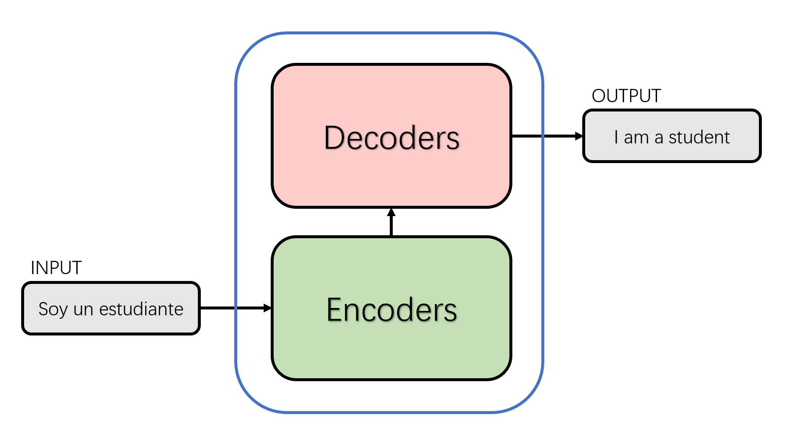
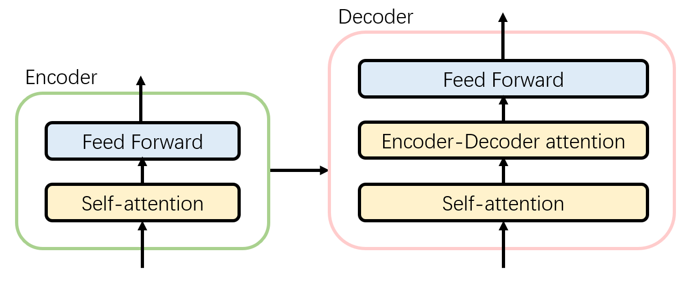

<style>
img{
    width: 60%;
    padding-left: 20%;
}
</style>
# Transformer
## 简介
2017年，Google团队在论文[《Attention Is All You Need》](https://proceedings.neurips.cc/paper_files/paper/2017/file/3f5ee243547dee91fbd053c1c4a845aa-Paper.pdf)中利用attention思想，首次提出了Transformer模型结构。与以往的RNN这类神经网络结构相比，Transformer在处理序列输入时对整个序列输入进行并行计算，不需要按照时间步循环递归处理输入序列，在seq2seq的任务中取得了创新性的成果。2018年，Google在论文[《BERT: Pre-training of Deep Bidirectional Transformers for Language Understanding》](https://arxiv.org/pdf/1810.04805.pdf)中首次使用Transformer进行大模型的预训练并在下游任务重进行微调。此后，研究人员将Transformer这种模型结构和预训练+微调这种训练方式相结合，提出了一系列Transformer模型结构、训练方式的改进。如今，各种基于Transformer的深度学习模型已经在机器翻译，问答系统，文本摘要和语音识别等NLP方向取得了众多成果。

## 模型描述
### 总体架构
我们可以从seq2seq的角度对Transformer进行宏观结构的学习。以机器翻译任务为例，Transformer可以被看成是一个黑盒，黑盒的输入是西班牙语文本序列，输出是英语文本序列。


将上图中的黑盒拆开成seq2seq的标准结构，得到一个编码器(Encoders)模块和一个解码器(Decoders)模块。如下图所示。



下面，再将上图中的编码器和解码器细节绘出。由下图我们可以看到，编码器模块由6个编码器(Encoder)组成。同理，解码器模块也是由6个的解码器(Decoder)组成。这里的基础组件个数是手动设置的超参数，也是Transformer中的第一个可调参数。每个编码器网络结构是一样的，每个解码器网络结构也是一样的。不同层编码器和解码器的网络结构不共享参数。


单层的编码器由两部分组成：
* Self-Attention Layer：即自注意力层，当要编码某个特定的词汇的时候，它会帮助编码器关注句子中其他词汇的信息，获取上下文的语义。
* Feed Forward Neural Network：即前馈神经网络，自注意力层的输出会经过前馈神经网络的处理得到新的向量，并送入下一层编码器继续相同的操作。

单层的解码器由三部分组成，除了编码器中提到的两个层，还加入了：
* Encoder-Decoder Attention Layer：这个层帮助解码器聚焦于输入序列最相关的部分,类似于seq2seq模型中的Attention。



以上是Transformer的总体架构。

### 输入
与大多数的自然语言处理任务一样，Transformer首先使用词嵌入(embedding)算法，将输入的文本序列中的每个单词转化为对应的词向量。实际应用中每个词的嵌入向量一般是512维，为了简洁和方便理解，这里使用4个格子代为表示。实际上，嵌入向量的维度是Transformer中第二个我们可以手动设置的超参数，一般地，该维度是训练集中句子长度的最大值。（在实际应用中，我们通常会综合考虑选取一个合适的长度作为输入文本序列的最大长度。如果一个句子达不到这个长度，那么就需要先填充一个特殊的“padding”词；如果句子超出这个长度，则需要做截断处理。）


为了处理模型中缺少一种解释输入序列中单词顺序的方法，Transformer在每个输入的嵌入向量中添加了位置向量(Positional Encoding)，其维度与嵌入向量一致。这些位置向量遵循某些特定的模式，这有助于模型确定每个单词的位置特征以及不同单词之间的距离特征。


在论文[《Attention Is All You Need》](https://proceedings.neurips.cc/paper_files/paper/2017/file/3f5ee243547dee91fbd053c1c4a845aa-Paper.pdf)中，对于该位置向量给出了如下计算方法：
$PE(pos,2i)=sin(\frac{pos}{10000^{\frac{2i}{d_{model}}}})$和
$PE(pos,2i+1)=cos(\frac{pos}{10000^{\frac{2i}{d_{model}}}})$
其中，$pos$是当前词在句子中的位置，$d_{model}$代表位置向量的维度，$i \in (0, d_{model})$代表位置向量第$i$维。在偶数位置，使用正弦编码，在奇数位置，使用余弦编码。

Positional Encoding与embedding的值相加，作为输入送到下一层。

### 编码器
经过输入处理后得到的向量将被送入第一层编码器，在self-attention处理完数据后会把数据送给前馈神经网络，前馈神经网络的计算可以并行，得到的输出会输入到下一层的编码器。向量序列在单层编码器中的流动如下图所示。


#### 自注意力层
下面以机器翻译为例，分析自注意力机制(Self Attention)。

假设我们要翻译的句子是：
”The animal didn't cross the street because it was too tired”

观察这个句子，其中的"it"是一个代词，那么其指代的是原句中的哪个词呢？是指"animal"还是"street"？这个问题对于人类来说是容易分辨的，但是对于模型来说却并非如此。Self Attention机制可以帮助模型在处理"it"一词时把其和"animal"关联起来。同样的，当模型处理句子中其他词时，Self Attention机制的作用便是使得模型不仅仅关注当前位置的词，还会关注句子中其他位置的相关的词，进而可以更好地理解当前位置的词，寻找一种对当前词更好的编码方式。

利用[Tensor2Tensor](https://colab.research.google.com/github/tensorflow/tensor2tensor/blob/master/tensor2tensor/notebooks/hello_t2t.ipynb)的可视化，我们可以直观地看到，当Transformer在第5层编码器编码"it"时的状态，可视化之后显示it有一部分注意力集中在了"The animal"上，并且把这两个词的信息融合到了"it"中。


下面详细讲解Self Attention机制计算的几个步骤。

* 第一步，Self Attention对编码器的每个输入分别计算三个向量query、key和value。即$q$、$k$、$v$。其中，$v$是表示输入特征的向量，$q$、$k$是计算Attention权重的特征向量。它们都是由输入的词嵌入向量与三个权重矩阵相乘得到的，而权重矩阵是模型训练阶段得到的。通常来说为了计算更加稳定，这三个向量的维度会比输入向量的维度小，这里我们假设是64。
  


* 第二步，计算输入的注意力得分，该分值决定了编码器对某个位置单词进行编码时对句子中其他位置单词的关注程度。以下图为例，假设我们现在在计算输入中第一个单词"Thinking"的注意力得分，这个得分是由query和key点乘得出来的。Thinking的第一个分数就是$q_1$和$k_1$的内积，第二个分数就是$q_1$和$k_2$的点积。


* 第三步，把每个分数除以 $\sqrt{d_k}$，$d_{k}$是Key向量的维度。在此处便是除以64的平方根8。该做法是默认的，当然也可以除以其他值，这样的目的是为了在反向传播时使梯度计算更加稳定。接下来将这些分数用Softmax函数作归一化处理，这样得到的注意力分数都是正数且和为1，如下图所示。此时的注意力分数表示在计算当前位置的时候，其他单词受到的关注度的大小。


* 第四步，将softmax得到的值与对应的Value向量相乘。这样做我们就可以把更多的注意力放在得分高的单词上，而得分较低的单词则获得非常少的注意力。最后，把上面得到的Value向量相加，就得到了Self Attention在当前位置对应的输出$z_1$，并把该结果传递到前馈神经网络。


至此，便是自注意力机制计算的全部过程。

在实际情况中，为了使计算更加快捷，我们选择将所有词向量放到一个矩阵中作为输入，并分别和3个权重矩阵相乘，得到$Q$，$K$，$V$矩阵。矩阵X中的每一行，表示句子中的每一个词的词向量。$Q$，$K$，$V$矩阵中的每一行分别代表Query向量，Key向量和Value向量，向量维度是$d_k$。


最后，我们将上述步骤总结到一个公式中：


实际上，这种通过query和key的相似性程度来确定value的权重分布的方法被称为scaled dot-product attention，公式如下：
 $ Attention(Q,K,V) = softmax(\frac{QK^T}{\sqrt{d_k}}) V $

#### 多头注意力机制

论文[《Attention Is All You Need》](https://proceedings.neurips.cc/paper_files/paper/2017/file/3f5ee243547dee91fbd053c1c4a845aa-Paper.pdf)加入了多头注意力机制作为改进。该机制也比较容易理解，即初始化多组$Q$，$K$，$V$矩阵进行计算。以论文为例，首先设定8组不同的权重$W^Q, W^K和W^V$​，使之分别与输入矩阵相乘得到8组$Q$，$K$，$V$矩阵。


同理，计算得到8个$Z$矩阵。


但由于前馈神经网络只能输入单个矩阵，于是我们把8个矩阵组合成一个大矩阵，再用一个附加的权重矩阵$W^O$和这个组合好的大矩阵相乘，得到一个最终的$Z$矩阵。


多头注意力机制对原attention层的增强体现在：
* 多头注意力机制将模型分为多个注意力头（attention heads），可以把输入的向量映射到多个对应的子空间。让模型去关注不同方面的信息，最后再将各个方面的信息综合起来，有助于网络捕捉到更丰富的特征和信息。以翻译句子：The animal didn’t cross the street because it was too tired为例，我们除了希望模型关注到"it"本身，以及"The"和"animal"之外，可能还希望模型关注到"tired"。在这个情况下，多头注意力机制就会发挥作用。

通过[Tensor2Tensor](https://colab.research.google.com/github/tensorflow/tensor2tensor/blob/master/tensor2tensor/notebooks/hello_t2t.ipynb)的可视化我们可以更直观地感受到多头注意力机制的作用。


#### 残差连接和标准化
解码器的每一个子模块后会有一个Add&Normalize模块。即残差链接和标准化模块。
* 残差连接是为了随着神经网络层数的加深，通过残差连接提升网络的表征能力，降低由于网络对称性引发的特征退化问题。
  
* 标准化把输入转化成均值为0方差为1的数据。我们在把数据送入激活函数之前进行标准化，防止随着网络层数加深数据的偏差越来越大。

编码器内的全部细节如下图所示：


### 解码器
解码器的结构和原理与编码器大同小异。在经过多层编码器的处理后，最后一层编码器会输出一组序列向量，这组序列向量会作为解码器的$K$、$V$输入，这两组向量会帮助解码器把注意力放在输入序列中合适的位置。解码阶段的每一个时间步都输出一个翻译后的单词，解码器当前时间步的输出又重新作为输入$Q$和编码器的输出$K$、$V$共同作为下一个时间步解码器的输入。然后重复这个过程，直到输出一个结束符。

#### 掩码
解码器在得到添加了位置向量的输入后，在自注意力层会有一个掩码操作。mask表示掩码，掩码的作用是对某些值进行掩盖，使其在参数更新时不产生效果。Transformer有以下两种掩码方式：
* padding mask：该方法会在scaled dot-product attention中使用。padding mask是每个位置都是Boolean的张量，其中false值对应我们要处理的位置。对每批次输入的序列我们需要进行对齐操作，较短的序列用0进行填充，较长的序列则是作截断处理。对于填充的部分，对注意力机制来说是没有什么价值的，于是该方法会在这些不应该吸引注意力的位置加一个极大的负数，再通过softmax处理后这些位置的概率就会无限接近于0。
* sequence mask：该方法只在decoder的 self-attention中使用。sequence mask使得decoder不能看见未来的信息。也就是对于一个序列，在time_step为t的时刻，解码输出只能依赖于t时刻之前的输出，不能依赖t之后的输出。具体做法是产生一个上三角矩阵，上三角的值全为0。把这个矩阵作用在每一个序列上。

### 线性层和softmax层
最后的线性层和softmax层需要把decoder输出的向量转换为要翻译出的单词。线性层是一个简单的全连接神经网络，它可以将解码器生成的向量映射到一个很大的向量logits中。logits向量的维度应当与模型词汇表的大小一致。假设模型的输出词汇表有10000个英语单词，则logits向量对应的维数也是10000，其中每一个数字对应一个单词的分数。Softmax层会将这些分数转换为对应的概率，此时概率最大的位置对应的词汇就是当前时间步输出的单词。

上述内容整体的示意图如下：


## 代码
### Embedding
```
class Embeddings(nn.Module):
    def __init__(self, d_model, vocab):
        super(Embeddings, self).__init__()
        self.lut = nn.Embedding(vocab, d_model) #vocab代表词表的词汇数量，d_model代表embedding的维度
        self.d_model = d_model #论文中为512

    def forward(self, x):
        return self.lut(x) * math.sqrt(self.d_model) 
```
代码非常简单，唯一需要注意的就是forward处理使用nn.Embedding对输入x进行Embedding之外，还除以了$\sqrt{d\_model}$。

#### Positional Embedding
```
class PositionalEncoding(nn.Module):

    def __init__(self, d_model, dropout, max_len=5000):
        super(PositionalEncoding, self).__init__()
        self.dropout = nn.Dropout(p=dropout)
        pe = torch.zeros(max_len, d_model)
        position = torch.arange(0., max_len).unsqueeze(1) # 增加维度
        div_term = torch.exp(torch.arange(0., d_model, 2) *
                             -(math.log(10000.0) / d_model)) # 相对位置公式
         
        pe[:, 0::2] = torch.sin(position * div_term)   # 取奇数列
        pe[:, 1::2] = torch.cos(position * div_term)   # 取偶数列
        pe = pe.unsqueeze(0)           # 增加维度
        self.register_buffer('pe', pe)
         
    def forward(self, x):
        x = x + Variable(self.pe[:, :x.size(1)], requires_grad=False) # embedding与positional相加
        return self.dropout(x)
```
由于模型不包含RNN和CNN结构，为了使模型能够有效利用序列的顺序特征，我们需要加入序列中各个Token间相对位置或Token在序列中绝对位置的信息。模型对序列中的词语出现的位置进行编码。positional encoding和embedding有相同的维度，这两个向量相加得到包含位置信息的输入。论文中使用的编码方法是在偶数位置使用正弦编码，在奇数位置使用余弦编码。其计算方法如下（在前面输入部分已作详细介绍，在此不再赘述）：
$ PE(pos,2i)=sin(\frac{pos}{10000^{\frac{2i}{d_{model}}}}) $
$ PE(pos,2i+1)=cos(\frac{pos}{10000^{\frac{2i}{d_{model}}}}) $

### Encoder
```
class Encoder(nn.Module):
    "Core encoder is a stack of N layers"

    def __init__(self, layer, N):
        super(Encoder, self).__init__()
        self.layers = clones(layer, N)
        self.norm = LayerNorm(layer.size) # 归一化

    def forward(self, x, mask):
        "Pass the input (and mask) through each layer in turn."
        for layer in self.layers:
            x = layer(x, mask) # 把序列跟mask输入到每层中
        return self.norm(x)
```
 Encoder会将输入序列映射到一个连续表示序列中,Encoder为EncoderLayer的实例化，文中为6层EncoderLayer组成，当然也可以选择不同的层数。
 ```
class EncoderLayer(nn.Module):
    "Encoder is made up of self-attn and feed forward (defined below)"
    def __init__(self, size, self_attn, feed_forward, dropout):
        super(EncoderLayer, self).__init__()
        self.self_attn = self_attn #sublayer 1 
        self.feed_forward = feed_forward #sublayer 2 
        self.sublayer = clones(SublayerConnection(size, dropout), 2) # 拷贝两个SublayerConnection，一个为了attention，一个是独自作为简单的神经网络
        self.size = size

    def forward(self, x, mask):
        "Follow Figure 1 (left) for connections."
        x = self.sublayer[0](x, lambda x: self.self_attn(x, x, x, mask)) # attention层，对应层1
        return self.sublayer[1](x, self.feed_forward) # 对应层2
 ```
 EncoderLayer这里分成了两个子层，一个作为Multi-Head Self Attention另一个为 Feed-Forward network。

 #### Muti-Head-Attention
~~~python
 class MultiHeadedAttention(nn.Module):
    def __init__(self, h, d_model, dropout=0.1):
        "Take in model size and number of heads."
        super(MultiHeadedAttention, self).__init__()
        assert d_model % h == 0
        # We assume d_v always equals d_k
        self.d_k = d_model // h  # d_v=d_k=d_model/h 
        self.h = h # heads 的数目文中为8
        self.linears = clones(nn.Linear(d_model, d_model), 4)
        self.attn = None  
        self.dropout = nn.Dropout(p=dropout)

    def forward(self, query, key, value, mask=None):
        "Implements Figure 2"
        if mask is not None:
            # Same mask applied to all h heads.
            mask = mask.unsqueeze(1)
        nbatches = query.size(0)

        query, key, value = \         # q,k,v [batch_size,Len,d_model = 512]
            [l(x).view(nbatches, -1, self.h, self.d_k).transpose(1, 2)
             for l, x in zip(self.linears, (query, key, value))] #[batch_size,len,h,d_k]转换为[batch_size,h,len,d_k] 

        x, self.attn = attention(query, key, value, mask=mask,# 进行attention
                                 dropout=self.dropout)

        x = x.transpose(1, 2).contiguous() \
            .view(nbatches, -1, self.h * self.d_k) # 还原序列[batch_size,len,d_model]
        return self.linears[-1](x)
~~~
 Muti-Head-Attention由h个Self-Attention组成，文中h为8，文中把512维分成了h个，把每个做self-attention，彼此之间参数不共享，Multi-head Attention的本质是，在参数总量保持不变的情况下，将同样的query, key, value映射到原来的高维空间的不同子空间中进行attention的计算，在最后一步再合并不同子空间中的attention信息。这样降低了计算每个head的attention时每个向量的维度，在某种意义上防止了过拟合；由于Attention在不同子空间中有不同的分布，Multi-head Attention实际上是寻找了序列之间不同角度的关联关系，并在最后concat这一步骤中，将不同子空间中捕获到的关联关系再综合起来。
~~~python
def attention(query, key, value, mask=None, dropout=None):
    "Compute 'Scaled Dot Product Attention'"
    d_k = query.size(-1)
    scores = torch.matmul(query, key.transpose(-2, -1)) \
             / math.sqrt(d_k) [batch,len,h,d_k] * [batch,len,d_k,len] # 得到[batch,h,len,len]
    if mask is not None:
        scores = scores.masked_fill(mask == 0, -1e9) # mask必须是一个ByteTensor而且shape必须和a一样,并且元素只能是0或者1 ，是将 mask中为1的 元素所在的索引，在a中相同的的索引处替换为value,mask value必须同为tensor
    p_attn = F.softmax(scores, dim = -1)
    if dropout is not None:
        p_attn = dropout(p_attn)
    return torch.matmul(p_attn, value), p_attn
~~~
Attention函数可以将Query和一组Key-Value对映射到输出，其中Query、Key、Value和输出都是向量。 输出是值的加权和，其中分配给每个Value的权重由Query与相应Key的兼容函数计算。使用不同的Linear layers基于x来计算 keys，queries和values，通过Linear过后的K，Q，V相互独立、权重不同。

### Decoder
~~~python
class Decoder(nn.Module): 
	def __init__(self, layer, N):
		super(Decoder, self).__init__()
		self.layers = clones(layer, N)
		self.norm = LayerNorm(layer.size)
	
	def forward(self, x, memory, src_mask, tgt_mask):
		for layer in self.layers:
			x = layer(x, memory, src_mask, tgt_mask)
		return self.norm(x)
~~~
Decoder也是N个DecoderLayer的stack，参数layer是DecoderLayer，它也是一个callable，最终__call__会调用DecoderLayer.forward方法，这个方法(后面会介绍)需要4个参数，输入x，Encoder层的输出memory，输入Encoder的Mask(src_mask)和输入Decoder的Mask(tgt_mask)。所有这里的Decoder的forward也需要这4个参数。
```
class DecoderLayer(nn.Module):
	"Decoder包括self-attn, src-attn, 和feed forward "
	def __init__(self, size, self_attn, src_attn, feed_forward, dropout):
		super(DecoderLayer, self).__init__()
		self.size = size
		self.self_attn = self_attn
		self.src_attn = src_attn
		self.feed_forward = feed_forward
		self.sublayer = clones(SublayerConnection(size, dropout), 3)
	
	def forward(self, x, memory, src_mask, tgt_mask): 
		m = memory
		x = self.sublayer[0](x, lambda x: self.self_attn(x, x, x, tgt_mask))
		x = self.sublayer[1](x, lambda x: self.src_attn(x, m, m, src_mask))
		return self.sublayer[2](x, self.feed_forward)
```
DecoderLayer比EncoderLayer多了一个src-attn层，这是Decoder时attend to Encoder的输出(memory)。src-attn和self-attn的实现是一样的，只不过使用的Query，Key和Value的输入不同。普通的Attention(src-attn)的Query是下层输入进来的(来自self-attn的输出)，Key和Value是Encoder最后一层的输出memory；而Self-Attention的Query，Key和Value都是来自下层输入进来的。