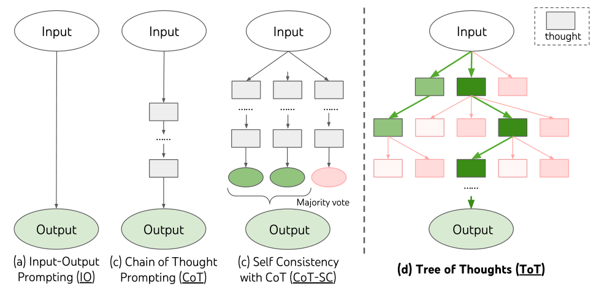

# **Batch Prompting: 使用大型语言模型API进行高效推理**

## 简介

[Yao等人，2023](https://arxiv.org/abs/2305.10601)引入了一种新的语言模型推理框架，
即“思想树”(ToT)，它概括了流行的“思想链”方法来提示语言模型，并允许探索连贯的文本单元(“思想”)，
作为解决问题的中间步骤。ToT允许LMs通过考虑多种不同的推理路径和自我评估选择来执行深思熟虑的决策，
以决定下一步的行动方针，以及在必要时做出全局选择时进行前瞻或回溯。

本文的实验涉及三个需要精心规划或搜索的任务:24点游戏、创意写作和迷你填字游戏。
结果表明，ToT具有足够的通用性和灵活性，可以支持不同层次的思维、不同的思维生成和评估方式，
以及适应不同问题性质的不同搜索算法，因此在这三个任务上都获得了更好的结果。

## 原理

ToT将所有问题都定义为对树的搜索，其中每个节点都是一个状态s = [x, z<sub>1..]I </sub>]，
表示部分解，包含输入和到目前为止的思想序列。ToT的具体实例包括回答四个问题:
1. 如何将中间过程分解为思维步骤;
2. 如何从每个状态中产生潜在的想法;
3. 如何启发式评估状态;
4. 使用什么搜索算法。



为了回答这四个问题，ToT的过程可以概括如下:

1. **思维分解**。根据不同的问题，一个想法可以是几个单词（填字游戏），一行方程（24点游戏），
或者一整段写作计划（创意写作）。一般来说，一个想法应该足够“小”，这样LMs才能产生有希望和多样化的结果，
但又应该足够“大”，这样LMs才能评估其解决问题的前景。
2. **思维生成器**。我们考虑两种策略来生成下一步思维的候选项:

   (1) 从CoT提示（用于创意写作）中提取想法样本。当思想空间丰富时（例如，每个思想是一个段落），i.i.d样本导
致多样性时，这种方法效果更好;

   (2) 使用“建议提示”提出想法（用于24点游戏，填字游戏）。当思维空间受限时（例如，每个想法只有一个词或一行
字），这种方法效果更好，在相同的语境中提出不同的想法可以避免重复。
3. **状态评估器**。使用LM有意地对状态进行推理。我们考虑两种策略来单独或共同评估状态:

   (1) 独立评估每个状态（用于24点游戏、填字游戏）;

   (2) 跨状态投票（用于创意写作）。

4. **搜索算法**。最后，在ToT框架内，可以根据树结构插入和使用不同的搜索算法。

   (1) 广度优先搜索(BFS)，每步维护一组b个最有希望的状态。这用于24点游戏和创意游戏，其中树的深度是有
限的(T≤3)，并且可以评估初始思维步骤并将其修剪为一个小集合(b≤5)。

   (2) 深度优先搜索(DFS)首先探索最有希望的状态，直到达到最终输出，或者状态评估者认为无法从当前的状态s解决问题。
在后一种情况下，从s开始的子树被剪枝。在这两种情况下，DFS都回溯到s的父状态以继续探索。这用于填字游戏。

## Prompt 示例

### *Prompt*

#### *Game of 24 Prompt*
```
propose_prompt:
Input: 2 8 8 14
Possible next steps:
2 + 8 = 10 (left: 8 10 14)
8 / 2 = 4 (left: 4 8 14)
14 + 2 = 16 (left: 8 8 16)
2 * 8 = 16 (left: 8 14 16)
8 - 2 = 6 (left: 6 8 14)
14 - 8 = 6 (left: 2 6 8)
14 /  2 = 7 (left: 7 8 8)
14 - 2 = 12 (left: 8 8 12)
Input: 4 9 10 13
Possible next steps:

value_prompt:
Evaluate if given numbers can reach 24 (sure/likely/impossible)
4 4 10
4 + 4 + 10 = 8 + 10 = 18
4 * 10 - 4 = 40 - 4 = 36
(10 - 4) * 4 = 6 * 4 = 24
sure
5 7 8
5 + 7 + 8 = 12 + 8 = 20
(8 - 5) * 7 = 3 * 7 = 21
I cannot obtain 24 now, but numbers are within a reasonable range
likely
10 10 11
10 + 10 + 11 = 31
(11 - 10) * 10 = 10
10 10 10 are all too big
impossible
10 13 13
```
#### *Creative Writing Prompt*
```
cot_prompt (5 times):
Write a coherent passage of 4 short paragraphs. 
The end sentence of each paragraph must be: 1.It isn't difficult to do a handstand if you just stand on your hands. 2.It caught him off guard that space smelled of seared steak. 3.When she didn’t like a guy who was trying to pick her up, she started using sign language. 4.Each person who knows you has a different perception of who you are.
Make a plan then write. Your output should be of the following format:
Plan:
Your plan here.

vote_prompt (5 times):
Given an instruction and several choices, decide which choice is most promising. Analyze each choice in detail, then conclude in the last line "The best choice is {s}", where s the integer id of the choice.
```
#### *Mini Crosswords Prompt*
```
propose_prompt:
Let's play a 5 x 5 mini crossword, where each word should have exactly 5 letters.
h1. One who saws
h2. A fungus genus
h3. An assessor
h4. Pasture land
h5. Receiving by the ear
v1. To swell; to increase
v2. The Brazilian macaw; an Australian bird
v3. A Timorese island
v4. Excessive fluid accumulation
v5. Dewy; roscid
Given the current status, list all possible answers for unfilled or changed words, and your confidence levels (certain/high/medium/low), using the format "h1. apple (medium)". Use "certain" cautiously and only when you are 100% sure this is the correct word. You can list more then one possible answer for each word.

value_prompt:
Evaluate if there exists a five letter word of some meaning that fit some letter constraints (sure/maybe/impossible).
Incorrect; to injure: w _ o _ g
The letter constraint is: 5 letters, letter 1 is w, letter 3 is o, letter 5 is g.
Some possible words that mean "Incorrect; to injure":
wrong (w r o n g): 5 letters, letter 1 is w, letter 3 is o, letter 5 is g. fit!
sure
Dewy; roscid: r _ _ _ l
The letter constraint is: 5 letters, letter 1 is r, letter 5 is l.
Some possible words that mean "Dewy; roscid":
moist (m o i s t): 5 letters, letter 1 is m, not r
humid (h u m i d): 5 letters, letter 1 is h, not r
I cannot think of any words now. Only 2 letters are constrained, it is still likely
maybe
Chance; a parasitic worm; a fish: w r a k _
The letter constraint is: 5 letters, letter 1 is w, letter 2 is r, letter 3 is a, letter 4 is k.
Some possible words that mean "Chance; a parasitic worm; a fish":
fluke (f l u k e): 5 letters, letter 1 is f, not w
I cannot think of any words now. 4 letters are constrained, and it is extremely unlikely to have a word with pattern w r a k _ to mean "Chance; a parasitic worm; a fish"
impossible
To swell; to increase: s u r _ _
The letter constraint is: 5 letters, letter 1 is s, letter 2 is u, letter 3 is r.
Some possible words that mean " To swell; to increase ":
```
### *Output* 
#### *Game of 24 Output*
```
output of propose_prompt:
4 + 9 = 13 (left: 10 13 13)
9 - 4 = 5 (left: 5 10 13)
10 - 4 = 6 (left: 6 9 13)
13 - 9 = 4 (left: 4 10 13)
4 * 9 = 36 (left: 10 13 36)
10 + 4 = 14 (left: 9 13 14)

output of vote_prompt:
10 + 13 + 13 = 36
(13 - 10) * 13 = 39
10 13 13 are all too big
impossible
```
#### *Creative Writing Output*
```
output of cot_prompt (1th output):
Plan:
1.Introduce the concept of doing a handstand by standing on one's hands.
2.Transition to a surprising observation about the smell of space.
3.Shift to a scenario where a woman uses sign language to discourage unwanted advances.
4.Conclude by emphasizing the unique perspectives people have of an individual.

output of vote_prompt:
Analyzing each choice:
Choice 1 focuses on a physical activity and provides practical tips for achieving a handstand. While it can be interesting, it doesn't contribute significantly to the overall coherence of the passage.
Choice 2 introduces an intriguing scenario in space, where the unexpected smell of seared steak surprises a character. This choice adds an element of surprise and captivation to the passage, making it engaging for readers.
Choice 3 highlights a unique response to an unwanted suitor by using sign language. It brings in a diverse perspective on communication and personal boundaries. However, it may not flow as smoothly with the other choices in the passage.
Choice 4 delves into the topic of perception and identity, emphasizing the complexity of human understanding. It adds depth and introspection to the passage, making it more thought-provoking.
Choice 5 offers a well-rounded conclusion to the passage, providing practical plans for personal growth and self-exploration. It brings together elements from the previous choices and offers a comprehensive approach to understanding oneself and the world.
Based on the analysis, the best choice is 5.
```
#### *Mini Crosswords Output*
```
output of propose_prompt:
Certainly! Let's go through each clue and provide possible answers for the unfilled or changed words, along with confidence levels:
h1. One who saws: sawer (certain)
h2. A fungus genus: uredo (certain)
h3. An assessor: rater (medium),judge (medium)
h4. Pasture land: grass (medium)
h5. Receiving by the ear: hearing (medium), eavesdrop (low)
v1. To swell; to increase: surge (medium)
v2. The Brazilian macaw; an Australian bird: ara (low), cockatoo (medium)
v3. A Timorese island: wetar (medium), alor (low)
v4. Excessive fluid accumulation: edema (medium)
v5. Dewy; roscid: moist (medium)
Please note that the confidence levels provided are subjective and based on the information available up to September 2021.

output of value_prompt:
surge (s u r g e): 5 letters, letter 1 is s, letter 2 is u, letter 3 is r. Fit!
sure
```
