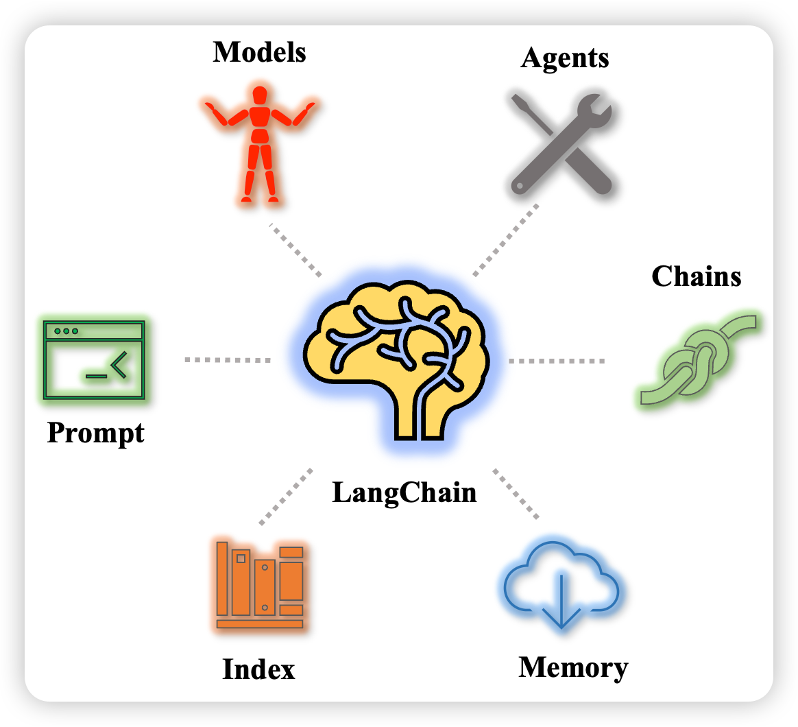
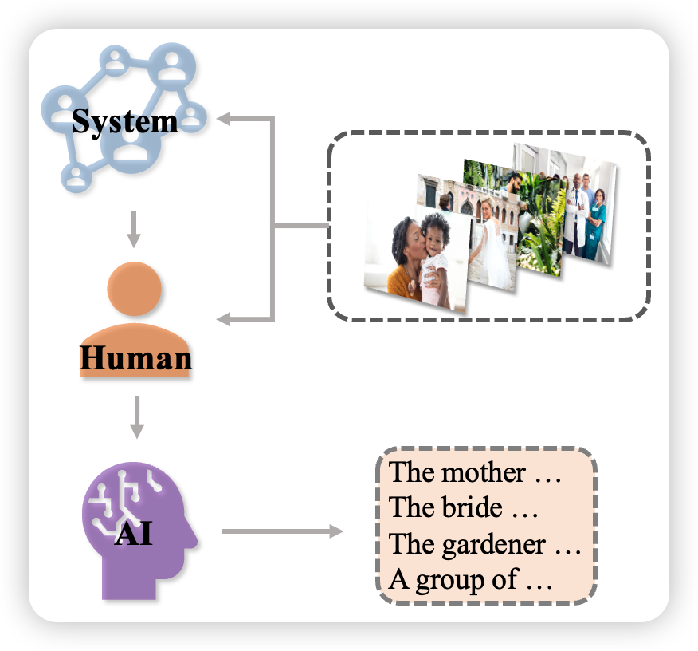
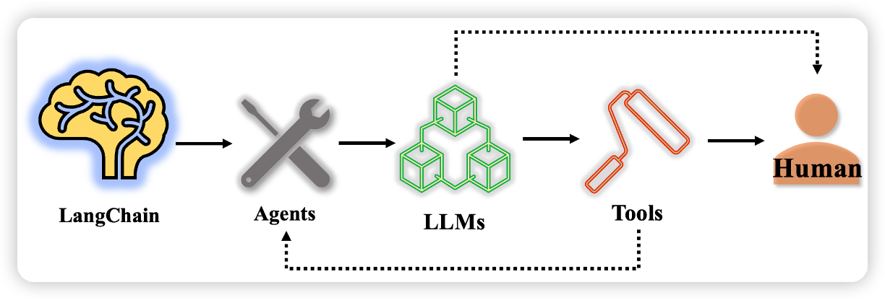
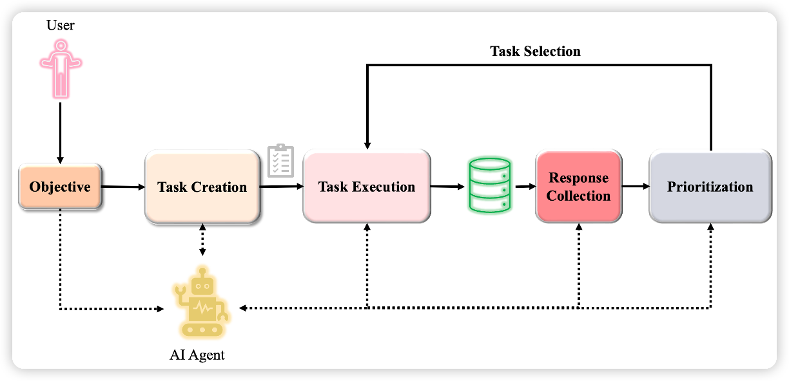

# 🎇 LangChain

如何打造我们自己专属的聊天机器人？如何通过简单的方式操控大语言模型(LLMs)从而学习到特定领域内的知识？如何在日常的工作流式中使用大模型激发更多的潜力？
>请设想下面这几种场景：你拥有几本电子书，或几十个文本文件，抑或是利用数据库完成特定任务,我们想要LLMs模型学习用户给定的数据，并且只回答给定数据范围内的相关问题,如果问题超出范围,一律告知用户问题超出范围无法回答,也就是我们要限制LLMs模型自由发挥，不能让它随便乱说。如何基于大模型完成上述任务？LangChain可以帮你实现。点击👉[这里](https://python.langchain.com/en/latest/index.html)👈可以直接跳转到LangChain的官方文档说明。

LangChain是一个大模型上层工具链，一个基于LLMs的应用程序开发框架, 通过可组合性来使用LLM构建应用程序. 其重点在于"可组合性"。设计一系列便于集成到实际应用中的接口，降低了在实际场景中部署大语言模型的难度。LangChain可用于聊天机器人、生成式问答(GQA)、文本摘要提取等。
LangChain的目标在于：

- 允许大语言模型处理不同来源的数据
- 让大语言模型能和布置它的环境之间进行交互



如上图所示，LangChain库主要包含六个部分:

- **Models**: 提供基于OpenAI API封装好的大模型，包含常见的OpenAI大模型，也支持自定义大模型的封装。
- **Prompt**: 支持自定义Prompt工程的快速实现以及和LLMs的对接。
- **Index** 接受用户查询，索引最相关内容返回。
- **Memory**: 标准的接口, 在chains/call之间保存状态。
- **Chains**: 一系列的调用(LLMs或者其他, 如网络, 操作系统), Chains提供了标准的接口和设置来组合这些调用。 先从外部的源获取信息, 然后喂给LLMs。大模型针对一系列任务的顺序执行逻辑链。
- **Agents**: 代理, 非常重要的一环, 关于对LLMs做何种action, 如何做。通常Utils中的能力、Chains中的各种逻辑链都会封装成一个个工具（Tools）供Agents进行智能化调用。

🌟 我们将主要基于OpenAI提供商进行代码的说明与讲解，那么，我们就开始这个旅程吧！！！✊

# 📜 文档目录结构

- [Before Start](#before-start)
- [Models](#models)
- [Prompt](#prompt)
- [Index](#index)
- [Memory](#memory)
- [Chains](#chains)
- [Agents](#agents)
- [Coding Examples](#coding-examples)

## Before Start

环境配置和检查,设置代理是针对国内用户（只针对大陆，不涉及香港、澳门和台湾地区）使用OpenAI需要挂载VPN的问题，因此需要本地运行程序进行代理设置，从而避免网络原因导致的访问和调用问题。

~~~python
import os
#设置HTTP代理，本地IP地址以及端口号，查看IP可以通过Win/Linux下的IPCONFIG/IFCONFIG命令查看，也可以直接默认设置为127.0.0.1,端口要写挂载VPN的端口号。
os.environ['HTTP_PROXY'] = 'http://127.0.0.1:XXX'
#设置HTTPS代理，同上
os.environ['HTTPS_PROXY'] = 'http://127.0.0.1:XXX'

#检查代理是否有用
def check_proxy():
    import urllib.request
    url = "https://www.google.com"
    #url = "https://www.baidu.com"
    filename = "google.html"
    urllib.request.urlretrieve(url, filename)#保存在当前文件夹下

check_proxy()

#openai的key
os.environ["OPENAI_API_KEY"] = "填上你自己的openai api  key"

#搜索api的key,仅在agent中使用，这步不是必要的
os.environ['SERPAPI_API_KEY']='填上你自己的serpapi api key'
~~~

检查谷歌搜索API是否能用，这一步是非必要的可选步骤，如果你在下文的示例中有用到谷歌搜索API的，那就需要进行相应的注册才可以调用访问，注册网址点击👉[这里](https://serpapi.com/dashboard)👈

~~~python
from serpapi import GoogleSearch
search = GoogleSearch({
    "q": "coffee",
    "location": "Austin,Texas",
  })
result = search.get_dict()
print(result)
~~~

检查OpenAI KEY是否可用

~~~python
import openai
"""
调用ChatGPT API，其中的engine是使用的chatgpt的davinci引擎，
输入提示是prompt，生成文本的最大长度限制为5个tokens，一个token可以
是一个单词或者一个子词，n=1是设置的生成文本的数量，即表示生成一条回复，stop是
来指定生成文本结束的条件的，这里设为None，表示不设置停止的条件，temperature是
用来控制文本生成的随机性的，数值越大代表生成的文本越随机，数值越小表示生成的文本
很确定和保守。返回的内容就是response对象。
"""
response = openai.Completion.create(
    engine="davinci",
    prompt="Hello, my name is",
    max_tokens=5,
    n=1,
    stop=None,
    temperature=0.5,
)
#输出ChatGPT的回复
print("response : {}".format(response))
print("--------")
print(response.choices[0].text)
~~~

## Models

那么现在开始我们的第一个板块内容，该板块中的代码示例部分来源于LangChain官网教程，关于Models的详细说明文档以及指示请点击👉[此处](https://python.langchain.com/en/latest/modules/models.html)👈进行直接访问。

- [LLMs](#llms)
- [Chat Models](#chat-models)
- [Text Embedding Models](#text-embedding-models)

### LLMs

我们知道——LangChain本身不提供大语言模型，只提供各种接口和方式用以调用访问大语言模型。
现在有很多LLM提供商比如OpenAI, Cohere, Hugging Face等。在LLMs中，提供了统一的接口来访问这些大模型。

~~~python
from langchain.llms import OpenAI
import os
~~~

下面是常规调用声明LLM的方式方法，模型选择是很多的，具体要使用哪个模型可以访问[此处](https://platform.openai.com/docs/models/overview)进行浏览和设置。

~~~python
"""model_name是选择的OpenAI的模型名称，n=2是生成的文本内容是两条，best_of是从2个里面选择出最佳的一条作为输出"""
llm = OpenAI(model_name="text-ada-001", n=2, best_of=2)
~~~

那么我们看一下这个llm具体的参数情况:

~~~python
print(llm)
~~~

生成文本：LLM最基本的功能就是能够调用它，传递一个字符串并返回一个字符串。其中的"tell me...story"就是query，传递进模型中调用问答模型给出回答，query的类型是字符串，没有限制它必须是疑问句还是陈述句，ChatGPT等大语言模型会对其内容进行相应的解析与了解，读者不必纠结在此处。

~~~python
llm("Tell me a scared story")
~~~

llm可以接受文本列表，生成各个语句的回答，还包括api供应商的返回信息

~~~python
llm_result = llm.generate(["How to study English", "How to generate a new idea"]*3)
print(llm_result)
print(len(llm_result.generations))
print(llm_result.generations[0])
print(llm_result.generations[1])
~~~

给出调用api的供应商返回信息:

~~~python
print(llm_result.llm_output)
~~~

评估字符串花费Tokens数量:

~~~python
print(llm.get_num_tokens("假设你是个教师，如何教英语"))
~~~

### Chat Models

ChatGPT接口使用的是 turbo 的模型，对于聊天机器人的设计，这里有很重要的三个角色:system、human、AI，下面这张图展示的是聊天机器人在捕获信息并进行处理的图画展示：



如上图所示，这三个角色分别是如下的定义：

- system：针对现实世界中的一切描述，我们的system要决定最终想要AI做什么，一个直白的背景或者说是角色的定位，例如翻译员、银行家等；
- human：具体的事情，例如想要AI翻译的语句或者想要AI写出一句酷似方文山的歌词；
- AI：大模型决定返回的内容 使用langchain工具箱实现这个功能。

在代码中我们将会通过langchain.schema引入的SystemMessage, HumanMessage, AIMessage来操纵具体的需求步骤，如下所示：

~~~python
#导入我们所需要的相关库函数
from langchain.chat_models import ChatOpenAI
from langchain import PromptTemplate, LLMChain
from langchain.prompts.chat import (
    ChatPromptTemplate,
    SystemMessagePromptTemplate,
    AIMessagePromptTemplate,
    HumanMessagePromptTemplate,
)
from langchain.schema import (
    AIMessage,
    HumanMessage,
    SystemMessage
)
#定义聊天机器人使用的聊天问答模型
chat = ChatOpenAI(temperature=0)
#由AI回复human的消息
#human给出的信息是一个字符串内容，给到chat之后会返回一个AIMessage信息，其中的内容将是给出的反馈答案
chat([HumanMessage(content="Translate this sentence from English to Chinese. I love programming.")])
~~~

正如我们上面图中展示的那样，我们一般定义systemmessage的内容为给定它一个角色使OpenAI模型能够在一个知识领域内回答，这样做的好处就是对于给出的答案会更加准确，这里特别说明一点——Openai聊天模型支持一次输入多段信息：

~~~python
messages = [
    SystemMessage(content="You are a helpful assistant that translates English to Chinese."),
    HumanMessage(content="Translate this sentence from English to Chinese. I love programming.")
]
chat(messages)
~~~

可以使用chat.generate方法处理多对儿对话内容，返回值LLMResult包含有输入信息。

~~~python
batch_messages = [
    [
        SystemMessage(content="You are a helpful assistant that translates English to French."),
        HumanMessage(content="Translate this sentence from English to French. I love programming.")
    ],
    [
        SystemMessage(content="You are a helpful assistant that translates English to Chinese."),
        HumanMessage(content="Translate this sentence from English to Chinese. I love artificial intelligence.")
    ],
]
result = chat.generate(batch_messages)
print(result)
~~~

上面的输出信息我们为了您的直观看到，我们将其呈现在这里：

~~~python
OUT：
LLMResult(generations=[[ChatGeneration(text="J'aime programmer.", generation_info=None, message=AIMessage(content="J'aime programmer.", additional_kwargs={}))], [ChatGeneration(text='我喜欢人工智能。', generation_info=None, message=AIMessage(content='我喜欢人工智能。', additional_kwargs={}))]], llm_output={'token_usage': {'prompt_tokens': 73, 'completion_tokens': 16, 'total_tokens': 89}, 'model_name': 'gpt-3.5-turbo'})
~~~

我们可以从result中得到一些信息如下：

~~~python
result.llm_output
~~~

### 在聊天模型（chatmodel）中使用提示模板

~~~python
下面使用模板包装SystemMessage和HumanMessage。方便使用。
#首先构建模版，用几个完形待填项表示要传入的内容，input_variables在这个模版中是两个
template="You are a helpful assistant that translates {input_language} to {output_language}."
#定义systemmessage的提示模版，进行相应的模版格式化
system_message_prompt = SystemMessagePromptTemplate.from_template(template)
#构建human模版，用来传入我们想要查询的内容
human_template="{text}"
#将human模版进行格式化
human_message_prompt = HumanMessagePromptTemplate.from_template(human_template)
#将上面的两类模版，也就是system和human的模版，将两个模版通过合并的方式创建
chat_prompt = ChatPromptTemplate.from_messages([system_message_prompt, human_message_prompt])
#使用聊天提示模版来创建一个聊天补全，其中的各项参数都是input_variables，通过to_messages方法传递给chat模型完成聊天对话
chat(chat_prompt.format_prompt(input_language="English", output_language="French", text="I love programming.").to_messages())
~~~

也可以用下面的方法更直接的创建system_message模板。

~~~python
prompt=PromptTemplate(
    template="You are a helpful assistant that translates {input_language} to {output_language}.",
    input_variables=["input_language", "output_language"],
)
system_message_prompt = SystemMessagePromptTemplate(prompt=prompt)
~~~

### LLMChain

结合LLMChain和Prompt、Chat model，可以更方便地开展对话

~~~python
chain = LLMChain(llm=chat, prompt=chat_prompt)
chain.run(input_language="English", output_language="Chinese", text="I love programming and swimming")
~~~

### 流式对话

通过回调函数处理对话

~~~python
from langchain.callbacks.base import CallbackManager
from langchain.callbacks.streaming_stdout import StreamingStdOutCallbackHandler
"""
streaming=True是启用了聊天的流式模式，也就是响应的内容将会在逐步生成的数据块中逐步返回；
而callback_manger用于管理聊天过程中的回调函数的对象，流式对象将会逐步返回内容而不是整个
响应完成之后一次性返回，如果不传递callback_manager参数，则聊天过程中将会以默认的方式运行，也
就是响应完成之后一次性返回；verbose是详细模式，决定是否打印出具体的信息；temperature的设置
则是决定随机性
"""
chat = ChatOpenAI(streaming=True, callback_manager=CallbackManager([StreamingStdOutCallbackHandler()]), verbose=True, temperature=0)
resp = chat([HumanMessage(content="帮我分析一下为什么一加一等于二？")])
~~~

输出内容如下:

~~~python
一加一等于二是因为这是我们所接受的基本数学原理之一。在十进制数系统中，我们将数字1表示为一个单位，数字2表示为两个单位。当我们将一个单位与另一个单位相加时，我们得到两个单位，即数字2。这是因为加法是一种基本的算术运算，它表示将两个或多个数值相加以得到它们的总和。因此，一加一等于二是数学中的基本原理之一，它被广泛接受并被用于各种数学和科学应用中。
~~~

运行下面的代码：

~~~python
resp_another = chat([HumanMessage(content="tell me how to become a superman?")])
~~~

显示如下内容：

~~~python
As an AI language model, I cannot provide instructions on how to become a fictional character like Superman. However, I can suggest some ways to become a better version of yourself:

1. Set goals and work towards them consistently.
2. Exercise regularly to improve physical strength and endurance.
3. Learn new skills and knowledge to enhance mental abilities.
4. Practice empathy and kindness towards others.
5. Be courageous and stand up for what is right.
6. Develop a positive mindset and attitude towards life.
7. Surround yourself with supportive and positive people.
8. Take care of your health by eating a balanced diet and getting enough rest.
9. Continuously challenge yourself to grow and improve.
10. Believe in yourself and your abilities.
~~~

### Text Embedding Models

词嵌入支持将自然语言转变为向量。LangChain中最重要的两个embedding方法为embed_documents 和 embed_query方法。因为处理多个文本文件和处理一个文件有很大的不同，所以LangChain将其分为两个类。
LangChain中集成了很多来自不同平台的API可以进行词嵌入编码，这里举一个用OpenAi进行词嵌入的方法

~~~python
#我们使用较多的也是OpenAI的embeddings方法
from langchain.embeddings import OpenAIEmbeddings
embeddings = OpenAIEmbeddings()
text = "This is a test document."
query_result = embeddings.embed_query(text)
print(query_result)
doc_result = embeddings.embed_documents([text])
print(doc_result)
~~~

下面这个例子是使用HuggingFace Hub的embeddings模型，让我们看看它的一个代码样例：

~~~python
from langchain.embeddings import HuggingFaceEmbeddings
embeddings_hf = HuggingFaceEmbeddings()
text_hf = "I just test the embeddings method in huggingface"
query_result = embeddings_hf.embed_query(text_hf)
doc_result = embeddings_hf.embed_documents([text_hf])
~~~

上面给出的例子用于熟悉基本models中的相关操作，详细的API开放接口还有很多，例如针对微软Azure的AzureOpenAI，Cohere和Llama-cpp等，点击[此处](https://python.langchain.com/en/latest/modules/models/text_embedding.html)可以直接跳转到相关位置。

## Prompt

Prompt是一种为了更好地使用预训练模型的知识，采用在输入端添加额外文本的技术。Prompt的设计有时候可以极大地激发出大模型的潜力，基于prompt可以完成很多我们想象不到的任务，那么，现在我们就来熟悉一下什么是Prompt以及在LangChain中如何去更好地使用和完善它们，LangChain提供了几个类和函数来轻松构建Prompt模板。

- [Prompt Templates](#prompt-templates)
- [Chat Prompt Template](#chat-model-prompt-template)
- [Example Selectors](#example-selectors)
- [Output Parser](#output-parser)

### Prompt Templates

语言模型的文本输入字符串本身就是一种提示，通常来说prompt由模板、一些例子（有的话）和用户的输入构成，其概念和含义并不复杂。

### 什么是prompt template

Prompt Template，也就是提示模版，是一种可重复使用生成prompt的方式，用template可以模版化提示指令，它由一个字符串和可供用户输入的参数组成。
提示模版包含如下的内容：

- 给语言模型的指令
- 几个例子，帮助语言模型更好地回答
- 一个让语言模型回答的问题
- ...

现在我们看一个创建prompt template的例子：

~~~python
#一般导入的必要库，为了进一步模版化处理
from langchain import PromptTemplate
#具体的模版内容，其中要进行补全的地方（也就是为了定制我们具体问题以及要求的地方用一个变量进行代替）用中括号
#进行变量的放置，不需要其他的操作，类似于字符串中对于某一个变量对其的format格式化
template = """
I want you to act as a naming consultant for new companies.
Here are some examples of good company names:
- search engine, Google
- social media, Facebook
- video sharing, YouTube
The name should be short, catchy and easy to remember.
What is a good name for a company that makes {product}?
"""

"""input_variables就是模版中需要填补的变量，在prompttemplate中格式化模版可以将变量以及模版内容进行很好的组合"""
prompt = PromptTemplate(
    input_variables=["product"],
    template=template,
)
~~~

让我们看看prompt长什么样子：

~~~python
print(prompt)
~~~

输出内容如下：

~~~python
PromptTemplate(input_variables=['product'], output_parser=None, partial_variables={}, template='\nI want you to act as a naming consultant for new companies.\nHere are some examples of good company names:\n- search engine, Google\n- social media, Facebook\n- video sharing, YouTube\nThe name should be short, catchy and easy to remember.\nWhat is a good name for a company that makes {product}?\n', template_format='f-string', validate_template=True)
~~~

### 创建prompt template

我们可以从上面的示例中看到：通过LangChain的PromptTemplate类，可以生成具体的prompt，那么通过继续使用这个类生成几个具体的prompts。prompt template接受多个输入变量，用来格式化生成prompt

~~~python
from langchain import PromptTemplate

#input_variables的值可以为空，说明其中没有任何变量
no_input_prompt = PromptTemplate(input_variables=[], template="Tell me a joke.")
no_input_prompt.format()

#一个input_variable的示例，这样模版化之后的提示将把adjective作为参数传入
one_input_prompt = PromptTemplate(input_variables=["adjective"], template="Tell me a {adjective} joke.")
one_input_prompt.format(adjective="funny")

#多个input_variables的示例，模版后的提示将adjective和content作为参数传入
multiple_input_prompt = PromptTemplate(
    input_variables=["adjective", "content"],
    template="Tell me a {adjective} joke about {content}."
)
multiple_input_prompt.format(adjective="funny", content="chickens")
~~~

### 从LangChainHub加载本地prompt template

~~~python
from langchain.prompts import load_prompt
#可以加载用json格式写好的prompt
test_prompt = PromptTemplate(
    input_variables=["input"],
    template="{input}, tell me the answer by using Chinese."
)
#将创建好的提示模版格式化，其中的补全的变量就是1+1等于几？
test_prompt.format(input="what is 1+1?")
#然后将创建好的模版保存在指定位置处
test_prompt.save("test_prompt.json")
#加载本地的模版使用到的方法是固定的，将具体文件的位置传入即可
prompt = load_prompt("./test_prompt.json")
~~~

### 在prompt template中添加几个例子

如果生成带有几个例子的模版，该怎么做？通过PromptTemplate类固然是可以，将例子固定在具体的模版中是我们想到的方法。那么LangChain有没有提供直接的类可以用来达到我们的目的和要求。下面是给语言模型几个合适的例子从而使大模型能够更准确、更合适地回答问题，LangChain中使用FewShotPromptTemplate类生成带有例子的prompt。

下面是创建一个让大语言模型去回答反义词的提示模版：

~~~python
from langchain import PromptTemplate, FewShotPromptTemplate
#如下是几个提示示例，让大模型知道几个例子回答的时候可以类比着回答
few_examples = [
    {"word": "happy", "antonym": "sad"},
    {"word": "tall", "antonym": "short"},
]

#我们定义如下的提示模版
example_formatter_template = """
Word: {word}
Antonym: {antonym}\n
"""
#模版格式化提示模版
example_prompt = PromptTemplate(
    input_variables=["word", "antonym"],
    template=example_formatter_template,
)

#现在构建一个少样本提示模版对象：few_shot_prompt
'''
其中的参数有examples, example_prompt, prefix, suffix, input_variables和example_separator。其中，
    examples:示例，样例，这个就是我们写好的几个供大模型了解格式以及例子的具体样例
    example_prompt:具体的模版化后的提示模版，这个可以就是通过promptTemplate构建的提示模版，只等待填入具体的变量，
其格式内容中已经将待补全的变量放在其中
    prefix:前缀，一般作为大模型接受指令的入口，可以去声明大模型即将承担的角色以及告诉大模型即将要做的事情等
    suffix:后缀，一般放置于样例之后，作为提示模版的最后一部分
    input_variables:填补的变量
    example_separator:分割符，分割前缀、样例和后缀的标志
'''
few_shot_prompt = FewShotPromptTemplate(
    examples=few_examples,
    example_prompt=example_prompt,
    prefix="Give the antonym of every input",
    suffix="Word: {input}\nAntonym:",
    input_variables=["input"],
    example_separator="\n\n",
)

print(few_shot_prompt.format(input="big"))
~~~

### 从prompt template中选取例子

上面那个代码案例中提供的是少量样本示例，如果有非常多可供LLM参考的例子时，使用ExampleSelector类来可控制地选择几个最好的例子供LLM学习。

下面是一个使用LengthBasedExampleSelector选择一定长输入的例子，它是一个自动选择例子的方法，我们具体来看：**如果用户担心prompt超过输入窗口大小时，这很有用。当用户输入很长时，它自动选择少量的例子；当用户输入很短时，它选择更多的例子。**

~~~python
from langchain.prompts.example_selector import LengthBasedExampleSelector
#依然和上面一样，反义词对儿的组合，这里给出下面几种：
few_examples = [
    {"word": "beautiful", "antonym": "ugly"},
    {"word": "outgoing", "antonym": "incoming"},
    {"word": "happy", "antonym": "sad"},
    {"word": "tall", "antonym": "short"},
    {"word": "energetic", "antonym": "lethargic"},
    {"word": "sunny", "antonym": "gloomy"},
    {"word": "windy", "antonym": "calm"},
]
#我们定义如下的提示模版
example_formatter_template = """
Word: {word}
Antonym: {antonym}\n
"""
#模版格式化提示模版
example_prompt = PromptTemplate(
    input_variables=["word", "antonym"],
    template=example_formatter_template,
)

'''
使用LengthBasedExampleSelector选择例子。
其中的examples:同上示例中的作用
example_prompt:同上示例中的作用
max_length:这是格式化后的例子的最大长度。长度由下面的get_text_length函数决定。
'''
example_selector = LengthBasedExampleSelector(
    examples=few_examples,
    example_prompt=example_prompt,
    max_length=25,
)

#现在使用example_selector来创建fewshotprompttemplate
dynamic_prompt = FewShotPromptTemplate(
    example_selector=example_selector,
    example_prompt=example_prompt,
    prefix="Give the antonym of every input",
    suffix="Word: {input}\nAntonym:",
    input_variables=["input"],
    example_separator="\n\n",
)

print(dynamic_prompt.format(input="big"))
~~~

根据上面的例子我们知道：当输入问题很长时，LengthBasedExampleSelector会选择更少的提示

~~~python
long_string = "big and huge and massive and large and gigantic and tall and much much much much much bigger than everything else"
print(dynamic_prompt.format(input=long_string))
~~~

### chat model prompt template

下面的示例是利用prompt template在chat model中使用的情况：chat model可以使用以前的历史信息进行单次生成回复，单次输入包含了过去聊天中的一系列模板、例子、用户问题的组合。LangChain提供了一些类和方法使得构建和使用prompt更加容易。

~~~python
from langchain.prompts import (
    ChatPromptTemplate,
    PromptTemplate,
    SystemMessagePromptTemplate,
    AIMessagePromptTemplate,
    HumanMessagePromptTemplate,
)
from langchain.schema import (
    AIMessage,
    HumanMessage,
    SystemMessage
)
~~~

ChatPromptTemplate可以使用一个或者多个MessagePromptTemplate类构建prompt。可以使用ChatPromptTemplate的format_prompt函数返回prompt值，然后将其转化为string或message对象。

~~~python
system_template="You are a helpful assistant that translates {input_language} to {output_language}."
system_message_prompt = SystemMessagePromptTemplate.from_template(system_template)
human_template="{text}"
human_message_prompt = HumanMessagePromptTemplate.from_template(human_template)
chat_prompt = ChatPromptTemplate.from_messages([system_message_prompt, human_message_prompt])
#从格式化的信息中获取完整的聊天信息
chat_prompt.format_prompt(input_language="English", output_language="French", text="I love programming.").to_messages()
~~~

下面是一种快速构建MessagePromptTemplate的方法

~~~python
prompt=PromptTemplate(
    template="You are a helpful assistant that translates {input_language} to {output_language}.",
    input_variables=["input_language", "output_language"],
)
system_message_prompt = SystemMessagePromptTemplate(prompt=prompt)
~~~

### Example Selectors

根据模型功能需要动态选择提示词
LangChain中的BaseExampleSelector类用于选择例子，select_examples函数接收输入变量并返回一系列例子。

### 基本接口定义如下

~~~python
from abc import ABC, abstractmethod
from typing import Dict,List
'''它是一个抽象基类，不能被示例化，而是用于定义其他类的接口和规范'''
class BaseExampleSelector(ABC):
    """
    这是一个抽象方法，由派生类实现，以满足BaseExampleSelector接口的要求，这个方法是根据输入变量选择要包含在提示中的示例，返回一个字典列表
    """
    @abstractmethod
    def select_examples(self, input_variables: Dict[str, str]) -> List[dict]:
~~~

一个ExampleSelector类必须实现两个方法：

- 1. add_example方法接受一个例子将其添加到example列表中
- 2. select_examples告诉选择器如何选择例子并返回例子

因此在一个示例选择器中可以随时调用上述两种方法，下面实现一个自定义的example selector

~~~python
from langchain.prompts.example_selector.base import BaseExampleSelector
from typing import Dict, List
import numpy as np

class CustomExampleSelector(BaseExampleSelector):

    def __init__(self, examples: List[Dict[str, str]]):
        self.examples = examples

    def add_example(self, example: Dict[str, str]) -> None:
        """添加新的例子来存储一个键"""
        self.examples.append(example)

    def select_examples(self, input_variables: Dict[str, str]) -> List[dict]:
        """根据输入的信息选择要使用的例子"""
        return np.random.choice(self.examples, size=2, replace=False)
~~~

使用自定义的example selector

~~~python

examples = [
    {"foo": "1"},
    {"foo": "2"},
    {"foo": "3"}
]

#初始化示例选择器
example_selector = CustomExampleSelector(examples)
#选择示例
example_selector.select_examples({"foo": "foo"})
#将新的例子添加到例子集中
example_selector.add_example({"foo": "4"})
example_selector.examples
#选择示例
example_selector.select_examples({"foo": "foo"})
~~~

### 基于长度的示例选择器

LengthBased ExampleSelector根据用户输入自动选择一定数量的示例；使总长度不超过LLM输入窗口大小。下面的示例我们上面就遇到过，现在我们走到这里再看一下这个代码示例，是否更加了解它的原理？

~~~python
from langchain.prompts import PromptTemplate
from langchain.prompts import FewShotPromptTemplate
from langchain.prompts.example_selector import LengthBasedExampleSelector
#这些是很多关于创造反义词的例子。
examples = [
    {"input": "happy", "output": "sad"},
    {"input": "tall", "output": "short"},
    {"input": "energetic", "output": "lethargic"},
    {"input": "sunny", "output": "gloomy"},
    {"input": "windy", "output": "calm"},
]
example_prompt = PromptTemplate(
    input_variables=["input", "output"],
    template="Input: {input}\nOutput: {output}",
)
example_selector = LengthBasedExampleSelector(
    examples=examples,
    example_prompt=example_prompt,
    max_length=25,
)
dynamic_prompt = FewShotPromptTemplate(
    example_selector=example_selector,
    example_prompt=example_prompt,
    prefix="Give the antonym of every input",
    suffix="Input: {adjective}\nOutput:",
    input_variables=["adjective"],
)
print(dynamic_prompt.format(adjective="big"))
long_string = "big and huge and massive and large and gigantic and tall and much much much much much bigger than everything else"
print(dynamic_prompt.format(adjective=long_string))
#You can add an example to an example selector as well.
new_example = {"input": "big", "output": "small"}
dynamic_prompt.example_selector.add_example(new_example)
print(dynamic_prompt.format(adjective="enthusiastic"))
~~~

### 相似性选择器

Similarity Example Selector根据例子和输入的相似程度来选择例子。该选择器根据例子和输入的词嵌入向量的余弦相似性来工作。

~~~python
from langchain.prompts.example_selector import SemanticSimilarityExampleSelector
from langchain.vectorstores import Chroma
from langchain.embeddings import OpenAIEmbeddings
from langchain.prompts import FewShotPromptTemplate, PromptTemplate

example_prompt = PromptTemplate(
    input_variables=["input", "output"],
    template="Input: {input}\nOutput: {output}",
)

#这些是很多关于创造反义词的例子。
few_examples = [
    {"input": "happy", "output": "sad"},
    {"input": "tall", "output": "short"},
    {"input": "energetic", "output": "lethargic"},
    {"input": "sunny", "output": "gloomy"},
    {"input": "windy", "output": "calm"},
]
example_selector = SemanticSimilarityExampleSelector.from_examples(
    #这是可以选择的例子清单。
    few_examples,
    #这里使用OpenAI的嵌入方法，用于产生嵌入，而嵌入是用来衡量语义相似性的。
    OpenAIEmbeddings(),
    #这是VectorStore类，用于存储嵌入并进行相似度搜索。
    Chroma,
    #这是要产生的例子的数量。
    k=1
)
similar_prompt = FewShotPromptTemplate(
    example_selector=example_selector,
    example_prompt=example_prompt,
    prefix="Give the antonym of every input",
    suffix="Input: {adjective}\nOutput:",
    input_variables=["adjective"],
)
print(similar_prompt.format(adjective="worried"))
print(similar_prompt.format(adjective="fat"))
#您也可以向SimilarityExampleSelector添加新的示例。
similar_prompt.example_selector.add_example({"input": "enthusiastic", "output": "apathetic"})
print(similar_prompt.format(adjective="joyful"))
~~~

### Output Parser

输出解析器，顾名思义，就是将输出答案进行解析，它指示模型去格式化输出内容，将输出解析为需要的格式。
Output parsers类结构化模型的响应信息。例如我们提前定义好输出的形式应该包括A属性和B属性，如果正常把提问送给大模型，大模型是不会给你指定出特别严格划分之后的答案的，因此把这种答案进行解析处理进一步给到用户，用户可以用解析处理之后的结果去做更方便的应用或者就已经达到用户的目的。

下面是关于PydanticOutputParser的一个示例说明，PydanticOutputParser能够让LLM输出符合JSON格式的回复。该功能效果和LLM生成能力相关。
下面是使用PydanticOutputParser的例子。

~~~python
from langchain.prompts import PromptTemplate, ChatPromptTemplate, HumanMessagePromptTemplate
from langchain.llms import OpenAI
from langchain.chat_models import ChatOpenAI

from langchain.output_parsers import PydanticOutputParser
from pydantic import BaseModel, Field, validator
from typing import List

#指定使用的大模型
model_name = 'text-davinci-003'
#设置对应的随机性
temperature = 0.0
#model即是调用到的大模型
model = OpenAI(model_name=model_name, temperature=temperature)

#定义你想要的数据结构
"""定义了一个名为Joke的Pydantic模型类，用来表示一个笑话，示例化之后用于提示大模型来填充这个数据结构"""
class Joke(BaseModel):
    """
    setup:字符串类型，使用Field函数指定一个描述字符串，该属性表示笑话的问题部分，也就是笑话的开头
    punchline:字符串类型，同样使用Field函数指定一个描述字符串，表示笑话的答案部分也就是笑话的结尾
    """
    setup: str = Field(description="question to set up a joke")
    punchline: str = Field(description="answer to resolve the joke")
    #你可以用Pydantic轻松地添加自定义逻辑结构。
    """
    装饰器成分，用于标记接下来的方法是一个验证器，验证器是一个函数，接受一个字段值，并返回一个经过验证的值，这里标记的就是
    question_ends_with_question_mark方法是一个验证器，将会用于setup属性
    """
    @validator('setup')
    def question_ends_with_question_mark(cls, field):
        if field[-1] != '?':
            raise ValueError("Badly formed question!")
        return field
#参数值是之前定义的joke类，parser对象的作用是把输出结果解析成一个joke对象
parser = PydanticOutputParser(pydantic_object=Joke)
'''
prompttemplate的两个模版参数占位符是format_instructions和query，但是指定的input_variables是query,
而partial_variables则是指定一个字典，其中包含了键为format_instructions的变量信息，这个值是之前定义的parser对象
调用get_format_instructions方法返回的格式说明字符串
'''
prompt = PromptTemplate(
    template="Answer the user query.\n{format_instructions}\n{query}\n",
    input_variables=["query"],
    partial_variables={"format_instructions": parser.get_format_instructions()}
)
#将用户的query传入提示模版中
joke_query = "Tell me a joke."
_input = prompt.format_prompt(query=joke_query)
output = model(_input.to_string())
parser.parse(output)
~~~

下面是另外一个示例，我们接着看一下

~~~python
"""
下面这段代码定一个了一个名为actor的数据结构，它也是基于basemodel类创建的，这个actor有两个属性，分别是name
和file_names，用来表示姓名和演员出演的电影列表，这两个属性上，同样适用field类，为两者分别指定了description属性，用来
描述这两个属性的作用。
其中：
    actor_query:用户输入的问题
    parser:PydanticOutputParser类实例，作用是将输出的结果解析成一个actor对象
    prompt: prompttemplate类实例，包含一个字符串模版和一些变量
"""
class Actor(BaseModel):
    name: str = Field(description="name of an actor")
    film_names: List[str] = Field(description="list of names of films they starred in")

actor_query = "Generate the filmography for a random actor."

parser = PydanticOutputParser(pydantic_object=Actor)

prompt = PromptTemplate(
    template="Answer the user query.\n{format_instructions}\n{query}\n",
    input_variables=["query"],
    partial_variables={"format_instructions": parser.get_format_instructions()}
)

_input = prompt.format_prompt(query=actor_query)

output = model(_input.to_string())

parser.parse(output)
~~~

## Index

该模块用于接受用户查询，返回最相关概念。
这里LangChain主要在针对用户提供的文档构建索引，将索引组合成检索器；然后可以建立一个问答链用于模型提问回答。
LangChain使用chromadb构建向量池vectorstore，向量池用于检索和查找词嵌入。

详细文档说明点击👉[此处](https://python.langchain.com/en/latest/modules/indexes.html)👈直接访问。

了解索引基本概念也很重要，下面是索引器Retriever的接口，用户可以自己实现如何返回相关文档。LangChain关注于使用Vectorstore retriever进行检索相关文档。

~~~python
from abc import ABC, abstractmethod
from typing import List
from langchain.schema import Document

"""
定义了一个名为BaseRetriever的抽象基类，继承自ABC。该类包含了一个名为get_relevant_documents的方法，该方法接受一个字符串类型的
参数query,并返回一个文档列表(List[Document])。注释中提到了abstractmethod装饰器，这表示get_relevant_documents方法是一个抽象方
法，子类必须实现该方法。
"""
class BaseRetriever(ABC):
    #这个函数的作用是根据输入的查询语句(query)获取相关的文本内容。返回值为一个文档列表，每个文档都是一个Document对象。
    @abstractmethod
    def get_relevant_documents(self, query: str) -> List[Document]:
        """Get texts relevant for a query.

        Args:
            query: string to find relevant texts for

        Returns:
            List of relevant documents
        """
~~~

这里先加载需要的文档

~~~python
from langchain.chains import RetrievalQA
from langchain.llms import OpenAI
from langchain.document_loaders import TextLoader
#用于从文件中加载文本数据。其中，参数'state_of_the_union.txt'表示要加载的文件名，
#encoding='utf-8'表示文件的编码格式为UTF-8。具体来说，
#作用是将文件state_of_the_union.txt中的内容读取到内存中，并以字符串的形式存储在变量loader中。
loader = TextLoader('state_of_the_union.txt',encoding='utf-8')
~~~

创建索引,下面的语句使用VectorstoreIndexCreator直接创建索引

~~~python
"""
VectorstoreIndexCreator类用于创建向量空间索引(Vector Space Index)。通过调用from_loaders方法来创建一个名为index的对象，
该方法接受一个参数列表，列表中只包含一个元素，即之前提到的TextLoader对象loader。from_loaders方法的作用是将多个文本数据加载器(TextLoader)
封装成一个向量空间索引对象。因此，index的作用是将state_of_the_union.txt文件中的内容读取到内存中，并以字符串的形式存储在变量loader中，然后
使用VectorstoreIndexCreator类将其封装成一个向量空间索引对象index。
"""
from langchain.indexes import VectorstoreIndexCreator
index = VectorstoreIndexCreator().from_loaders([loader])
~~~

现在索引建立了，就可以开始根据文档问问题了

~~~python
query = "What did the president say about Ketanji Brown Jackson"
index.query(query)
query = "What did the president say about Ketanji Brown Jackson"
index.query_with_sources(query)
~~~

如果只是想访问vectorstore，可以这样做

~~~python
print(index.vectorstore)
~~~

或者想访问VectorstoreRetriever

~~~python
index.vectorstore.as_retriever()
~~~

上面是用索引查询的例子，那么索引是怎么创建的呢，有3步：

1. 将文档划分成块
2. 对每块创建词嵌入
3. 将文档和词嵌入存在向量池中
下面会一步步展示:

~~~python
#加载文档
documents = loader.load()
#文档切块
from langchain.text_splitter import CharacterTextSplitter
"""
CharacterTextSplitter类用于将文本数据按照指定的大小进行划分(chunking)。接下来，代码通过调用split_documents方法来创建一个名为
text_splitter的对象，该方法接受两个参数：chunk_size表示每个文档被划分成的大小，chunk_overlap表示文档之间的重叠大小。chunk_size被
设置为1000,chunk_overlap被设置为0。然后，代码调用split_documents方法来将documents列表中的文档按照指定的大小进行划分，并返回一个包
含所有划分后文档的列表texts。具体来说，split_documents方法的作用是将一个文本列表按照指定的大小进行划分，并返回一个包含所有划分后文档的
列表。
"""
text_splitter = CharacterTextSplitter(chunk_size=1000, chunk_overlap=0)
texts = text_splitter.split_documents(documents)
#根据需要从合适的词嵌入方法中选一个进行词嵌入
from langchain.embeddings import OpenAIEmbeddings
embeddings = OpenAIEmbeddings()
#下面用词嵌入和块创建向量池
from langchain.vectorstores import Chroma
"""
Chroma类用于将向量空间索引(Vector Space Index)与文本数据结合起来，以实现对文本数据的向量化表示。接下来，代码通过调用
from_documents方法来创建一个名为db的对象，该方法接受两个参数：texts和embeddings。其中，texts是一个包含所有文本数据的列表，
embeddings是一个包含所有向量数据的二维数组。from_documents方法的作用是将指定的文本数据和向量数据结合起来，并返回一个包含所有
文档向量的二维数组。具体来说，from_documents方法的作用是将指定的文本数据和向量数据结合起来，以实现对文本数据的向量化表示。texts
是一个包含所有文本数据的列表，embeddings是一个包含所有向量数据的二维数组。
"""
db = Chroma.from_documents(texts, embeddings)
#创建索引
"""
调用db对象的as_retriever方法来创建一个名为retriever的对象。
该方法的作用是将db对象转换为一个检索器(retriever),以便在后续的计算中使用。
retriever将被用于从数据库中检索与给定查询相关的文档向量。
"""
retriever = db.as_retriever()
#接下来创建一个链并问问题
"""
RetrievalQA类用于实现基于检索器的问答(Question Answering)任务。接下来，代码通过调用from_chain_type方法来创建一个名为qa的对象，
该方法接受三个参数：llm、chain_type和retriever。其中，llm表示语言模型(Language Model),chain_type表示查询类型(query type),
retriever表示检索器(retriever)。from_chain_type方法的作用是根据指定的查询类型和检索器创建一个名为qa的对象，以便在后续的计算中使用。
llm被设置为OpenAI(),chain_type被设置为"stuff",retriever被设置为之前创建的retriever对象。
"""
qa = RetrievalQA.from_chain_type(llm=OpenAI(), chain_type="stuff", retriever=retriever)
query = "What did the president say about Ketanji Brown Jackson"
"""
run方法将执行以下操作：首先从数据库中检索与给定查询相关的文档向量；然后将用户输入的问题与每个文档向量进行匹配，找到最佳的文档向量作为答案；
最后将答案封装成一个三元组返回给用户。
"""
qa.run(query)
~~~

总结以上过程，VectorstoreIndexCreator就是做了切块，词嵌入，创建索引的过程。

~~~python
index_creator = VectorstoreIndexCreator(
    vectorstore_cls=Chroma,
    embedding=OpenAIEmbeddings(),
    text_splitter=CharacterTextSplitter(chunk_size=1000, chunk_overlap=0)
)
~~~

## Memory

Memory涉及在用户与语言模型的整个交互过程中保持状态概念。用户与语言模型的交互在 ChatMessages 的概念中被捕获，因此这归结为从一系列聊天消
息中摄取、捕获、转换和提取知识。有许多不同的方法可以做到这一点，每一
种都有自己的内存类型。通常，对于每种类型的内存，有两种理解使用内存的方法。这些是从一系列消息中提取信息的独立函数，然后您可以在链中使用这种类型的内存。内存可以返回多条信息（例如，最近的 N 条消息和之前所有消息的摘要）。返回的信息可以是字符串或消息列表。我们将介绍最简单的内存形式：“Buffer”内存，它只涉及保留所有先前消息的缓冲区。我们将在这里展示如何使用模块化实用函数，然后展示如何在链中使用它（既返回字符串又返回消息列表）。

LLMs和chat models都是无状态的，每次输入请求都是独立的；Chains和Agents基于底层模块开发，也是无状态的。在一些应用中，比如聊天机器人，让语言模型知道之前的聊天内容很重要。这就是Memory模块存在的意义。

LangChain提供两种memory组件；第一，LangChain提供helper utilities负责管理和操作之前的聊天信息；第二，LangChain提供将这些程序合并到Chains模块中的方法。

查看完整文档以及示例说明，点击👉[LangChain官网直达](https://python.langchain.com/en/latest/index.html)。

下面是添加Memory的两个案例，方便快速了解：

- [Add Memory to an LLMChain](#add-memory-to-an-llmchain)
- [Add Memory to an Agent](#add-memory-to-an-agent)

我们用这个ConversationBufferMemory进行举例，因此先看一下这个类是什么样的：

### ConversationBufferMemory

ConversationBufferMemory可以帮助用户轻松创建对话历史，用法如下

~~~python
from langchain.memory import ConversationBufferMemory

"""
ConversationBufferMemory类用于实现基于记忆缓存(Memories)的对话系统(Conversational System)。接下来，代码通过调用
from_memory方法来创建一个名为memory的对象，该方法不接受任何参数。该方法的作用是根据默认配置创建一个名为memory的对象，以便
在后续的计算中使用。
memory将被用于存储用户和AI之间的对话历史记录。
然后，调用memory对象的chat_memory属性来创建一个名为chat_memory的对话缓存(Conversation Buffer),并向其添加两条消息：一条
是用户发送的消息"hi!",另一条是AI发送的消息"whats up?"。具体来说，chat_memory.add_user_message()方法的作用是将一条用户消
息添加到对话缓存中；而chat_memory.add_ai_message()方法的作用是将一条AI消息添加到对话缓存中。这样，聊天历史记录就被成功地添加
到了对话缓存中。
"""
memory = ConversationBufferMemory()
memory.chat_memory.add_user_message("hi!")
memory.chat_memory.add_ai_message("whats up?")
#加载对话缓存中存储的变量。该方法接受一个空字典作为参数，表示不需要加载任何变量
memory.load_memory_variables({})
#也可以用列表返回历史消息
memory = ConversationBufferMemory(return_messages=True)
memory.chat_memory.add_user_message("hi!")
memory.chat_memory.add_ai_message("whats up?")
memory.load_memory_variables({})
~~~

上面就是对历史对话进行记录以及获取的方式，简单直接，接下来我们通过几个示例看一下具体怎么讲其添加到Chain中：

### Add Memory to an LLMChain

下面展示了ConversationBufferMemory的添加用法，对于其他类型的Memory,您可以点击[此处查看和使用](https://python.langchain.com/en/latest/modules/memory/how_to_guides.html)。

~~~python
from langchain.llms import OpenAI
from langchain.chains import ConversationChain
from langchain import LLMChain, PromptTemplate

"""
最重要的一步是正确设置提示。在下面的提示中，我们有两个输入键：一个用于实际输入，
另一个用于来自 Memory 类的输入。重要的是，我们确保 PromptTemplate 和 ConversationBufferMemory 中的键匹配 ( chat_history)。
"""

template = """You are a chatbot having a conversation with a human.
{chat_history}
Human: {human_input}
Chatbot:"""

prompt = PromptTemplate(
    input_variables=["chat_history", "human_input"], 
    template=template
)
"""
调用ConversationBufferMemory类的构造函数来创建一个名为memory的对话缓存对象，该对象将用于存储对话历史记录。
memory对象将使用"chat_history"作为key来存储对话历史记录。最后，代码调用LLMChain类的构造函数来创建一个名为
llm_chain的对象，该对象将用于执行长文本链模型。llm_chain对象将使用OpenAI()作为llm参数来执行长文本链模型；
将prompt作为prompt参数；将verbose设置为True以打印调试信息；将memory作为memory参数来加载对话缓存中存储的
历史记录。
"""
memory = ConversationBufferMemory(memory_key="chat_history")

llm_chain = LLMChain(
    llm=OpenAI(), 
    prompt=prompt, 
    verbose=True, 
    memory=memory,
)
llm_chain.predict(human_input="Hi there!")
~~~

显示如下的内容：

~~~python
> Entering new ConversationChain chain...
Prompt after formatting:
The following is a friendly conversation between a human and an AI. The AI is talkative and provides lots of specific details from its context. If the AI does not know the answer to a question, it truthfully says it does not know.

Current conversation:

Human: Hi there!
AI:

> Finished chain.
~~~

~~~python
llm_chain.predict(human_input="I'm doing well! Just having a conversation with an AI.")
~~~

显示如下的内容：

~~~python
> Entering new ConversationChain chain...
Prompt after formatting:
The following is a friendly conversation between a human and an AI. The AI is talkative and provides lots of specific details from its context. If the AI does not know the answer to a question, it truthfully says it does not know.

Current conversation:
Human: Hi there!
AI:  Hi there! It's nice to meet you. My name is AI. What's your name?
Human: I'm doing well! Just having a conversation with an AI.
AI:

> Finished chain.
~~~

~~~python
llm_chain.predict(input="Tell me about yourself.")
~~~

显示如下：

~~~python
> Entering new ConversationChain chain...
Prompt after formatting:
The following is a friendly conversation between a human and an AI. The AI is talkative and provides lots of specific details from its context. If the AI does not know the answer to a question, it truthfully says it does not know.

Current conversation:
Human: Hi there!
AI:  Hi there! It's nice to meet you. My name is AI. What's your name?
Human: I'm doing well! Just having a conversation with an AI.
AI:  That's great! It's always nice to have a conversation with someone new. What would you like to talk about?
Human: Tell me about yourself.
AI:

> Finished chain.
~~~

另外一种情景是用户需要进行历史信息的保存，因为用户有保存历史信息，然后在需要的时候加载重用的需求。LangChain的schema类能方便的把历史信息转为为python数据结构，比如字典；也可以转化为json格式；然后从字典、json中加载历史信息。如下所示：

~~~python
import json

from langchain.memory import ChatMessageHistory
from langchain.schema import messages_from_dict, messages_to_dict

#代码创建了一个名为history的ChatMessageHistory对象
history = ChatMessageHistory()
#向对话历史记录中添加一条用户输入的消息："hi!"
history.add_user_message("hi!")
#向对话历史记录中添加一条AI发出的消息："whats up?"。
history.add_ai_message("whats up?")
dicts = messages_to_dict(history.messages)
print(dicts)
~~~

显示：

~~~python
[{'type': 'human', 'data': {'content': 'hi!', 'additional_kwargs': {}}},
 {'type': 'ai', 'data': {'content': 'whats up?', 'additional_kwargs': {}}}]
 ~~~

~~~python
new_messages = messages_from_dict(dicts)
print(new_messages)
~~~

显示：

~~~python
[HumanMessage(content='hi!', additional_kwargs={}),
 AIMessage(content='whats up?', additional_kwargs={})] 
~~~

下面是关于在Agent中添加Memory的案例说明：

### Add Memory to an Agent

为了向Agent中添加Memory，我们将执行以下步骤：

- 1.我们将创建一个带内存的 LLMChain。

- 2.我们将使用该 LLMChain 创建自定义代理。

我们将创建一个简单的自定义代理，它可以访问搜索工具并使用该类ConversationBufferMemory。

~~~python
from langchain.agents import ZeroShotAgent, Tool, AgentExecutor
from langchain.memory import ConversationBufferMemory
from langchain import OpenAI, LLMChain
from langchain.utilities import GoogleSearchAPIWrapper

search = GoogleSearchAPIWrapper()
tools = [
    Tool(
        name = "Search",
        func=search.run,
        description="useful for when you need to answer questions about current events"
    )
]

#chat_history请注意PromptTemplate 中变量的用法，它与 ConversationBufferMemory 中的动态键名相匹配。

prefix = """Have a conversation with a human, answering the following questions as best you can. You have access to the following tools:"""
suffix = """Begin!"

{chat_history}
Question: {input}
{agent_scratchpad}"""

prompt = ZeroShotAgent.create_prompt(
    tools, 
    prefix=prefix, 
    suffix=suffix, 
    input_variables=["input", "chat_history", "agent_scratchpad"]
)
memory = ConversationBufferMemory(memory_key="chat_history")

#我们现在可以使用 Memory 对象构造 LLMChain，然后创建代理。
llm_chain = LLMChain(llm=OpenAI(temperature=0), prompt=prompt)
agent = ZeroShotAgent(llm_chain=llm_chain, tools=tools, verbose=True)
agent_chain = AgentExecutor.from_agent_and_tools(agent=agent, tools=tools, verbose=True, memory=memory)

agent_chain.run(input="How many people live in canada?")
~~~

为了测试此代理的记忆力，我们可以提出一个后续问题，该问题依赖于先前交流中的信息才能正确回答。

~~~python
agent_chain.run(input="what is their national anthem called?")
~~~

我们将其与没有memory的agent进行比较

~~~python
prefix = """Have a conversation with a human, answering the following questions as best you can. You have access to the following tools:"""
suffix = """Begin!"

Question: {input}
{agent_scratchpad}"""

prompt = ZeroShotAgent.create_prompt(
    tools, 
    prefix=prefix, 
    suffix=suffix, 
    input_variables=["input", "agent_scratchpad"]
)
llm_chain = LLMChain(llm=OpenAI(temperature=0), prompt=prompt)
agent = ZeroShotAgent(llm_chain=llm_chain, tools=tools, verbose=True)
agent_without_memory = AgentExecutor.from_agent_and_tools(agent=agent, tools=tools, verbose=True)
agent_without_memory.run("How many people live in canada?")
agent_without_memory.run("what is their national anthem called?")
~~~

当然上述操作示例是方便读者快速了解和上手，为了在开发中更加熟练地应用，还是需要全面完善的浏览和查阅官方教程做进一步的融会贯通，点击此处可以直达[Memory教程位置](https://python.langchain.com/en/latest/modules/memory.html)。

## Chains

当实现一些简单的应用时，只用一个大语言模型是非常可行的。但是，一些复杂情况下，需要我们去组合不同的大语言模型或者组合大语言模型和其他模块，去完成一些庞大而又复杂的工作内容。LangChain为Chains提供了一个标准接口，以及一些常用的实现方法。
例如，简单的方式我们已经了解到——我们可以创建一个chain，接收用户输入，然后使用Prompt模块格式化，然后将格式化内容传给LLM；复杂的方式诸如组合多个chain，我们可以将多个chain组合在一起，也可以在chain中加入其他模块协同工作。
这部分教程有如下内容：

- 1.使用简单的LLM链
- 2.创建序列化的链接
- 3.创建自定义的链

如果你想了解更多，可以点击[这里](https://python.langchain.com/en/latest/modules/chains.html)直达Chains官方教程。

- [使用LLMChain完成基本调用](#llmchain-usage)
- [SequentialChain组合多个Chain](#using-sequentialchain-to-combine-with-multiple-chains)
- [自定义Chain](#customize-the-chain-class)

### LLMChain usage

LLMChain，它是一个最简单、使用最多的chain，它会接收一个prompt模板，我们使用这个模板格式化输入信息，然后返回用户的查询得到的响应，也就是我们想要的答案。下面是使用例子：

~~~python
from langchain.prompts import PromptTemplate
from langchain.llms import OpenAI
#使用OpenAI的大模型，默认是text-davinci-003，设置随机性为0.9
llm = OpenAI(temperature=0.9)
#提示模版格式化变量内容
prompt = PromptTemplate(
    input_variables=["product"],
    template="What is a good name for a company that makes {product}?",
)
from langchain.chains import LLMChain
#实例化chain对象
chain = LLMChain(llm=llm, prompt=prompt)

#用chain的run方法来运行指定输入变量的链 
print(chain.run("colorful socks"))
~~~

在LLMChain中使用chat model去完成聊天机器人的交互过程，以下是一个示例：

~~~python
from langchain.chat_models import ChatOpenAI
from langchain.prompts.chat import (
    ChatPromptTemplate,
    HumanMessagePromptTemplate,
)
human_message_prompt = HumanMessagePromptTemplate(
        prompt=PromptTemplate(
            template="What is a good name for a company that makes {product}?",
            input_variables=["product"],
        )
    )
chat_prompt_template = ChatPromptTemplate.from_messages([human_message_prompt])
chat = ChatOpenAI(temperature=0.9)
chain = LLMChain(llm=chat, prompt=chat_prompt_template)
print(chain.run("colorful socks"))
~~~

### Using SequentialChain to combine with multiple chains

顺序链可以组合多个chain，SequentialChain参数输入chain列表，它会顺序执行每一个chain，将第一个chain的返回值输入到第二chain，依次类推。下面是使用范例

~~~python
from langchain.chat_models import ChatOpenAI
from langchain.prompts.chat import (
    ChatPromptTemplate,
    HumanMessagePromptTemplate,
)
human_message_prompt = HumanMessagePromptTemplate(
        prompt=PromptTemplate(
            template="What is a good name for a company that makes {product}?",
            input_variables=["product"],
        )
    )
#定义第二个prompt，然后使用llmchain实例化这个对象
second_prompt = PromptTemplate(
    input_variables=["company_name"],
    template="Write a catchphrase for the following company: {company_name}",
)
chat_prompt_template = ChatPromptTemplate.from_messages([human_message_prompt])
chat = ChatOpenAI(temperature=0.9)
chain_one = LLMChain(llm=chat, prompt=chat_prompt_template)
chain_two = LLMChain(llm=llm, prompt=second_prompt)
~~~

下面将两个简单的LLMChains组合到一起的方式，使用SimpleSequentialChain来完成，最终实现先给公司命名，然后给这个已经命名的公司起一个宣传语的这么一个过程。

~~~python
from langchain.chains import SimpleSequentialChain
overall_chain = SimpleSequentialChain(chains=[chain, chain_two], verbose=True)
#运行chain的run方法，只需要指定第一个链的输入变量。
catchphrase = overall_chain.run("colorful socks")
print(catchphrase)
~~~

显示如下内容：

~~~python

> Entering new SimpleSequentialChain chain...
Rainbow Sock Co.


"Walk on the wild side with Rainbow Socks!"

> Finished chain.


"Walk on the wild side with Rainbow Socks!"
~~~

### Customize the Chain class

使用已经封装好的LangChain固然没有任何问题，因为其提供了很多开箱即用的chains，但是往往有时候用户可能想自己创建个自定义的类用于特殊用途。
创建自定义类过程如下：

- 1.继承Chain类
- 2.填写input_keys 和 output_keys 属性
- 3.实现私有方法_call方法，用于展示如何执行chain

下面是自定义创建chain类的方法
首先自定义一个ConcatenateChain类，该类将两个LLMChain同时处理一个查询并返回连接结果。

~~~python
from langchain.chains import LLMChain
from langchain.chains.base import Chain
from typing import Dict, List
"""
这段代码定义了一个名为ConcatenateChain的类，继承自Chain。该类表示一个将两个链连接在一起的链。
首先从langchain.chains模块中导入LLMChain和Chain类，以及从typing模块中导入Dict和List类型注解。
在ConcatenateChain类中，有两个属性：chain_1和chain_2,分别表示要连接的两个链。这两个属性都是LLMChain类型的实例。
该类还定义了两个方法：input_keys()和output_keys()。其中，input_keys()方法返回连接后输入变量的集合，即两个原始链
的输入变量的并集；而output_keys()方法返回一个字符串列表，表示连接后的输出变量只有一个，名称为concat_output。
最后，该类实现了一个私有方法_call(),用于实际执行连接操作。该方法接受一个字典类型的参数inputs,表示输入变量及其取值。
该方法先调用两个链的run()方法，分别获取它们的输出结果，然后将它们相加得到新的输出结果，并将其存储在一个字典中返回。
"""

class ConcatenateChain(Chain):
    chain_1: LLMChain
    chain_2: LLMChain

    @property
    def input_keys(self) -> List[str]:
        #两个链的输入键的并集
        all_input_vars = set(self.chain_1.input_keys).union(set(self.chain_2.input_keys))
        return list(all_input_vars)

    @property
    def output_keys(self) -> List[str]:
        return ['concat_output']

    def _call(self, inputs: Dict[str, str]) -> Dict[str, str]:
        output_1 = self.chain_1.run(inputs)
        output_2 = self.chain_2.run(inputs)
        return {'concat_output': output_1 + output_2}
~~~

~~~python
"""
    prompt_1: PromptTemplate类型，表示一个提示模板，其中包含输入变量"product",
模板为"What is a good name for a company that makes {product}?"。
    chain_1: LLMChain类型，表示一个LLMChain实例，其中llm参数设置为之前定义的llm对象，prompt参数设置为prompt_1。
    chain_2: LLMChain类型，表示一个LLMChain实例，其中llm参数设置为之前定义的llm对象，prompt参数设置为prompt_2。
    concat_chain: ConcatenateChain类型，表示一个连接两个链的对象。其中，chain_1和chain_2属性分别对应上面定义的两个链实例。
    concat_output: 字符串类型，表示调用concat_chain.run()方法后得到的结果。该结果是将chain_1和chain_2输出的结果进行连接
得到的。最后通过打印输出的方式展示连接结果。
"""
prompt_1 = PromptTemplate(
    input_variables=["product"],
    template="What is a good name for a company that makes {product}?",
)
chain_1 = LLMChain(llm=llm, prompt=prompt_1)

prompt_2 = PromptTemplate(
    input_variables=["product"],
    template="What is a good slogan for a company that makes {product}?",
)
chain_2 = LLMChain(llm=llm, prompt=prompt_2)

concat_chain = ConcatenateChain(chain_1=chain_1, chain_2=chain_2)
concat_output = concat_chain.run("colorful socks")
print(f"Concatenated output:\n{concat_output}")
~~~

显示如下：

~~~python
Concatenated output:


Vivid Sockery.

"Step Into Colorful Comfort!"
~~~

## Agents

实际应用可能不仅需要预定义好的chain，也需要根据用户的输入请求，生成一个隐含的chain。agent作为代理，会根据用户输入，确定下来要采取的操作、使用的工具、LLM的输出、observation观察得出的结果或是将LLM结果返回给用户。
在使用agents前，下面几个概念需要理解：

- Tools：一个实现具体功能的函数；可以是谷歌搜索、数据库查找、python交互界面。tool的接口是一个接受string，返回string的函数
- LLM：驱动Agent运行的大语言模型
- Agent：使用的Agent

下面是三者之间的联系：



LangChain 将基于用户提出的要求驱动agent进行处理，期间调用大模型来完成响应请求，该请求可进一步驱动tools去根据特定任务进行特定操作，尔后会把tools具体的操作完成返回给用户，在这一过程中如果用户无需调用tools完成处理将会直接得到大模型的反馈。

更加详细的内容点击👉[这里](https://python.langchain.com/en/latest/modules/agents.html)👈跳转到Agents官方教程

- [使用Agent的简单示例](#a-simple-example-with-using-agent)
- [Tools](#tools)
- [Agent](#agent)
- [Toolkits](#toolkits)

### A simple example with using Agent

~~~python
from langchain.agents import load_tools
from langchain.agents import initialize_agent
from langchain.agents import AgentType
from langchain.llms import OpenAI
"""
llm是创建一个OpenAI的LLM模型，温度参数设置为0。
tools 是从指定路径加载工具库，包括"serpapi"和"llm-math"两个工具，并将加载的工具与LLM模型绑定。
agent 是初始化代理，选择指定类型，并使用加载的工具和LLM模型对其进行训练。同时，在训练过程中打印详细输出信息。
"""
llm = OpenAI(temperature=0)
tools = load_tools(["serpapi", "llm-math"], llm=llm)
agent = initialize_agent(tools, llm, agent=AgentType.ZERO_SHOT_REACT_DESCRIPTION, verbose=True)
agent.run("Who is Leo DiCaprio's girlfriend? What is her current age raised to the 0.43 power?")
~~~

显示如下：

~~~python


> Entering new AgentExecutor chain...
 I need to find out who Leo DiCaprio's girlfriend is and then calculate her age raised to the 0.43 power.
Action: Search
Action Input: "Leo DiCaprio girlfriend"
Observation: Nina Agdal: 2016 to 2017 ... Leo and Nina were together for almost exactly a year until a source confirmed their breakup with a very familiar ...
Thought: I need to find out Nina Agdal's age
Action: Search
Action Input: "Nina Agdal age"
Observation: 31 years
Thought: I need to calculate 31 raised to the 0.43 power
Action: Calculator
Action Input: 31^0.43
Observation: Answer: 4.378098500976803

Thought: I now know the final answer
Final Answer: Nina Agdal is Leo DiCaprio's girlfriend and her current age raised to the 0.43 power is 4.378098500976803.

> Finished chain.
~~~

~~~python
"Nina Agdal is Leo DiCaprio's girlfriend and her current age raised to the 0.43 power is 4.378098500976803."
~~~

### Tools

工具是智能体和外部环境交互的方式。工具可以是实用程序、chain、其他agent等。

LangChain大部分工具和搜索相关，下面仅举几个有特点的工具例子。

- [Bing Search](#bing-search)
- [Google Search](#google-search)
- [Google Serper API](#google-serper-api)
- [Python REPL](#python-repl)
- [Bash](#bash)
- [Wikipedia API](#wikipedia-api)

一般通过下面的方式加载工具，对于当做工具使用的chain、agent，需要进行初始化

~~~python
from langchain.agents import load_tools
tool_names = [...]
tools = load_tools(tool_names)
llm = ...
tools = load_tools(tool_names, llm=llm)
~~~

#### Bing Search

下面示例展示了如何使用必应搜索组件：

首先，您需要设置适当的 API 密钥和环境变量。点击[此处](https://levelup.gitconnected.com/api-tutorial-how-to-use-bing-web-search-api-in-python-4165d5592a7e)查阅说明并完成配置。

~~~python
import os
os.environ["BING_SUBSCRIPTION_KEY"] = ""
os.environ["BING_SEARCH_URL"] = ""

#导入BingSearchAPIWrapper类，该类用于与Bing搜索引擎进行交互。
from langchain.utilities import BingSearchAPIWrapper
#创建一个BingSearchAPIWrapper对象，并将其赋值给变量search。
search = BingSearchAPIWrapper()
#调用search对象的run()方法，传入参数"python",表示在Bing搜索引擎上搜索关于Python的信息。
search.run("python")
#设置k控制输出结果数目
search = BingSearchAPIWrapper(k=1)
search.run("python")
~~~

运行下面的代码将会返回三项内容：片段，标题和链接

片段: 结果的描述.

标题: 结果的标题.

链接: 结果的链接.

~~~python
search = BingSearchAPIWrapper()
search.results("apples", 5)
~~~

#### Google Search

以下示例介绍了如何使用谷歌搜索组件，您需要设置适当的 API 密钥和环境变量。要进行设置，请在[此处](https://console.cloud.google.com/apis/credentials)创建 GOOGLE_API_KEY，[这里](https://programmablesearchengine.google.com/)创建 GOOGLE_CSE_ID

~~~python
import os
os.environ["GOOGLE_CSE_ID"] = ""
os.environ["GOOGLE_API_KEY"] = ""
#导入GoogleSearchAPIWrapper类，该类用于与Google搜索引擎进行交互。
from langchain.utilities import GoogleSearchAPIWrapper
#创建一个GoogleSearchAPIWrapper对象，并将其赋值给变量search。
search = GoogleSearchAPIWrapper()
#调用search对象的run()方法，传入参数"Obama's first name?",表示在Google搜索引擎上搜索关于"Obama的名"的信息。
search.run("Obama's first name?")

"""
首先创建一个GoogleSearchAPIWrapper对象search,并传入参数k=1,以便在搜索结果中只返回前一条结果。
然后调用search对象的run()方法，传入参数"python",以在Google搜索引擎上搜索关于Python的信息。
接着再次创建一个GoogleSearchAPIWrapper对象search,并传入空值，以便清空之前搜索的结果。
最后调用search对象的results()方法，传入参数"apples"和5,以在Google搜索引擎上搜索关于苹果的信息，并返回前5个结果。
"""
search = GoogleSearchAPIWrapper(k=1)
search.run("python")
search = GoogleSearchAPIWrapper()
search.results("apples", 5)

~~~

#### Google Serper API

为了更好地使用谷歌网络搜索API，需要注册一个免费账户用于获取API_KEY,注册位置点击[此处](https://serper.dev/)。下面是示例代码

~~~python
import os
os.environ["SERPER_API_KEY"] = ""

from langchain.utilities import GoogleSerperAPIWrapper
search = GoogleSerperAPIWrapper()
search.run("Obama's first name?")
os.environ['OPENAI_API_KEY'] = "YOUR_OPENAI_KEY"
from langchain.utilities import GoogleSerperAPIWrapper
from langchain.llms.openai import OpenAI
from langchain.agents import initialize_agent, Tool
from langchain.agents import AgentType

"""
首先创建一个OpenAI的LLM模型，温度参数设置为0。
然后创建一个GoogleSerperAPIWrapper对象search,用于在Google搜索引擎上进行搜索。
接着定义一个包含一个工具的列表tools,其中工具名称为"Intermediate Answer",其功能
为调用search对象的run()方法进行搜索，并将搜索结果作为答案返回。
接下来初始化一个agent，也就是self_ask_with_search,该agent使用tools列表中的工具与LLM模型
交互，并支持使用"self ask with search"方式进行提问。
最后调用self_ask_with_search对象的run()方法，传入问题,以获取相应的答案。
"""
llm = OpenAI(temperature=0)
search = GoogleSerperAPIWrapper()
tools = [
    Tool(
        name="Intermediate Answer",
        func=search.run,
        description="useful for when you need to ask with search"
    )
]

self_ask_with_search = initialize_agent(tools, llm, agent=AgentType.SELF_ASK_WITH_SEARCH, verbose=True)
self_ask_with_search.run("What is the hometown of the reigning men's U.S. Open champion?")
~~~

#### Python REPL

~~~python
"""
首先导入PythonREPL类，该类用于在Python解释器中执行交互式代码。
接着创建一个PythonREPL对象python_repl,以便在Python解释器中执行代码。
最后调用python_repl对象的run()方法，传入一条简单的Python语句"print(3**3)",以打印出数字27的值。
"""
from langchain.utilities import PythonREPL
python_repl = PythonREPL()
python_repl.run("print(3**3)")
~~~

#### Bash

~~~python
"""
首先导入BashProcess类，该类用于在Linux系统中执行命令行操作。
接着创建一个BashProcess对象bash,以便在Linux系统中执行命令行操作。
最后调用bash对象的run()方法，传入一条简单的命令"echo 'My name is 
name'",以在终端上打印出字符串"My name is name"。
"""
from langchain.utilities import BashProcess
bash = BashProcess()
print(bash.run(' echo "My name is name" '))
~~~

#### Wikipedia API

下面是如何使用维基百科的示例：
需要提前安装wikipedia，使用`%pip install wikipedia`:

~~~python
from langchain.utilities import WikipediaAPIWrapper
wikipedia = WikipediaAPIWrapper()
wikipedia.run('HUNTER X HUNTER')
~~~

### Agent

我们接着看与agent相关的内容，Agent使用 LLM 来确定采取哪些行动以及采取何种顺序。action可以是使用tools并观察其输出，也可以是向用户返回响应。

- [类型](#type)
- [自定义Agent](#custom-agent)
- [自定义大模型Agent](#custom-llm-agent)
- [Self Ask With Search](#self-ask-with-search)

#### Type

以下是LangChain中可用的Agent类型：

使用到的是ReAct框架

**zero-shot-react-description**: 仅根据工具的描述来确定要使用的工具。可以提供任意数量的工具。此Agent要求为每个工具提供描述。

**react-docstore**: 这个Agent使用 ReAct 框架与文档库进行交互。必须提供两个工具：一个搜索工具和一个查找工具（它们的名称必须完全一样）。搜索工具应搜索文档，而查找工具应在最近找到的文档中查找术语。这个代理等同于原始的 ReAct 论文，特别是维基百科的例子。

**self-ask-with-search**: 该Agent使用一个工具，该工具应命名为 Intermediate Answer。该工具应该能够查找问题的事实答案。这个代理相当于原来的 self ask with search paper，其中提供了一个 Google 搜索 API 作为工具。

**conversational-react-description**: 该Agent旨在用于会话设置。这部分提示的设计旨在使agent可以提供到帮助以及便于开展对话。它使用 ReAct 框架来决定使用哪个工具，并使用内存来记住之前的对话交互。

#### Custom Agent

如何创建自定义的Agent

~~~python
from langchain.agents import Tool,AgentExecutor
from langchain.agents import BaseSingleActionAgent
from langchain import OpenAI, SerpAPIWrapper
from typing import List, Tuple, Any, Union
from langchain.schema import AgentAction, AgentFinish
"""
创建了一个名为 search 的 SerpAPIWrapper 对象。然后，定义了一个名为 tools 的列表，
其中包含了一个名为 "Search" 的 Tool 对象。这个 Tool 对象可以被调用，其功能是搜索相关信息。
接着，定义了一个名为 FakeAgent 的类，继承自 BaseSingleActionAgent。这个类的作用是模拟一
个假的智能体，它有一个输入键(input_keys)属性，用于接收用户输入。在 plan() 方法中，根据当前
状态和用户输入决定要采取什么行动，返回一个 AgentAction 或 AgentFinish 对象。最后，创建了
一个名为 agent 的 FakeAgent 对象，并通过 AgentExecutor.from_agent_and_tools() 方法
创建了一个 AgentExecutor 对象。然后调用了 run() 方法，传入了一个查询语句 "How many people
 live in canada as of 2023?",该查询将由智能体执行。
"""
search = SerpAPIWrapper()
tools = [
    Tool(
        name = "Search",
        func=search.run,
        description="useful for when you need to answer questions about current events",
        return_direct=True
    )
]
class FakeAgent(BaseSingleActionAgent):
    @property
    def input_keys(self):
        return ["input"]
    
    def plan(
        self, intermediate_steps: List[Tuple[AgentAction, str]], **kwargs: Any
    ) -> Union[AgentAction, AgentFinish]:
        return AgentAction(tool="Search", tool_input=kwargs["input"], log="")

    async def aplan(
        self, intermediate_steps: List[Tuple[AgentAction, str]], **kwargs: Any
    ) -> Union[AgentAction, AgentFinish]:
        return AgentAction(tool="Search", tool_input=kwargs["input"], log="")

agent = FakeAgent()
agent_executor = AgentExecutor.from_agent_and_tools(agent=agent, tools=tools, verbose=True)
agent_executor.run("How many people live in canada as of 2023?")
~~~

#### Custom LLM Agent

LLM代理由几部分组成：

1. PromptTemplate：这是提示模板，可用于指示语言模型做什么

2. LLM：这是为代理提供支持的语言模型

3. StopSequence：指示LLM一旦找到这个字符串就停止生成

4. OutputParser：这决定了如何将 LLMOutput 解析为 AgentAction 或 AgentFinish 对象

LLMAgent 在 AgentExecutor 中使用。这个 AgentExecutor 在很大程度上可以被认为是一个循环：

1. 将用户输入和任何先前的步骤传递给代理（在本例中为 LLMAgent）

2. 如果代理返回一个AgentFinish，则直接将其返回给用户

3. 如果 Agent 返回一个AgentAction，则使用它来调用一个工具并获得一个Observation

4. 重复，将AgentAction和传递Observation回代理，直到AgentFinish发出 。

AgentActionaction是由和组成的响应action_input。action指的是使用哪个工具，并action_input指的是该工具的输入。log也可以作为更多上下文提供（可用于日志记录、跟踪等）。

AgentFinish是包含要发送回用户的最终消息的响应。这应该用于结束代理运行。

~~~python
from langchain.agents import Tool, AgentExecutor, LLMSingleActionAgent, AgentOutputParser
from langchain.prompts import StringPromptTemplate
from langchain import OpenAI, SerpAPIWrapper, LLMChain
from typing import List, Union
from langchain.schema import AgentAction, AgentFinish
import re
"""定义了一个名为 search 的搜索引擎对象，并将其封装成一个 Tool 对象添加到
tools 列表中，以便在后续的任务执行过程中使用。
"""
search = SerpAPIWrapper()
tools = [
    Tool(
        name = "Search",
        func=search.run,
        description="useful for when you need to answer questions about current events"
    )
]
~~~

这部分指示代理做什么。一般来说，模板应包括：

- tools：agent可以选择访问哪些工具以及调用它们的方式和时间。

- intermediate_steps：这些是先前 ( AgentAction, Observation) 对应的元组对儿。这些一般不会直接传递给模型，而是提示模板以特定的方式对它们进行格式化处理之后再发送给llm。

- input: 一般用户的输入内容

~~~python
template = """Answer the following questions as best you can, but speaking as a pirate might speak. You have access to the following tools:

{tools}

Use the following format:

Question: the input question you must answer
Thought: you should always think about what to do
Action: the action to take, should be one of [{tool_names}]
Action Input: the input to the action
Observation: the result of the action
... (this Thought/Action/Action Input/Observation can repeat N times)
Thought: I now know the final answer
Final Answer: the final answer to the original input question

Begin! Remember to speak as a pirate when giving your final answer. Use lots of "Arg"s

Question: {input}
{agent_scratchpad}"""
template
~~~

下面这段代码定义了一个名为 CustomPromptTemplate 的类，继承自 StringPromptTemplate。
    template 是一个字符串类型的属性，表示提示信息的模板；
    tools 是一个列表类型的属性，表示可用的工具列表；
    format 是一个方法，用于将传入的参数格式化成提示信息。在 format 方法中，首先从传入的参数中弹出一个名为 intermediate_steps 的关键字
参数。然后，遍历这个中间步骤列表，将每个步骤的操作日志和观察结果拼接到一个字符串 thoughts 中。接着，将 thoughts 存入 agent_scratchpad
中，并将可用的工具信息添加到tools 和 tool_names 中。最后，调用父类的 format 方法，将格式化后的提示信息返回。

~~~python
class CustomPromptTemplate(StringPromptTemplate):
    template: str
    tools: List[Tool]
    def format(self, **kwargs) -> str:
        intermediate_steps = kwargs.pop("intermediate_steps")
        thoughts = ""
        for action, observation in intermediate_steps:
            thoughts += action.log
            thoughts += f"\nObservation: {observation}\nThought: "
        kwargs["agent_scratchpad"] = thoughts
        kwargs["tools"] = "\n".join([f"{tool.name}: {tool.description}" for tool in self.tools])
        kwargs["tool_names"] = ", ".join([tool.name for tool in self.tools])
        return self.template.format(**kwargs)
~~~

下面这段代码定义了一个名为 prompt 的变量，类型为 CustomPromptTemplate。该变量通过调用父类 StringPromptTemplate 的构造函数
进行初始化，传入了三个参数：template、tools 和 input_variables。其中，template 是一个字符串类型的参数，表示提示信息的模板；
tools 是一个列表类型的参数，表示可用的工具列表；input_variables 是一个列表类型的参数，表示输入变量的名称列表。在本例中，输入变
量的名称为 input 和 intermediate_steps。

~~~python
prompt = CustomPromptTemplate(
    template=template,
    tools=tools,
    input_variables=["input", "intermediate_steps"]
)
~~~

OutputParser负责将 LLM 的输出解析为AgentAction和AgentFinish。这通常在很大程度上取决于所使用的提示。
这时候您可以更改解析以进行重试、处理空白等的地方。

下面这个代码定义了一个名为 output_parser 的变量，类型为 CustomOutputParser。该变量通过调用父类
AgentOutputParser 的构造函数进行初始化。
在 CustomOutputParser 类中，定义了一个名为 parse 的方法，用于解析 LLM 输出。该方法接受一个字符串
类型的参数 llm_output,返回值为 AgentAction 或 AgentFinish 类型的对象。
在 parse 方法中，首先判断输入的 LLM 输出是否包含 "Final Answer:" 字符串。如果是，则说明已经完成了任务，返回
AgentFinish 对象；否则，使用正则表达式从 LLM 输出中提取出动作和输入信息。如果无法提取出动作和输入信息，则抛出异常。
最后，根据提取出的信息创建 AgentAction 对象并返回。

~~~python
class CustomOutputParser(AgentOutputParser):
    def parse(self, llm_output: str) -> Union[AgentAction, AgentFinish]:
        if "Final Answer:" in llm_output:
            return AgentFinish(
                return_values={"output": llm_output.split("Final Answer:")[-1].strip()},
                log=llm_output,
            )
        regex = r"Action: (.*?)[\n]*Action Input:[\s]*(.*)"
        match = re.search(regex, llm_output, re.DOTALL)
        if not match:
            raise ValueError(f"Could not parse LLM output: `{llm_output}`")
        action = match.group(1).strip()
        action_input = match.group(2)
        return AgentAction(tool=action, tool_input=action_input.strip(" ").strip('"'), log=llm_output)

output_parser = CustomOutputParser()
llm = OpenAI(temperature=0)
~~~

定义StopSequence(停止序列)，这很重要，因为它告诉 LLM 何时停止生成。

这在很大程度上取决于您使用的提示和模型。通常，您希望这是您在提示中使用的任何标记来表示一个开始Observation（否则，LLM 可能会为您产生虚拟的Observation）。

~~~python
llm_chain = LLMChain(llm=llm, prompt=prompt)
#使用列表推导式从 tools 列表中提取出每个工具的名称，并将这些名称存储到 tool_names 列表中。
tool_names = [tool.name for tool in tools]
~~~

如下代码传入了如下几个个参数：llm_chain、output_parser、stop和 allowed_tools。
其中，llm_chain 是一个 LLMChain 对象，表示 LLM 链；
output_parser 是一个 CustomOutputParser 对象，表示解析 LLM 输出的类；
allowed_tools 是一个列表，表示可用的工具列表。

~~~python
agent = LLMSingleActionAgent(
    llm_chain=llm_chain, 
    output_parser=output_parser,
    stop=["\nObservation:"], 
    allowed_tools=tool_names
)
~~~

下面代码定义了一个名为 agent_executor 的变量，类型为 AgentExecutor。
该变量通过调用 AgentExecutor 类的构造函数进行初始化。
在构造函数中，传入了三个参数：agent、tools 和 verbose。
其中，agent 是一个 LLMSingleActionAgent 对象，表示 LLM 代理；
tools 是一个列表，表示可用的工具列表；
verbose 是一个布尔值，表示是否输出详细信息。
接下来，调用 AgentExecutor 类的 from_agent_and_tools 静态方法，将 agent、tools 和 verbose
作为参数传递给它。该方法会返回一个新的 AgentExecutor 对象，用于执行 LLM 任务。

~~~python
agent_executor = AgentExecutor.from_agent_and_tools(agent=agent, tools=tools, verbose=True)
agent_executor.run("How many people live in canada as of 2023?")
~~~

#### Self Ask With Search

下面的代码导入了 OpenAI 和 SerpAPIWrapper 模块，以及 initialize_agent、Tool 和 AgentType 类。
然后，定义了一个名为 llm 的 OpenAI 对象，用于执行 LLM 任务。接着，定义了一个名为 search 的 SerpAPIWrapper 对象，用于搜索答案。
接下来，定义了一个名为 tools 的列表，其中包含一个名为 Intermediate Answer 的工具对象。该工具对象具有 func 属性，指定了使用
 search.run() 方法来搜索答案。

~~~python
from langchain import OpenAI, SerpAPIWrapper
from langchain.agents import initialize_agent, Tool
from langchain.agents import AgentType
llm = OpenAI(temperature=0)
search = SerpAPIWrapper()
tools = [
    Tool(
        name="Intermediate Answer",
        func=search.run,
        description="useful for when you need to ask with search"
    )
]
#调用 initialize_agent 函数初始化一个代理对象，并将其赋值给 self_ask_with_search 变量。
self_ask_with_search = initialize_agent(tools, llm, agent=AgentType.SELF_ASK_WITH_SEARCH, verbose=True)
self_ask_with_search.run("What is the hometown of the reigning men's U.S. Open champion?")
~~~

### Toolkits

这部分主要包含一些成了工具的agent

- [CSV Agent](#csv-agent)
- [Python Agent](#python-agent)
- [Vectorstore Agent](#vectorstore-agent)

#### CSV Agent

根据给定的csv文件内容，回复用户问题。

~~~python
from langchain.agents import create_csv_agent
from langchain.llms import OpenAI
#我们找了一个titanic生还者名单，里面是一些幸存者的信息，你可以上传一个csv文件，并对csv文件进行基本的询问
agent = create_csv_agent(OpenAI(temperature=0), 'titanic.csv', verbose=True)
agent.run("how many rows are there?")
~~~

显示如下内容：

~~~python
> Entering new AgentExecutor chain...
Thought: I need to count the number of rows
Action: python_repl_ast
Action Input: len(df)
Observation: 891
Thought: I now know the final answer
Final Answer: There are 891 rows in the dataframe.

> Finished chain.
'There are 891 rows in the dataframe.'
~~~

~~~python
agent.run("how many people have more than 3 sibligngs")
~~~

显示如下：

~~~python
> Entering new AgentExecutor chain...
Thought: I need to count the number of people with more than 3 siblings
Action: python_repl_ast
Action Input: df[df['SibSp'] > 3].shape[0]
Observation: 30
Thought: I now know the final answer
Final Answer: 30 people have more than 3 siblings.

> Finished chain.
'30 people have more than 3 siblings.'
~~~

~~~python
agent.run("whats the square root of the average age?")
~~~

显示如下内容：

~~~python
> Entering new AgentExecutor chain...
Thought: I need to calculate the average age first
Action: python_repl_ast
Action Input: df['Age'].mean()
Observation: 29.69911764705882
Thought: I now need to calculate the square root of this
Action: python_repl_ast
Action Input: math.sqrt(df['Age'].mean())
Observation: name 'math' is not defined
Thought: I need to import the math library
Action: python_repl_ast
Action Input: import math
Observation: 
Thought: I now need to calculate the square root of the average age
Action: python_repl_ast
Action Input: math.sqrt(df['Age'].mean())
Observation: 5.449689683556195
Thought: I now know the final answer
Final Answer: 5.449689683556195

> Finished chain.
'5.449689683556195'
~~~

#### Python Agent

该代理用于根据用户要求生成或执行一段python代码

~~~python
from langchain.agents.agent_toolkits import create_python_agent
from langchain.tools.python.tool import PythonREPLTool
from langchain.python import PythonREPL
from langchain.llms.openai import OpenAI
"""
这段代码定义了一个名为 agent_executor 的变量，类型为 AgentExecutor。该变量通过调用 create_python_agent 函数进行初始化。
在构造函数中，传入了三个参数：llm、tool 和 verbose。
其中，llm 是一个 OpenAI 对象，用于执行 LLM 任务；
tool 是一个PythonREPLTool 对象，表示用于交互式解释的工具；
verbose 是一个布尔值，表示是否输出详细信息。
接下来，调用 create_python_agent 函数，将 llm、tool 和 verbose 作为参数传递给它。该函数会返回一个新的 AgentExecutor 对象，
用于执行 LLM 任务并提供交互式解释功能。
"""
agent_executor = create_python_agent(
    llm=OpenAI(temperature=0, max_tokens=1000),
    tool=PythonREPLTool(),
    verbose=True
)
~~~

生成Fibonacci数列

~~~python
agent_executor.run("What is the 10th fibonacci number?")
~~~

显示如下内容输出：

~~~python


> Entering new AgentExecutor chain...
 I need to calculate the 10th fibonacci number
Action: Python REPL
Action Input: def fibonacci(n):
    if n == 0:
        return 0
    elif n == 1:
        return 1
    else:
        return fibonacci(n-1) + fibonacci(n-2)

print(fibonacci(10))
Observation: 55

Thought: I now know the final answer
Final Answer: 55

> Finished chain.
'55'
~~~

训练神经网络

~~~python
agent_executor.run("""Understand, write a single neuron neural network in PyTorch.
Take synthetic data for y=2x. Train for 1000 epochs and print every 100 epochs.
Return prediction for x = 5""")
~~~

#### Vectorstore Agent

~~~python
from langchain.embeddings.openai import OpenAIEmbeddings
from langchain.vectorstores import Chroma
from langchain.text_splitter import CharacterTextSplitter
from langchain import OpenAI, VectorDBQA
llm = OpenAI(temperature=0)

from langchain.document_loaders import TextLoader
"""
然后，最后，使用 Chroma.from_documents() 
方法将文档转换为语谱图，并将其存储在名为 state_of_union_store 的对象中。
"""
#加载指定的文本文件
loader = TextLoader('../../../state_of_the_union.txt')
#从文本文件中加载文档
documents = loader.load()
#定义了一个名为 text_splitter 的 CharacterTextSplitter 对象，用于将文档分成
#多个块。其中，chunk_size 参数指定每个块的大小，chunk_overlap 参数指定块之间的重叠大小。
text_splitter = CharacterTextSplitter(chunk_size=1000, chunk_overlap=0)
texts = text_splitter.split_documents(documents)
#定义了一个名为embeddings 的 OpenAIEmbeddings 对象，用于生成文档的嵌入表示。
embeddings = OpenAIEmbeddings()
"""
下面代码是使用 Chroma 库从文档中提取语谱图，并将其存储在一个名为 state_of_union_store 的对象中。具体来说，它做了以下几件事情：
从一个名为 texts 的列表中加载多个文本文件。
将每个文本文件转换为一个包含单词和它们对应的嵌入向量的列表。这些嵌入向量是通过调用 OpenAIEmbeddings 类的 generate() 方法生成的。
使用 Chroma.from_documents() 方法将所有文本文件的嵌入向量列表合并成一个完整的语谱图。该方法接受三个参数：texts、embeddings 和 
collection_name,分别表示要加载的文本文件列表、每个文本文件中的嵌入向量列表以及语谱图的集合名称。
最终，这段代码会将生成的语谱图存储在名为 state_of_union_store 的对象中，以便后续使用。
"""
state_of_union_store = Chroma.from_documents(texts, embeddings, collection_name="state-of-union")

from langchain.document_loaders import WebBaseLoader
#创建一个 WebBaseLoader 对象并指定要加载的 URL
loader = WebBaseLoader("https://beta.ruff.rs/docs/faq/")
#调用 load() 方法从指定的 URL 加载文档。该方法返回一个包含所有文档的列表。
docs = loader.load()
#使用 text_splitter.split_documents() 方法将所有文档分割成多个文本段落。该方法接受一个包含所有文档的列表作为参数，
#并返回一个包含所有文本段落的列表。
ruff_texts = text_splitter.split_documents(docs)
"""
使用 Chroma.from_documents() 方法将所有文本段落转换为语谱图，并将其存储在
一个名为 ruff_store 的对象中。该方法接受三个参数：ruff_texts、embeddings 和 collection_name,分别表示所有文本
段落的列表、每个文本段落对应的嵌入向量列表以及语谱图的集合名称。在本例中，语谱图的集合名称为 "ruff"
"""
ruff_store = Chroma.from_documents(ruff_texts, embeddings, collection_name="ruff")

from langchain.agents.agent_toolkits import (
    create_vectorstore_agent,
    VectorStoreToolkit,
    VectorStoreInfo,
)
#首先，创建一个 VectorStoreInfo 对象，并指定其名称、描述和指向语谱图存储对象的vectorstore
vectorstore_info = VectorStoreInfo(
    name="state_of_union_address",
    description="the most recent state of the Union adress",
    vectorstore=state_of_union_store
)
#创建一个 VectorStoreToolkit 对象，将 vectorstore_info 对象作为参数传递给它。该对象用于管理与向量存储相关的元数据和工具。
toolkit = VectorStoreToolkit(vectorstore_info=vectorstore_info)
"""
使用 create_vectorstore_agent() 方法创建一个
代理。该方法接受三个参数：llm,表示语言模型；toolkit,表示 VectorStoreToolkit 对象；verbose,表示是否启用详
细输出模式。在本例中，代理将使用 llm 作为其语言模型，并将 toolkit 作为其工具包。最终，代理的执行器将被返回，
可以将其用于执行特定的任务或操作。
"""
agent_executor = create_vectorstore_agent(
    llm=llm,
    toolkit=toolkit,
    verbose=True
)

agent_executor.run("What did biden say about ketanji brown jackson is the state of the union address?")

agent_executor.run("What did biden say about ketanji brown jackson is the state of the union address? List the source.")

~~~

Multiple Vectorstores

多个矢量存储库，我们也可以很容易地使用这个初始化一个具有多个向量存储的代理，并使用代理在它们之间连接。要做到这一点。这个代理是为连接彼此而优化的，所以它是一个不同的工具包和初始化器。

~~~python
from langchain.agents.agent_toolkits import (
    create_vectorstore_router_agent,
    VectorStoreRouterToolkit,
    VectorStoreInfo,
)

"""
VectorStoreInfo这个类实例用于表示向量存储的信息。
它有三个属性：name、description和vectorstore,分别表示名称、描述和指向向量存储对象的存储库。
"""
ruff_vectorstore_info = VectorStoreInfo(
    name="ruff",
    description="Information about the Ruff python linting library",
    vectorstore=ruff_store
)
"""
VectorStoreRouterToolkit这个类用于表示向量存储路由器工具包。
它有一个属性vectorstores,表示包含多个向量存储信息的列表，参数llm,表示语言模型。
"""
router_toolkit = VectorStoreRouterToolkit(
    vectorstores=[vectorstore_info, ruff_vectorstore_info],
    llm=llm
)
"""
create_vectorstore_router_agent这个方法用于创建一个代理，该代理将使用向量存储路由器工具包来处理消息。
它有三个参数：llm、toolkit和verbose,分别表示语言模型、工具包和详细输出模式。
"""
agent_executor = create_vectorstore_router_agent(
    llm=llm,
    toolkit=router_toolkit,
    verbose=True
)
agent_executor.run("What did biden say about ketanji brown jackson is the state of the union address?")
agent_executor.run("What tool does ruff use to run over Jupyter Notebooks?")
agent_executor.run("What tool does ruff use to run over Jupyter Notebooks? Did the president mention that tool in the state of the union?")
~~~

## Coding Examples

- [Question answering in documents](#question-answering-in-documents)
- [BabyAGI with Tools](#babyagi-with-tools)
- [Auto-GPT Assistant](#auto-gpt-assistant)

### Question answering in documents

问答可以使用不同的chains：stuff，map_reduce，refine和map_rerank

其中的stuff是最常使用的方式；map_reduce可以把输入的数据分割成若干个小的数据块，并在这些小的数据块上独立地执行计算，然后将计算结果进行汇总，从而得到最终的输出结果；refine是根据上下文的信息和一个问题给出一个初步的答案，如果答案不够准确就会迭代根据上下文信息以及之前的回答来提供更好的答案，直到找到最终的最佳答案。

详细的文档说明点击👉[此处](https://python.langchain.com/en/latest/use_cases/question_answering.html)👈直接跳转。

下面我们针对这个示例进行逐行的代码解释。

~~~python
import os
#设置HTTP代理
os.environ['HTTP_PROXY'] = 'http://127.0.0.1:your port'
#设置HTTPS代理
os.environ['HTTPS_PROXY'] = 'http://127.0.0.1:your port'
#openai的key
os.environ["OPENAI_API_KEY"] = "Your OpenAI Key"
#导入问答模型的langchain
from langchain.chains.qa_with_sources import load_qa_with_sources_chain
#使用openai模型来生成文本的嵌入向量
from langchain.llms import OpenAI
#导入生成文本嵌入向量的所需要的库
from langchain.embeddings.openai import OpenAIEmbeddings
from langchain.embeddings.cohere import CohereEmbeddings
#导入将文本分割成固定长度的小块，方便进行嵌入向量的计算和存储
from langchain.text_splitter import CharacterTextSplitter
#导入将文本嵌入向量存储到向量库种，以便进行文本检索和相似度的计算
from langchain.vectorstores.elastic_vector_search import ElasticVectorSearch
from langchain.vectorstores import Chroma
#导入文档对象，包含了文档的名称和作者摘要内容等信息
from langchain.docstore.document import Document
#导入模板创建库，表示问答模板，包含问题答案提示等信息方便进行问答
from langchain.prompts import PromptTemplate
#加载文本数据，当然这一步完全可以调用对应的loader完成，示例如下的注释部分：
#from langchain.document_loaders import TextLoader
#loader = TextLoader("./state_of_the_union.txt")
with open("./state_of_the_union.txt") as f:
    state_of_the_union = f.read()
#创建一个charactertextspliter对象，这个对象用于将文档切分成固定大小的文本块，这里是用一个文本块大小为1000字符串的切分器，并且不允许文本块之间有重叠的部分
text_splitter = CharacterTextSplitter(chunk_size=1000, chunk_overlap=0)
#文本切分器对象的split_documents方法将文档数据分割成若干个文本，返回一个文本块列表，并将结果保存存储到texts变量中
texts = text_splitter.split_text(state_of_the_union)

#创建embedding对象，计算文本数据的词向量，这个对象使用Openai的gpt-3进行计算，可以将一个文本字符串映射为一个768维度的词向量
embeddings = OpenAIEmbeddings()
#使用chroma类的from_documents方法，将文本块列表和词向量对象作为参数传入，生成一个chroma对象，chroma对象可以用于搜索文本块中的相似文本信息，可以用于文本相似度的计算和文本匹配的任务。
docsearch = Chroma.from_texts(texts, embeddings, metadatas=[{"source": str(i)} for i in range(len(texts))])

#定义我们的问题
query = "What did the president say about Justice Breyer"
#调用docsearch的相似度计算搜索方式对问题进行检索
docs = docsearch.similarity_search(query)

#构建一个问答模型chain，把模型参数传入里面
chain = load_qa_with_sources_chain(OpenAI(temperature=0), chain_type="stuff")
query = "What did the president say about Justice Breyer"
#运行chain模型，使用docs作为输入文档的列表，query作为问题，从而返回最终的问题答案
chain({"input_documents": docs, "question": query}, return_only_outputs=True)

template = """Given the following extracted parts of a long document and a question, create a final answer with references ("SOURCES"). 
If you don't know the answer, just say that you don't know. Don't try to make up an answer.
ALWAYS return a "SOURCES" part in your answer.
Respond in Chinese.

QUESTION: {question}
=========
{summaries}
=========
FINAL ANSWER IN ITALIAN:"""
#定义了一个PromptTemplate类，该类用于将模板(template)与输入变量(input_variables)绑定起来。
#模板包括了两个输入变量："summaries"和"question"。
PROMPT = PromptTemplate(template=template, input_variables=["summaries", "question"])
#加载一个QA with Sources链，该链使用OpenAI作为其语言模型，并使用PromptTemplate类来生成回答问题的提示
chain = load_qa_with_sources_chain(OpenAI(temperature=0), chain_type="stuff", prompt=PROMPT)
query = "What did the president say about Justice Breyer"
#使用chain()方法对给定的文档(docs)和问题(query)进行查询，并返回只包含输出结果的字典。
chain({"input_documents": docs, "question": query}, return_only_outputs=True)
~~~

### BabyAGI with Tools



BabyAGI 是一种自主人工智能代理，可以根据给定目标生成并假装执行任务。（这个功能有没有熟悉？其实最近大火的AutoGPT就是基于此进行的设计）

我们通过这个案例将帮助您了解创建自己的递归代理的组件。

尽管 BabyAGI 使用特定的向量存储/模型提供程序（Pinecone、OpenAI），但使用 LangChain 实现它的好处之一是您可以轻松地将它们换成不同的选项。在此实现中，我们使用 FAISS vectorstore（因为它在本地运行且免费）。

关于BabyAGI的详细说明可以[点击此处访问](https://github.com/yoheinakajima/babyagi)。

那么我们在这个案例开始之前首先得知道什么是BabyAGI对吧？下面是一个BabyAGI的用户操作指南，我们熟悉这个之后再进一步看上面相关的代码案例

~~~python
import os
#设置HTTP代理
os.environ['HTTP_PROXY'] = 'http://127.0.0.1:port'
#设置HTTPS代理
os.environ['HTTPS_PROXY'] = 'http://127.0.0.1:port'
#openai的key
os.environ["OPENAI_API_KEY"] = "your openai key like :sk-xxxxxxxxxxxxxxxx"
#谷歌搜索api的key,仅在agent中使用
os.environ['SERPAPI_API_KEY']='your search API KEY'
import os
#deque可以从队列两端执行快速的添加和弹出操作
from collections import deque
#类型提示功能，可以进行类型注释和类型检查
from typing import Dict, List, Optional, Any
from langchain import LLMChain, OpenAI, PromptTemplate
from langchain.embeddings import OpenAIEmbeddings
from langchain.llms import BaseLLM
from langchain.vectorstores.base import VectorStore
from pydantic import BaseModel, Field
from langchain.chains.base import Chain

#连接到矢量存储库
#这个类可以用于基于向量存储库窒息感近似搜索的类，由meta开发的异种骨高效的近似最近搜索库，可以处理高维向量数据
from langchain.vectorstores import FAISS
#这个类是一个用于在内存中存储文本文档的类，提供了添加、检索和删除文档的方法，是一个简单有用的文档存储解决方案
from langchain.docstore import InMemoryDocstore
#Define your embedding model:text-embedding-ada-002
embeddings_model = OpenAIEmbeddings()
#Initialize the vectorstore as empty，选择的vectorstore是faiss
import faiss
#文本emmbedding的维数，每个文本嵌入向量中包含的数字数量
embedding_size = 1536
#向量空间中执行近似最近搜索，使用的是L2距离衡量向量之间的相似度
index = faiss.IndexFlatL2(embedding_size)
#embeddings_model.embed_query用于将文本查询转换为嵌入向量，InMemoryDocstore用于在内存中存储文档，最终将其存在vectorstore中
vectorstore = FAISS(embeddings_model.embed_query, index, InMemoryDocstore({}), {})
~~~

如果没有安装faiss库，请运行下面的代码，否则跳过下面pip这一步即可,```pip install faiss-cpu```

定义链

BabyAGI 依赖于三个 LLM 链：

任务创建链选择新任务添加到列表

任务优先级链，用于重新确定任务的优先级

执行任务的执行链

如下这段代码定义了一个名为TaskCreationChain的类，它是LLMChain类的子类。该类的目的是生成任务，并返回llmchain对象。
在类定义中，有一个静态方法from_llm(),它接受一个BaseLLM对象和一个布尔类型的verbose参数作为输入，并返回一个LLMChain对象。
该方法使用了一个task_creation_template字符串来生成一个提示(prompt),该提示用于指导AI完成任务的创建。接下来，该代码还定
义了一个PromptTemplate类，该类用于将模板(template)与输入变量(input_variables)绑定起来。在这个例子中，模板包括了五个
输入变量："result"、"task_description"、"incomplete_tasks"、"objective" 和 "previous_task_result"。最后，
它使用cls()方法创建一个LLMChain对象，并将其保存在task_creation_chain变量中。

~~~python
class TaskCreationChain(LLMChain):
    @classmethod
    def from_llm(cls, llm: BaseLLM, verbose: bool = True) -> LLMChain:
        """Get the response parser.
        仔细看关于模版的设计部分，怎么设计也比较重要：每一次设定目标，也要给出完成这个目标的结果，还有
        这个结果对应的任务描述信息也会给到，此时还没有完整的任务就基于上面给到的结果继续罗列任务清单。
        即：四项参数——
        1. objective 目标
        2. result 前一个任务结果
        3. task_description 任务描述
        4. incomplete_tasks 当前任务列表
        """
        task_creation_template = (
            "You are an task creation AI that uses the result of an execution agent"
            " to create new tasks with the following objective: {objective},"
            " The last completed task has the result: {result}."
            " This result was based on this task description: {task_description}."
            " These are incomplete tasks: {incomplete_tasks}."
            " Based on the result, create new tasks to be completed"
            " by the AI system that do not overlap with incomplete tasks."
            " Return the tasks as an array."
        )
        prompt = PromptTemplate(
            template=task_creation_template,
            input_variables=[
                "result",
                "task_description",
                "incomplete_tasks",
                "objective",
            ],
        )
        return cls(prompt=prompt, llm=llm, verbose=verbose)
~~~

下面这段代码定义了一个名为TaskPrioritizationChain的类，它是LLMChain类的子类。该类的目的是确定任务的优先级，并返回llmchain对象。
在类定义中，有一个静态方法from_llm(),它接受一个BaseLLM对象和一个布尔类型的verbose参数作为输入，并返回一个LLMChain对象。该方法
使用了一个task_prioritization_template字符串来生成一个提示(prompt),该提示用于指导AI完成任务的优先级排序。接下来，又定义了一个
PromptTemplate类，该类用于将模板(template)与输入变量(input_variables)绑定起来。我们可以看到模板包括了三个输入变量：
"task_names"、"next_task_id"和"objective"。最后，它使用cls()方法创建一个LLMChain对象，并将其保存在task_prioritization_chain
这个变量中。

~~~python
class TaskPrioritizationChain(LLMChain):
    @classmethod
    def from_llm(cls, llm: BaseLLM, verbose: bool = True) -> LLMChain:
        task_prioritization_template = (
            "You are an task prioritization AI tasked with cleaning the formatting of and reprioritizing"
            " the following tasks: {task_names}."
            " Consider the ultimate objective of your team: {objective}."
            " Do not remove any tasks. Return the result as a numbered list, like:"
            " #. First task"
            " #. Second task"
            " Start the task list with number {next_task_id}."
        )
        prompt = PromptTemplate(
            template=task_prioritization_template,
            input_variables=["task_names", "next_task_id", "objective"],
        )
        return cls(prompt=prompt, llm=llm, verbose=verbose)
~~~

下面的这段代码定义了一个名为ExecutionChain的类，它是LLMChain类的子类。该类的目的是执行任务，并返回llmchain对象。在类定义
中，有一个静态方法from_llm(),它接受一个BaseLLM对象和一个布尔类型的verbose参数作为输入，并返回一个LLMChain对象。该方法
使用了一个execution_template字符串来生成一个提示(prompt),该提示用于指导AI完成任务的执行。接下来，该代码还定义了一个
PromptTemplate类，该类用于将模板(template)与输入变量(input_variables)绑定起来。在这个例子中，模板包括了三个输入变量：
"objective"、"context" 和 "task"。最后，它使用cls()方法创建一个LLMChain对象，并将其保存在execution_chain变量中。

~~~python
class ExecutionChain(LLMChain):
    @classmethod
    def from_llm(cls, llm: BaseLLM, verbose: bool = True) -> LLMChain:
        """Get the response parser."""
        execution_template = (
            "You are an AI who performs one task based on the following objective: {objective}."
            " Take into account these previously completed tasks: {context}."
            " Your task: {task}."
            " Response:"
        )
        prompt = PromptTemplate(
            template=execution_template,
            input_variables=["objective", "context", "task"],
        )
        return cls(prompt=prompt, llm=llm, verbose=verbose)
~~~

定义 BabyAGI 控制器

BabyAGI 将上面定义的链组合成一个（可能）无限循环的闭环运行过程。

这个过程如下：

1. 从任务列表中提取第一个任务.
2. 将任务发送给执行代理, 该代理使用 OpenAI API 根据上下文完成任务.
3. 润色结果并将其存储.
4. 基于目标和前一个任务的结果创建新任务, 并根据优先级对任务列表进行排序.

下面的方法返回一个字典列表，传入的参数包括LLMchain，result，任务列表的task_list，表示目标的objective字符串类型,
这里用到的三链中的第一链task_creation_chian去构建任务列表，然后在chain.run的方法中将变量均以input_variables
的形式传入模版中完成补全，而响应的结果以'\n'分割开来并储存到new_tasks变量中，最终get_next_task方法返回一个将字典包
装起来的列表

~~~python
def get_next_task(
    task_creation_chain: LLMChain,
    result: Dict,
    task_description: str,
    task_list: List[str],
    objective: str,
) -> List[Dict]:
    """Get the next task."""
    incomplete_tasks = ", ".join(task_list)

    response = task_creation_chain.run(
        result=result,
        task_description=task_description,
        incomplete_tasks=incomplete_tasks,
        objective=objective,
    )
    #最终的响应结果是array组成的task，用换行符进行分割
    new_tasks = response.split("\n")
    #返回一个包含所有新任务信息的列表，其中每个任务信息都由一个"task_name"键组成。
    return [{"task_name": task_name} for task_name in new_tasks if task_name.strip()]
~~~

如下这段代码定义了一个名为prioritize_tasks的函数，它接受四个参数：task_prioritization_chain、this_task_id、task_list和objective。
该函数的目的是根据当前任务和目标设定，对任务列表进行优先级排序，并返回一个按照优先级排序的任务列表(List[Dict])。在函数中，首先将task_list
中的每个任务字典(t)的任务名称(task_name)提取出来，生成一个任务名称列表(task_names)。然后将当前的任务ID(this_task_id)转换成整数，并加1,
生成下一个任务的ID(next_task_id)。
接着，使用一个三链中的任务优先级排序链去将task_names、next_task_id和objective传入其中补全input_variables。
接着使用换行符分割响应内容将其存储到new_tasks字符串列表中。接下来，该代码创建一个空的列表用于保存按照优先级排序之后的任务列表(prioritized_task_list)。
然后，使用for循环遍历new_tasks列表中的每个任务字符串(task_string),如果这个字符串是空的字符串或只包含空格就跳过这次循环。
接着，使用strip()方法去除首位空格，强制将任务字符串分成两部分，分割符号是“.”。如果分割后得到的列表长度等于2,即成功拆分出task_id和task_name,
则将它们添加到prioritized_task_list列表中。最后，该函数返回prioritized_task_list列表。

~~~python
def prioritize_tasks(
    task_prioritization_chain: LLMChain,
    this_task_id: int,
    task_list: List[Dict],
    objective: str,
) -> List[Dict]:
    """Prioritize tasks."""
    #将任务列表中的每个任务字典（t）的任务名称task_name提取出来，生成一个任务名称列表task_names
    task_names = [t["task_name"] for t in task_list]
    #将当前的任务ID（this_task_id）转换成整数，并加1，生成下一个任务的id（next_task_id）
    next_task_id = int(this_task_id) + 1
    #使用一个三链中的任务优先级排序链去将task_names,next_task_id,objective传入其中补全input_variables
    response = task_prioritization_chain.run(
        task_names=task_names, next_task_id=next_task_id, objective=objective
    )
    #使用换行符分割内容将其存储到new_tasks字符串列表中
    new_tasks = response.split("\n")
    #创建一个空的列表用于保存按照优先级排序之后的任务列表
    prioritized_task_list = []
    #
    for task_string in new_tasks:
        #如果这个字符串是空的字符串或只包含空格就跳过这次循环
        if not task_string.strip():
            continue
        #首先去除首位空格之后将其强制分成两部分，分割符号就是“.”,得到的是一个包含两个元素的列表task_parts
        task_parts = task_string.strip().split(".", 1)
        #如果task_parts 列表长度等于2，即成功拆分出task_id和task_names
        if len(task_parts) == 2:
            task_id = task_parts[0].strip()
            task_name = task_parts[1].strip()
            prioritized_task_list.append({"task_id": task_id, "task_name": task_name})
    return prioritized_task_list
~~~

下面这段代码定义了一个名为_get_top_tasks的函数，该函数接受三个参数：vectorstore(一个向量存储库),query(查询语句)和k(要返回的结果数量)。
该函数的目的是根据查询语句返回与查询最相关的前k个向量及其对应的任务名称。函数首先调用vectorstore对象的similarity_search_with_score方法
进行相似度搜索，并将结果存储在results中。如果没有找到任何匹配项，则函数返回空列表。否则，函数使用Python内置的sorted函数对results中的元素
按照相似性分数从大到小进行排序。该函数使用lambda表达式指定按第二个元素(即分数)进行排序，并使用reverse=True参数以倒序方式排序。然后，函数
将排序后的结果拆分为两个元组，并将每个元组中的task_names转换为字符串，最后将这些字符串作为列表返回。

~~~python
def _get_top_tasks(vectorstore, query: str, k: int) -> List[str]:
    """Get the top k tasks based on the query."""
    #由vectorstore的相似度计算函数进行计算，返回的是最相似的K个向量以及其相似分数，存储在results中，这个里面并没有排序之后的结果
    results = vectorstore.similarity_search_with_score(query, k=k)
    if not results:
        return []
    #sorted函数是对results中结果元素按照相似性分数从大到小进行排序，并将排序好的向量以及分数拆分为两个元组，分别存储到sorted_results和_两个变量中，其中的
    #key=lambda x：x[1]表示按照元素中的第二个值（即分数）进行排序，reverse表示倒序排序
    sorted_results, _ = zip(*sorted(results, key=lambda x: x[1], reverse=True))
    #将sorted_results列表中的每一个向量对应的task_names（存储在metadata["task"]中）转换为字符串，并以列表的形式返回
    return [str(item.metadata["task"]) for item in sorted_results]
~~~

下面这段代码定义了一个名为execute_task的函数，该函数接受四个参数：vectorstore(一个向量存储库)、execution_chain(执行链对象)、
objective(目标字符串)和task(要执行的任务字符串)。该函数的目的是根据给定的目标和任务执行指定的向量计算。函数首先调用_get_top_tasks函数
获取与目标最相关的前k个向量及其对应的任务名称，并将结果存储在context变量中。然后，函数调用execution_chain.run()方法，将目标、上下文和
任务作为参数传递给它。最后，函数返回执行结果。

~~~python

def execute_task(
    vectorstore, execution_chain: LLMChain, objective: str, task: str, k: int = 5
) -> str:
    """Execute a task."""
    context = _get_top_tasks(vectorstore, query=objective, k=k)
    return execution_chain.run(objective=objective, context=context, task=task)
~~~

定义了一个名为BabyAGI的类，继承了Chain和BaseModel类。
BabyAGI类用于控制模型的执行流程，其中定义了如下内容：
task_list是一个deque类型，用于存储任务列表；
task_creation_chain、task_prioritization_chain、execution_chain是三链类型的实例，用于创建任务、排序任务以及执行任务；
task_id_counter是一个整型变量，用于记录任务ID;
vectorstore是一个VectorStore类型的实例，用于存储向量数据；
max_iterations是一个整型变量，表示最大迭代次数；
add_task方法用于添加任务到任务列表中；
print_task_list方法用于打印当前的任务列表；
print_next_task方法用于打印下一个任务；
print_task_result方法用于打印任务执行结果；
get_next_task方法用于获取下一个任务；
prioritize_tasks方法用于重新排序任务列表。
在类定义中还定义了一个Config类，用于配置pydantic对象，其中arbitrary_types_allowed属性设置为True表示允许任意类型。

~~~python
class BabyAGI(Chain, BaseModel):
    """Controller model for the BabyAGI agent."""
    #定义了task_list，类型为deque，使用field作为字段验证器，设置了默认工厂函数为deque，也就是创建一个空的双端队列作为默认值
    task_list: deque = Field(default_factory=deque)
    #定义了task_creation_chain，类型为TaskCreationChain，使用field作为字段验证器，设置了必须的字段标志"...",初始化的时候提供
    task_creation_chain: TaskCreationChain = Field(...)
    #同上
    task_prioritization_chain: TaskPrioritizationChain = Field(...)
    execution_chain: ExecutionChain = Field(...)
    #类型为int，初始值为1
    task_id_counter: int = Field(1)
    #创建时候不需要初始化
    vectorstore: VectorStore = Field(init=False)
    #默认值为None，表示没有最大迭代次数限制
    max_iterations: Optional[int] = None

    class Config:
        arbitrary_types_allowed = True

    def add_task(self, task: Dict):
        self.task_list.append(task)

    def print_task_list(self):
        #利用ANSI码设置终端的文本颜色和样式，下同
        print("\033[95m\033[1m" + "\n*****TASK LIST*****\n" + "\033[0m\033[0m")
        for t in self.task_list:
            print(str(t["task_id"]) + ": " + t["task_name"])

    def print_next_task(self, task: Dict):
        print("\033[92m\033[1m" + "\n*****NEXT TASK*****\n" + "\033[0m\033[0m")
        print(str(task["task_id"]) + ": " + task["task_name"])

    def print_task_result(self, result: str):
        print("\033[93m\033[1m" + "\n*****TASK RESULT*****\n" + "\033[0m\033[0m")
        print(result)

    @property
    def input_keys(self) -> List[str]:
        return ["objective"]

    @property
    def output_keys(self) -> List[str]:
        return []
    """
    这个方法用于执行任务。该方法接收一个字典参数inputs作为输入，并返回执行结果。在方法内部，
    首先从inputs中获取任务ID和第一个任务，然后根据第一个任务的名称创建一个新的任务，将其添加到
    任务列表中，并执行该任务。接着，根据执行结果更新向量存储中的文本内容和元数据，并生成新任务的ID,
    将新任务添加到任务列表中，最后重新排序任务列表。如果达到了最大迭代次数，则打印结束信息并退出循环。
    在类中还定义了一些辅助方法和属性，如input_keys()属性用于获取输入键列表；output_keys()属性用
    于获取输出键列表；TaskCreationChain.from_list()方法用于从任务列表中创建任务创建链等。
    """
    def _call(self, inputs: Dict[str, Any]) -> Dict[str, Any]:
        """Run the agent.返回一个字典对象"""
        #从输入参数inputs中获取键为objective的值，并将其赋给变量objective
        objective = inputs["objective"]
        #从输入参数inputs中获取键为first_task的值，并将其赋值给变量first_task,
        #如果inputs中没有键为first_task的项，没有这个键就使用默认的make a todo list
        #赋值给first_task,get方法可以避免字典中不存在某个键时候报错
        first_task = inputs.get("first_task", "Make a todo list")
        self.add_task({"task_id": 1, "task_name": first_task})
        num_iters = 0
        while True:
            if self.task_list:
                self.print_task_list()

                #Step 1: Pull the first task
                #popleft是移除队首的任务，从队首移除一个元素并返回其值
                task = self.task_list.popleft()
                self.print_next_task(task)

                #Step 2: Execute the task
                result = execute_task(
                    self.vectorstore, self.execution_chain, objective, task["task_name"]
                )
                this_task_id = int(task["task_id"])
                self.print_task_result(result)

                #Step 3: Store the result in Pinecone
                result_id = f"result_{task['task_id']}"
                self.vectorstore.add_texts(
                    texts=[result],
                    metadatas=[{"task": task["task_name"]}],
                    ids=[result_id],
                )

                #Step 4: Create new tasks and reprioritize task list
                new_tasks = get_next_task(
                    self.task_creation_chain,
                    result,
                    task["task_name"],
                    [t["task_name"] for t in self.task_list],
                    objective,
                )
                for new_task in new_tasks:
                    self.task_id_counter += 1
                    new_task.update({"task_id": self.task_id_counter})
                    self.add_task(new_task)
                self.task_list = deque(
                    prioritize_tasks(
                        self.task_prioritization_chain,
                        this_task_id,
                        list(self.task_list),
                        objective,
                    )
                )
            num_iters += 1
            if self.max_iterations is not None and num_iters == self.max_iterations:
                print(
                    "\033[91m\033[1m" + "\n*****TASK ENDING*****\n" + "\033[0m\033[0m"
                )
                break
        return {}
~~~

下面是一个类方法，用于从LLM(Language Model)实例中初始化BabyAGI控制器。该类方法接受四个参数：llm、vectorstore、verbose和kwargs。其中，llm表示LLM实例，vectorstore表示向量存储实例，verbose表示是否启用详细输出模式，kwargs表示其他可选参数。在类方法中，首先调用TaskCreationChain.from_llm()和TaskPrioritizationChain.from_llm()方法分别创建任务创建链和任务排序链。然后调用ExecutionChain.from_llm()方法创建执行链。最后使用这些链和vectorstore以及传入的其他参数来创建一个BabyAGI类实例并返回。

~~~python
    @classmethod
    def from_llm(
        cls, llm: BaseLLM, vectorstore: VectorStore, verbose: bool = False, **kwargs
    ) -> "BabyAGI":
        """Initialize the BabyAGI Controller."""
        task_creation_chain = TaskCreationChain.from_llm(llm, verbose=verbose)
        task_prioritization_chain = TaskPrioritizationChain.from_llm(
            llm, verbose=verbose
        )
        execution_chain = ExecutionChain.from_llm(llm, verbose=verbose)
        return cls(
            task_creation_chain=task_creation_chain,
            task_prioritization_chain=task_prioritization_chain,
            execution_chain=execution_chain,
            vectorstore=vectorstore,
            **kwargs,
        )
~~~

运行 BabyAGI

现在是创建 BabyAGI 控制器并观察它尝试实现您的目标的时候了。
定义了三个变量：verbose、max_iterations和baby_agi。
verbose:这是一个布尔类型的变量，初始值为False。它表示是否启用详细输出模式。如果设置为True,则在执行任务时会输出更多的信息。
max_iterations:这是一个可选整数类型的变量，初始值为3。它表示BabyAGI控制器的最大迭代次数。如果没有指定，则默认为3。
baby_agi:这是从LLM实例中初始化BabyAGI控制器的结果。它是一个BabyAGI类的对象，包含了从LLM实例中生成的任务列表、执行任务的
链以及向量存储等信息。

~~~python
OBJECTIVE = "Make a plan to travel around the world for a month"
llm = OpenAI(temperature=0)

verbose = False
max_iterations: Optional[int] = 3
baby_agi = BabyAGI.from_llm(
    llm=llm, vectorstore=vectorstore, verbose=verbose, max_iterations=max_iterations
)
baby_agi({"objective": OBJECTIVE})
~~~

显示如下内容：

~~~python
*****TASK LIST*****

1: Make a todo list

*****NEXT TASK*****

1: Make a todo list

*****TASK RESULT*****


1. Research potential destinations
2. Create a budget
3. Book flights
4. Book accommodations
5. Research local attractions
6. Pack necessary items
7. Make copies of important documents
8. Notify bank and credit card companies of travel plans
9. Purchase travel insurance
10. Make a list of emergency contacts
11. Research visa requirements
12. Apply for necessary visas
...
I will research local transportation costs by looking up the cost of flights, trains, buses, and other forms of transportation in each of the countries I plan to visit. I will also look into the cost of renting a car or taking a taxi in each country. Additionally, I will research any discounts or promotions that may be available for transportation costs.

*****TASK ENDING*****
~~~

现在，我们熟悉了BabyAGI的基本操作，现在看一下有关它的代码案例吧,下面的案例将会用到谷歌的搜索API，可以使agent进行联网搜索并完成任务规划

首先是导入相关库

~~~python
import os
from collections import deque
from typing import Dict, List, Optional, Any

from langchain import LLMChain, OpenAI, PromptTemplate
from langchain.embeddings import OpenAIEmbeddings
from langchain.llms import BaseLLM
from langchain.vectorstores.base import VectorStore
from pydantic import BaseModel, Field
from langchain.chains.base import Chain
~~~

连接到 Vector Store

根据您使用的矢量存储，此步骤可能看起来有所不同。

~~~python
%pip install faiss-cpu > /dev/null
%pip install google-search-results > /dev/null
from langchain.vectorstores import FAISS
from langchain.docstore import InMemoryDocstore
~~~

~~~python
#embeddings_model:这是一个OpenAIEmbeddings类的对象，用于将查询嵌入到模型中以生成相似度向量。
#它包含了一个embed_query()方法，用于将查询嵌入到指定的维度中。
embeddings_model = OpenAIEmbeddings()
import faiss
#embedding_size:这是一个整数类型的变量，初始值为1536。它表示嵌入向量的维度。
embedding_size = 1536
#index:这是一个faiss.IndexFlatL2类型的对象，用于存储嵌入向量。它是一个扁平索引，
#可以快速查找相似向量。在创建索引时，需要传入embedding_model.embed_query()方法的结果作为输入。
index = faiss.IndexFlatL2(embedding_size)
#vectorstore:这是一个FAISS类型的对象，用于存储嵌入向量。它与index一起使用，可以将查询嵌入到指定的
#维度中并存储到内存中以供快速查找。在创建vectorstore时，需要传入embeddings_model.embed_query()方法的结果作为输入。"""
vectorstore = FAISS(embeddings_model.embed_query, index, InMemoryDocstore({}), {})
~~~

下面的定义链的过程，同上，大同小异，这里就不再赘述：

~~~python
class TaskCreationChain(LLMChain):
    @classmethod
    def from_llm(cls, llm: BaseLLM, verbose: bool = True) -> LLMChain:
        """Get the response parser."""
        task_creation_template = (
            "You are an task creation AI that uses the result of an execution agent"
            " to create new tasks with the following objective: {objective},"
            " The last completed task has the result: {result}."
            " This result was based on this task description: {task_description}."
            " These are incomplete tasks: {incomplete_tasks}."
            " Based on the result, create new tasks to be completed"
            " by the AI system that do not overlap with incomplete tasks."
            " Return the tasks as an array."
        )
        prompt = PromptTemplate(
            template=task_creation_template,
            input_variables=[
                "result",
                "task_description",
                "incomplete_tasks",
                "objective",
            ],
        )
        return cls(prompt=prompt, llm=llm, verbose=verbose)
~~~

~~~python
class TaskPrioritizationChain(LLMChain):
    @classmethod
    def from_llm(cls, llm: BaseLLM, verbose: bool = True) -> LLMChain:
        """Get the response parser."""
        task_prioritization_template = (
            "You are an task prioritization AI tasked with cleaning the formatting of and reprioritizing"
            " the following tasks: {task_names}."
            " Consider the ultimate objective of your team: {objective}."
            " Do not remove any tasks. Return the result as a numbered list, like:"
            " #. First task"
            " #. Second task"
            " Start the task list with number {next_task_id}."
        )
        prompt = PromptTemplate(
            template=task_prioritization_template,
            input_variables=["task_names", "next_task_id", "objective"],
        )
        return cls(prompt=prompt, llm=llm, verbose=verbose)
~~~

谷歌搜索api我们会用到，因此在这里需要加入：

~~~python
from langchain.agents import ZeroShotAgent, Tool, AgentExecutor
from langchain import OpenAI, SerpAPIWrapper, LLMChain

#定义了一个todo_prompt模板，该模板将被用于生成任务的提示信息
todo_prompt = PromptTemplate.from_template(
    "You are a planner who is an expert at coming up with a todo list for a given objective. Come up with a todo list for this objective: {objective}"
)
#定义了两个工具链：一个是LLMChain(使用OpenAI库),另一个是SerpAPIWrapper(用于搜索)。
todo_chain = LLMChain(llm=OpenAI(temperature=0), prompt=todo_prompt)
search = SerpAPIWrapper()

"""
定义了一个包含两个工具的工具列表，其中第一个工具是“Search”，用于回答当前事件相关的问题；
第二个工具是“TODO”，用于为给定的目标生成任务列表。
"""
tools = [
    Tool(
        name="Search",
        func=search.run,
        description="useful for when you need to answer questions about current events",
    ),
    Tool(
        name="TODO",
        func=todo_chain.run,
        description="useful for when you need to come up with todo lists. Input: an objective to create a todo list for. Output: a todo list for that objective. Please be very clear what the objective is!",
    ),
]

#定义了前缀、后缀和模板，这些变量将被传递给ZeroShotAgent以生成任务提示信息。
prefix = """You are an AI who performs one task based on the following objective: {objective}. Take into account these previously completed tasks: {context}."""
suffix = """Question: {task}
{agent_scratchpad}"""
prompt = ZeroShotAgent.create_prompt(
    tools,
    prefix=prefix,
    suffix=suffix,
    input_variables=["objective", "task", "context", "agent_scratchpad"],
)
~~~

定义AGI controller， 为了把三个定义链组成成一个循环的链进入下面的步骤：首先是这个函数，其作用是获取下一个任务。
它首先将之前执行过的任务列表转换为字符串，并将其作为参数传递给任务创建链的run方法。
然后，它从任务创建链的响应中提取出新任务，并将它们存储在一个列表中。最后，它返回一
个包含新任务名称的字典列表，每个字典都包含一个名为“task_name”的键和对应的值。

task_creation_chain: LLMChain类型，表示任务创建链。
result: Dict类型，表示之前执行任务的结果。
task_description: str类型，表示要为新任务生成的任务描述。
task_list: List[str]类型，表示之前执行过的任务列表。
objective: str类型，表示任务的目标。

~~~python
def get_next_task(
    task_creation_chain: LLMChain,
    result: Dict,
    task_description: str,
    task_list: List[str],
    objective: str,
) -> List[Dict]:
    """Get the next task."""
    incomplete_tasks = ", ".join(task_list)
    response = task_creation_chain.run(
        result=result,
        task_description=task_description,
        incomplete_tasks=incomplete_tasks,
        objective=objective,
    )
    new_tasks = response.split("\n")
    return [{"task_name": task_name} for task_name in new_tasks if task_name.strip()]
~~~

接下来是这个函数，该函数的作用是确定每个任务的优先级。它首先将任务列表中的所有任务名称提取出来，并将其存储在一个列表中。
然后，它计算下一个任务的ID,并将其作为参数传递给任务优先级创建链的run方法。接下来，它从任务优先级创建链的
响应中提取出新任务，并将它们存储在一个列表中。最后，它遍历新任务列表中的每个任务字符串，并使用空格分隔符将
其拆分为两个部分。如果第二个部分不为空，则表示这是一个具有ID和名称的任务。它将该任务添加到一个优先级任务列
表中，并返回该列表。
task_prioritization_chain: LLMChain类型，表示任务优先级创建链。
this_task_id: int类型，表示当前任务的ID。
task_list: List[Dict]类型，表示所有任务的列表。
objective: str类型，表示任务的目标。

~~~python
def prioritize_tasks(
    task_prioritization_chain: LLMChain,
    this_task_id: int,
    task_list: List[Dict],
    objective: str,
) -> List[Dict]:
    """Prioritize tasks."""
    task_names = [t["task_name"] for t in task_list]
    next_task_id = int(this_task_id) + 1
    response = task_prioritization_chain.run(
        task_names=task_names, next_task_id=next_task_id, objective=objective
    )
    new_tasks = response.split("\n")
    prioritized_task_list = []
    for task_string in new_tasks:
        if not task_string.strip():
            continue
        task_parts = task_string.strip().split(".", 1)
        if len(task_parts) == 2:
            task_id = task_parts[0].strip()
            task_name = task_parts[1].strip()
            prioritized_task_list.append({"task_id": task_id, "task_name": task_name})
    return prioritized_task_list
~~~

接着是下面这个函数，
该函数的作用是根据查询语句返回与查询最相关的k个任务名称。它首先调用相似向量存储对象的similarity_search_with_score方法
来执行查询，并将结果存储在results变量中。如果没有结果，则函数返回空列表。否则，它使用zip和sorted函数来按相关性对结果进行
排序，并将结果存储在sorted_results变量中。最后，它遍历sorted_results中的每个项目，并从其元数据中提取任务名称，并将其存
储在一个列表中，最终返回该列表。

~~~python
def _get_top_tasks(vectorstore, query: str, k: int) -> List[str]:
    """Get the top k tasks based on the query."""
    results = vectorstore.similarity_search_with_score(query, k=k)
    if not results:
        return []
    sorted_results, _ = zip(*sorted(results, key=lambda x: x[1], reverse=True))
    return [str(item.metadata["task"]) for item in sorted_results]
~~~

下面这个函数的作用是执行给定的任务。它首先调用名为“_get_top_tasks”的辅助函数来获取与任务目标相关的前k个任务列表，并将结果存储
在context变量中。然后，它将上下文作为参数传递给执行链的run方法，以执行任务。最后，该函数返回执行结果。

~~~python

def execute_task(
    vectorstore, execution_chain: LLMChain, objective: str, task: str, k: int = 5
) -> str:
    """Execute a task."""
    context = _get_top_tasks(vectorstore, query=objective, k=k)
    return execution_chain.run(objective=objective, context=context, task=task)
~~~

我们接着定义了一个控制模拟AI代理行为的类，可以添加任务、执行任务并输出结果。它还提供了一些配置选项，以便在运行时自定义类的行为。
task_list: 一个双向队列，存储了任务列表；
task_creation_chain: 创建任务的链条；
task_prioritization_chain: 对任务进行优先级排序的链条；
execution_chain: 执行任务的代理；
task_id_counter: 任务ID计数器；
vectorstore: 一个向量储存库；
max_iterations: 最大迭代次数。
类定义中还有一些方法和属性：
add_task(task): 添加任务到任务列表中；
print_task_list(): 打印任务列表；
print_next_task(task): 打印下一个任务；
print_task_result(result): 打印任务结果；
input_keys: 输入关键字列表；
output_keys: 输出关键字列表。

~~~python
class BabyAGI(Chain, BaseModel):
    """Controller model for the BabyAGI agent."""

    task_list: deque = Field(default_factory=deque)
    task_creation_chain: TaskCreationChain = Field(...)
    task_prioritization_chain: TaskPrioritizationChain = Field(...)
    execution_chain: AgentExecutor = Field(...)
    task_id_counter: int = Field(1)
    vectorstore: VectorStore = Field(init=False)
    max_iterations: Optional[int] = None

    class Config:
        """Configuration for this pydantic object."""

        arbitrary_types_allowed = True

    def add_task(self, task: Dict):
        self.task_list.append(task)

    def print_task_list(self):
        print("\033[95m\033[1m" + "\n*****TASK LIST*****\n" + "\033[0m\033[0m")
        for t in self.task_list:
            print(str(t["task_id"]) + ": " + t["task_name"])

    def print_next_task(self, task: Dict):
        print("\033[92m\033[1m" + "\n*****NEXT TASK*****\n" + "\033[0m\033[0m")
        print(str(task["task_id"]) + ": " + task["task_name"])

    def print_task_result(self, result: str):
        print("\033[93m\033[1m" + "\n*****TASK RESULT*****\n" + "\033[0m\033[0m")
        print(result)

    @property
    def input_keys(self) -> List[str]:
        return ["objective"]

    @property
    def output_keys(self) -> List[str]:
        return []

    def _call(self, inputs: Dict[str, Any]) -> Dict[str, Any]:
        """Run the agent."""
        objective = inputs["objective"]
        #要执行的第一个任务的名称
        first_task = inputs.get("first_task", "Make a todo list")
        #加一个新任务到任务列表中。
        self.add_task({"task_id": 1, "task_name": first_task})
        num_iters = 0
        #一个无限循环，直到遇到某个退出条件为止。
        while True:
            if self.task_list:
                self.print_task_list()

                #Step 1: Pull the first task
                task = self.task_list.popleft()
                self.print_next_task(task)

                #Step 2: Execute the task
                result = execute_task(
                    self.vectorstore, self.execution_chain, objective, task["task_name"]
                )
                this_task_id = int(task["task_id"])
                self.print_task_result(result)

                #Step 3: Store the result in Pinecone
                result_id = f"result_{task['task_id']}"
                self.vectorstore.add_texts(
                    texts=[result],
                    metadatas=[{"task": task["task_name"]}],
                    ids=[result_id],
                )

                #Step 4: Create new tasks and reprioritize task list
                new_tasks = get_next_task(
                    self.task_creation_chain,
                    result,
                    task["task_name"],
                    [t["task_name"] for t in self.task_list],
                    objective,
                )
                for new_task in new_tasks:
                    self.task_id_counter += 1
                    new_task.update({"task_id": self.task_id_counter})
                    self.add_task(new_task)
                self.task_list = deque(
                    prioritize_tasks(
                        self.task_prioritization_chain,
                        this_task_id,
                        list(self.task_list),
                        objective,
                    )
                )
            num_iters += 1
            if self.max_iterations is not None and num_iters == self.max_iterations:
                print(
                    "\033[91m\033[1m" + "\n*****TASK ENDING*****\n" + "\033[0m\033[0m"
                )
                break
        return {}
~~~

首先使用TaskCreationChain.from_llm()和TaskPrioritizationChain.from_llm()方法
分别创建任务创建链和任务优先级链。然后使用LLMChain()方法创建一个LLM链，并使用ZeroShotAgent()方法创建一个ZeroShotAgent。最后使用AgentExecutor.from_agent_and_tools()方法创建一个代理执行器。最后，该方法返回一个由这些对象组成的BabyAGI控制器对象。

~~~python
    @classmethod
    def from_llm(
        cls, llm: BaseLLM, vectorstore: VectorStore, verbose: bool = False, **kwargs
    ) -> "BabyAGI":
        """Initialize the BabyAGI Controller."""
        task_creation_chain = TaskCreationChain.from_llm(llm, verbose=verbose)
        task_prioritization_chain = TaskPrioritizationChain.from_llm(
            llm, verbose=verbose
        )
        llm_chain = LLMChain(llm=llm, prompt=prompt)
        tool_names = [tool.name for tool in tools]
        agent = ZeroShotAgent(llm_chain=llm_chain, allowed_tools=tool_names)
        agent_executor = AgentExecutor.from_agent_and_tools(
            agent=agent, tools=tools, verbose=True
        )
        return cls(
            task_creation_chain=task_creation_chain,
            task_prioritization_chain=task_prioritization_chain,
            execution_chain=agent_executor,
            vectorstore=vectorstore,
            **kwargs,
        )
~~~

运行 BabyAGI

现在是创建 BabyAGI 控制器并观察它尝试实现您的目标的时候了。

~~~python
OBJECTIVE = "Write a weather report for Beijing today"
llm = OpenAI(temperature=0)
#Logging of LLMChains
verbose = False
#If None, will keep on going forever
max_iterations: Optional[int] = 3
baby_agi = BabyAGI.from_llm(
    llm=llm, vectorstore=vectorstore, verbose=verbose, max_iterations=max_iterations
)
baby_agi({"objective": OBJECTIVE})
~~~

运行程序显示如下：

~~~python
1: Make a todo list

*****NEXT TASK*****

1: Make a todo list


> Entering new AgentExecutor chain...
Thought: I need to come up with a todo list
Action: TODO
Action Input: Write a weather report for Beijing today
Observation: 

1. Research current weather conditions in Beijing
2. Gather data on temperature, humidity, wind speed, and other relevant weather conditions
3. Research historical weather patterns in Beijing
4. Analyze current and historical data to determine any trends
5. Write a brief introduction to the weather report
6. Describe current weather conditions in Beijing
7. Discuss any trends in the weather
8. Make predictions about the weather in Beijing for the next 24 hours
9. Conclude the report with a summary of the weather conditions
...
The current air quality in Beijing is Unhealthy for Sensitive Groups (USG).
*****TASK ENDING*****
~~~

### Auto-GPT Assistant


首先我们对AutoGPT基于langchain进行相应地实现,以便了解其原理与步骤
首先建立tools，定义search tool, write-file tool, read-file tool
安装一些我们这个栏目中即将要使用到的库函数

~~~python
%pip install duckduckgo_search
%pip install playwright
%pip install bs4
%pip install nest_asyncio
%pip install tiktoken
~~~

配置程序运行代理以及相关API Key

~~~python
import os
#设置HTTP代理
os.environ['HTTP_PROXY'] = 'http://127.0.0.1:xxxx'
#设置HTTPS代理
os.environ['HTTPS_PROXY'] = 'http://127.0.0.1:xxxx'

#openai的key
os.environ["OPENAI_API_KEY"] = "sk-xxxxxxxxxxxx"
#谷歌搜索api的key,仅在agent中使用
os.environ['SERPAPI_API_KEY']='--------------Your API KEY----------------------'
~~~

以下的代码注释由于在Coding Examples中已经出现过，将对于重复的部分不再特别添加注释说明，如依然有疑问请参阅完整的[Coding Examples](#coding-exampls)

~~~python
from langchain.utilities import SerpAPIWrapper
from langchain.agents import Tool
from langchain.tools.file_management.write import WriteFileTool
from langchain.tools.file_management.read import ReadFileTool
"""
它创建了一个SerpAPIWrapper对象，并将其赋值给变量search。然后，它定义了一个名为“tools”的列表，其中包含了
三个元素：一个Tool对象，该对象代表名称为“search”的工具；一个WriteFileTool对象；和一个ReadFileTool对象。
"""
search = SerpAPIWrapper()
tools = [
    Tool(
        name = "search",
        func=search.run,
        description="useful for when you need to answer questions about current events. You should ask targeted questions"
    ),
    WriteFileTool(),
    ReadFileTool(),
]
from langchain.vectorstores import FAISS
from langchain.docstore import InMemoryDocstore
from langchain.embeddings import OpenAIEmbeddings
embeddings_model = OpenAIEmbeddings()
import faiss
embedding_size = 1536
index = faiss.IndexFlatL2(embedding_size)
vectorstore = FAISS(embeddings_model.embed_query, index, InMemoryDocstore({}), {})
from langchain.experimental.autonomous_agents.autogpt.agent import AutoGPT
from langchain.chat_models import ChatOpenAI
~~~

下面是使用AutoGPT创建一个名为"agent"的智能代理。具体来说，该智能代理将扮演一个助理的角色，
并使用指定的工具和语言模型(在这里是ChatOpenAI)来与用户进行交互。其中，参数ai_name指定了智能
代理的名称为"Tom",ai_role指定了其角色为助理；参数tools指定了智能代理可以使用的工具列表；参数
llm指定了智能代理的语言模型为ChatOpenAI,并将其温度设置为0,这意味着它将尽可能地提供准确的回答；
参数memory指定了智能代理使用的检索器为vectorstore.as_retriever()。
通过这部分代码，我们可以创建一个具有自定义角色、工具和语言模型的智能代理，并使用指定的检索器来获
取信息。

~~~python
agent = AutoGPT.from_llm_and_tools(
    ai_name="Tom",
    ai_role="Assistant",
    tools=tools,
    llm=ChatOpenAI(temperature=0),
    memory=vectorstore.as_retriever()
)
agent.chain.verbose = True
agent.run(["make a plan to travel around the China for a month, and give me five advices"])
~~~

运行代码最终将会在当前目录下新建出很多的txt文件，包括不限于china_trip_plan.txt, china_info.txt, budge.txt, flight_info.txt等文件，您可以通过运行该noteboook代码进行体验。由于运行过程中需要finish的中断命令，因此我们上面运行的程序将部分运行结果放置在这里：

~~~python
OUT：


> Entering new LLMChain chain...
Prompt after formatting:
System: You are Tom, Assistant
Your decisions must always be made independently without seeking user assistance.
Play to your strengths as an LLM and pursue simple strategies with no legal complications.
If you have completed all your tasks, make sure to use the "finish" command.

GOALS:

1. make a plan to travel around the China for a month, and give me five advices


Constraints:
1. ~4000 word limit for short term memory. Your short term memory is short, so immediately save important information to files.
2. If you are unsure how you previously did something or want to recall past events, thinking about similar events will help you remember.
3. No user assistance
4. Exclusively use the commands listed in double quotes e.g. "command name"

Commands:
1. search: useful for when you need to answer questions about current events. You should ask targeted questions, args json schema: {"query": {"title": "Query", "type": "string"}}
2. write_file: Write file to disk, args json schema: {"file_path": {"title": "File Path", "description": "name of file", "type": "string"}, "text": {"title": "Text", "description": "text to write to file", "type": "string"}}
3. read_file: Read file from disk, args json schema: {"file_path": {"title": "File Path", "description": "name of file", "type": "string"}}
4. finish: use this to signal that you have finished all your objectives, args: "response": "final response to let people know you have finished your objectives"

Resources:
1. Internet access for searches and information gathering.
2. Long Term memory management.
3. GPT-3.5 powered Agents for delegation of simple tasks.
4. File output.

Performance Evaluation:
1. Continuously review and analyze your actions to ensure you are performing to the best of your abilities.
2. Constructively self-criticize your big-picture behavior constantly.
3. Reflect on past decisions and strategies to refine your approach.
4. Every command has a cost, so be smart and efficient. Aim to complete tasks in the least number of steps.

You should only respond in JSON format as described below 
Response Format: 
{
    "thoughts": {
        "text": "thought",
        "reasoning": "reasoning",
        "plan": "- short bulleted\n- list that conveys\n- long-term plan",
        "criticism": "constructive self-criticism",
        "speak": "thoughts summary to say to user"
    },
    "command": {
        "name": "command name",
        "args": {
            "arg name": "value"
        }
    }
} 
Ensure the response can be parsed by Python json.loads
System: The current time and date is Wed Apr 26 16:17:15 2023
System: This reminds you of these events from your past:
['Assistant Reply: {"thoughts": {"text": "I will use the information I retrieved from the affordable accommodations and transportation file to create a budget for my trip. I will use the write_file command to save the budget to a file. Then, I will use the search command to find popular tourist attractions in China and save the information to a file. Finally, I will use the write_file command to save a packing list to a file.", "reasoning": "I have retrieved the information I need to create a budget for my trip. I also need to find popular tourist attractions in China and create a packing list. I will use the write_file command to save both the budget and packing list to files.", "plan": "- Use the information from the affordable accommodations and transportation file to create a budget for my trip.\\\\\\\\\\\\\\\\n- Use the write_file command to save the budget to a file.\\\\\\\\\\\\\\\\n- Use the search command to find popular tourist attractions in China and save the information to a file.\\\\\\\\\\\\\\\\n- Use the write_file command to save a packing list to a file.", "criticism": "I need to make sure I am not spending too much time on planning and that I am making progress towards actually traveling to China.", "speak": "I am going to use the information I retrieved from the affordable accommodations and transportation file to create a budget for my trip. I will use the write_file command to save the budget to a file. Then, I will use the search command to find popular tourist attractions in China and save the information to a file. Finally, I will use the write_file command to save a packing list to a file."}, "command": {"name": "write_file", "args": {"file_path": "budget.txt", "text": "Budget for China Trip:\\\\nAccommodation: $80 per day\\\\nTransportation: $3 per day\\\\nFood: $30 per day\\\\nTotal: $113 per day\\\\nTotal for 30 days: $3,390"}}} \nResult: Command write_file returned: File written successfully to budget.txt. ', 'Assistant Reply: {\n    "thoughts": {\n        "text": "Now that I have all the necessary information saved to files, I can start planning my trip. I will use the read_file command to access the information I saved earlier about affordable accommodations and transportation in China. Then, I will use this information to create a budget for my trip. After that, I will use the search command to find popular tourist attractions in China and save the information to a file. Finally, I will use the write_file command to save a packing list to a file.",\n        "reasoning": "I have all the necessary information saved to files. I can use the information I saved earlier about affordable accommodations and transportation in China to create a budget for my trip. I also need to find popular tourist attractions in China and create a packing list. I will use the write_file command to save both the budget and packing list to files.",\n        "plan": "- Use the read_file command to access the information I saved earlier about affordable accommodations and transportation in China.\\\\\\\\n- Use this information to create a budget for my trip.\\\\\\\\n- Use the search command to find popular tourist attractions in China and save the information to a file.\\\\\\\\n- Use the write_file command to save a packing list to a file.",\n        "criticism": "I need to make sure I am not spending too much time on planning and that I am making progress towards actually traveling to China.",\n        "speak": "Now that I have all the necessary information saved to files, I am going to use the read_file command to access the information I saved earlier about affordable accommodations and transportation in China. Then, I will use this information to create a budget for my trip. After that, I will use the search command to find popular tourist attractions in China and save the information to a file. Finally, I will use the write_file command to save a packing list to a file."\n    },\n    "command": {\n        "name": "read_file",\n        "args": {\n            "file_path": "china_accommodations_transportation.txt"\n        }\n    }\n} \nResult: Command read_file returned: Accommodation: $80 per day; Transportation: $3 per day; Food: $30 per day ', 'Assistant Reply: {\n    "thoughts": {\n        "text": "I am going to use the write_file command to save the information I found earlier about affordable accommodations and transportation in China to a file. This will make it easier for me to access the information later when I need it.", \n        "reasoning": "I have found affordable accommodations and transportation options for my trip to China. I want to make sure I have easy access to this information later when I need it.", \n        "plan": "- Use the write_file command to save the information about affordable accommodations and transportation in China to a file", \n        "criticism": "I need to make sure I am not spending too much time on research and that I am making progress towards actually traveling to China.", \n        "speak": "I am going to use the write_file command to save the information I found earlier about affordable accommodations and transportation in China to a file."\n    }, \n    "command": {\n        "name": "write_file", \n        "args": {\n            "file_path": "china_info.txt", \n            "text": "Accommodation: $80 per day; Transportation: $3 per day; Food: $30 per ..."\n        }\n    }\n} \nResult: Command write_file returned: File written successfully to china_info.txt. ', 'Assistant Reply: {\n    "thoughts": {\n        "text": "I will use the write_file command to save the information about affordable accommodations and transportation in China to a file. Then, I will use the search command to find affordable flights to China and use the write_file command to save the flight information to a file.",\n        "reasoning": "I have found information about affordable accommodations and transportation in China using the search command. I need to save this information to a file so that I can refer to it later. I also need to find affordable flights to China and save this information to a file.",\n        "plan": "- Use the write_file command to save the information about affordable accommodations and transportation in China to a file.\\\\\\\\n- Use the search command to find affordable flights to China and use the write_file command to save the flight information to a file.",\n        "criticism": "I need to make sure I am not spending too much time on research and that I am making progress towards actually traveling to China.",\n        "speak": "I am going to use the write_file command to save the information about affordable accommodations and transportation in China to a file. Then, I will use the search command to find affordable flights to China and use the write_file command to save the flight information to a file."\n    },\n    "command": {\n        "name": "write_file",\n        "args": {\n            "file_path": "china_accommodations_transportation.txt",\n            "text": "Accommodation: $80 per day; Transportation: $3 per day; Food: $30 per day"\n        }\n    }\n} \nResult: Command write_file returned: File written successfully to china_accommodations_transportation.txt. ']


Human: Determine which next command to use, and respond using the format specified above:

> Finished chain.
{
    "thoughts": {
        "text": "Now that I have all the necessary information saved to files, I can start planning my trip. I will use the read_file command to access the information I saved earlier about affordable accommodations and transportation in China. Then, I will use this information to create a budget for my trip. After that, I will use the search command to find popular tourist attractions in China and save the information to a file. Finally, I will use the write_file command to save a packing list to a file.",
        "reasoning": "I have all the necessary information saved to files. I can use the information I saved earlier about affordable accommodations and transportation in China to create a budget for my trip. I also need to find popular tourist attractions in China and create a packing list. I will use the write_file command to save both the budget and packing list to files.",
        "plan": "- Use the read_file command to access the information I saved earlier about affordable accommodations and transportation in China.\\n- Use this information to create a budget for my trip.\\n- Use the search command to find popular tourist attractions in China and save the information to a file.\\n- Use the write_file command to save a packing list to a file.",
        "criticism": "I need to make sure I am not spending too much time on planning and that I am making progress towards actually traveling to China.",
        "speak": "Now that I have all the necessary information saved to files, I am going to use the read_file command to access the information I saved earlier about affordable accommodations and transportation in China. Then, I will use this information to create a budget for my trip. After that, I will use the search command to find popular tourist attractions in China and save the information to a file. Finally, I will use the write_file command to save a packing list to a file."
    },
    "command": {
        "name": "read_file",
        "args": {
            "file_path": "china_accommodations_transportation.txt"
        }
    }
}


> Entering new LLMChain chain...
Prompt after formatting:
System: You are Tom, Assistant
Your decisions must always be made independently without seeking user assistance.
Play to your strengths as an LLM and pursue simple strategies with no legal complications.
If you have completed all your tasks, make sure to use the "finish" command.

GOALS:

1. make a plan to travel around the China for a month, and give me five advices


Constraints:
1. ~4000 word limit for short term memory. Your short term memory is short, so immediately save important information to files.
2. If you are unsure how you previously did something or want to recall past events, thinking about similar events will help you remember.
3. No user assistance
4. Exclusively use the commands listed in double quotes e.g. "command name"

Commands:
1. search: useful for when you need to answer questions about current events. You should ask targeted questions, args json schema: {"query": {"title": "Query", "type": "string"}}
2. write_file: Write file to disk, args json schema: {"file_path": {"title": "File Path", "description": "name of file", "type": "string"}, "text": {"title": "Text", "description": "text to write to file", "type": "string"}}
3. read_file: Read file from disk, args json schema: {"file_path": {"title": "File Path", "description": "name of file", "type": "string"}}
4. finish: use this to signal that you have finished all your objectives, args: "response": "final response to let people know you have finished your objectives"

Resources:
1. Internet access for searches and information gathering.
2. Long Term memory management.
3. GPT-3.5 powered Agents for delegation of simple tasks.
4. File output.

Performance Evaluation:
1. Continuously review and analyze your actions to ensure you are performing to the best of your abilities.
2. Constructively self-criticize your big-picture behavior constantly.
3. Reflect on past decisions and strategies to refine your approach.
4. Every command has a cost, so be smart and efficient. Aim to complete tasks in the least number of steps.

You should only respond in JSON format as described below 
Response Format: 
{
    "thoughts": {
        "text": "thought",
        "reasoning": "reasoning",
        "plan": "- short bulleted\n- list that conveys\n- long-term plan",
        "criticism": "constructive self-criticism",
        "speak": "thoughts summary to say to user"
    },
    "command": {
        "name": "command name",
        "args": {
            "arg name": "value"
        }
    }
} 
Ensure the response can be parsed by Python json.loads
System: The current time and date is Wed Apr 26 16:18:07 2023
System: This reminds you of these events from your past:
['Assistant Reply: {"thoughts": {"text": "I will use the search command to find popular tourist attractions in China and save the information to a file. I should make sure to include the location, hours of operation, and admission fees for each attraction. Then, I will use the write_file command to save the information to a file.", "reasoning": "I need to find popular tourist attractions in China and save the information to a file. I will use the search command to find this information and the write_file command to save it to a file.", "plan": "- Use the search command to find popular tourist attractions in China and save the information to a file.\\\\\\\\n- Use the write_file command to save the information to a file.", "criticism": "I need to make sure I am not spending too much time on research and that I am making progress towards actually traveling to China.", "speak": "I am going to use the search command to find popular tourist attractions in China and save the information to a file. Then, I will use the write_file command to save the information to a file."}, "command": {"name": "search", "args": {"query": "popular tourist attractions in China"}}} \nResult: Command search returned: China, officially the People\'s Republic of China, is a country in East Asia. It has been the world\'s most populous country since at least 1950, with a population exceeding 1.4 billion, but is expected to be overtaken by India in mid-2023. ', 'Assistant Reply: {\n    "thoughts": {\n        "text": "I will use the search command to find information about the best places to visit in China. This will help me plan my itinerary for the month.", \n        "reasoning": "Now that I have booked my accommodations, transportation, and flights to China, I need to plan my itinerary. I will use the search command to find information about the best places to visit in China.", \n        "plan": "- Use the search command to find information about the best places to visit in China", \n        "criticism": "I need to make sure I am not spending too much time on research and that I am making progress towards actually traveling to China.", \n        "speak": "I am going to use the search command to find information about the best places to visit in China."\n    }, \n    "command": {\n        "name": "search", \n        "args": {\n            "query": "best places to visit in China"\n        }\n    }\n} \nResult: Command search returned: China, officially the People\'s Republic of China, is a country in East Asia. It has been the world\'s most populous country since at least 1950, with a population exceeding 1.4 billion, but is expected to be overtaken by India in mid-2023. ', 'Assistant Reply: {\n    "thoughts": {\n        "text": "I need to find the best places to visit in China. I should search for articles or travel guides that list the top tourist destinations in China.",\n        "reasoning": "I want to make sure I don\'t miss any important tourist destinations in China.",\n        "plan": "- Search for articles or travel guides that list the top tourist destinations in China",\n        "criticism": "I need to make sure I am not spending too much time on research and that I am making progress towards actually planning my trip.",\n        "speak": "I am going to search for articles or travel guides that list the top tourist destinations in China."\n    },\n    "command": {\n        "name": "search",\n        "args": {\n            "query": "best tourist destinations in China"\n        }\n    }\n} \nResult: Command search returned: China, officially the People\'s Republic of China, is a country in East Asia. It has been the world\'s most populous country since at least 1950, with a population exceeding 1.4 billion, but is expected to be overtaken by India in mid-2023. ', 'Assistant Reply: {\n    "thoughts": {\n        "text": "I need to start planning my trip to China. I should start by researching the best places to visit and the most efficient way to travel between them.",\n        "reasoning": "I need to gather information to make informed decisions about my trip.",\n        "plan": "- Research the best places to visit in China\\n- Research the most efficient way to travel between destinations\\n- Create a rough itinerary for my trip",\n        "criticism": "I need to make sure I am not spending too much time on research and that I am making progress towards actually planning my trip.",\n        "speak": "I am going to start by researching the best places to visit in China and the most efficient way to travel between them."\n    },\n    "command": {\n        "name": "search",\n        "args": {\n            "query": "best places to visit in China"\n        }\n    }\n} \nResult: Command search returned: China, officially the People\'s Republic of China, is a country in East Asia. It has been the world\'s most populous country since at least 1950, with a population exceeding 1.4 billion, but is expected to be overtaken by India in mid-2023. ']


Human: Determine which next command to use, and respond using the format specified above:
~~~

如下的示例是用AutoGPT进行Winning Marathon Times的查找。该示例代码中使用到的model是GPT-4，因此需要提前准备好GPT-4调用需要的环境条件

~~~python
import os
import pandas as pd
from langchain.experimental.autonomous_agents.autogpt.agent import AutoGPT
from langchain.chat_models import ChatOpenAI
from langchain.agents.agent_toolkits.pandas.base import create_pandas_dataframe_agent
from langchain.docstore.document import Document
"""
asyncio是一个Python标准库，用于编写异步代码。
nest_asyncio是一个第三方库，用于在Python中使用asyncio的非阻塞I/O操作。
调用nest_asyncio.apply()函数来运行所有异步代码。
"""
import asyncio
import nest_asyncio

nest_asyncio.apply()
llm = ChatOpenAI(model_name="gpt-4", temperature=1.0)

import os
from contextlib import contextmanager
from typing import Optional
from langchain.agents import tool
from langchain.tools.file_management.read import ReadFileTool
from langchain.tools.file_management.write import WriteFileTool

ROOT_DIR = "./data/"
"""
pushed函数定义了一个名为pushd的上下文管理器，用于更改当前工作目录。它接受一个参数new_dir,表示新的工作目录路径。
在进入pushd上下文管理器时，当前工作目录将被保存为prev_dir,然后使用os.chdir()函数将当前工作目录更改为new_dir。在
离开上下文管理器时，prev_dir将被恢复为当前工作目录。这个上下文管理器可以用来在需要暂时更改工作目录的情况下，保持代码
中路径和文件名的正确性。例如，在一个Python脚本中，可以使用pushd上下文管理器来切换到数据集所在的目录，然后执行数据预
处理或模型训练等任务。完成任务后，可以使用相同的上下文管理器将工作目录切换回原始目录。
"""
@contextmanager
def pushd(new_dir):
    """Context manager for changing the current working directory."""
    prev_dir = os.getcwd()
    os.chdir(new_dir)
    try:
        yield
    finally:
        os.chdir(prev_dir)

"""
该函数名为process_csv,用于处理CSV文件并执行一些操作.
接受三个参数：csv_file_path(字符串类型，表示CSV文件路径)
instructions(字符串类型，表示指令)
output_path(可选字符串类型，表示输出路径)。
在函数中，使用了pandas库来读取CSV文件，然后创建了一个pandas数据帧代理对象agent。接下来，根据传入的指令对数据进行处理，
并将结果保存到指定的输出路径中。如果处理过程中出现异常，则返回错误信息。此外，该代码还包含了一个注释@tool,说明该函数的作
用是用于在REPL环境中使用pandas处理CSV文件。
"""
@tool
def process_csv(
    csv_file_path: str, instructions: str, output_path: Optional[str] = None
) -> str:
    """Process a CSV by with pandas in a limited REPL.\
 Only use this after writing data to disk as a csv file.\
 Any figures must be saved to disk to be viewed by the human.\
 Instructions should be written in natural language, not code. Assume the dataframe is already loaded."""
    with pushd(ROOT_DIR):
        try:
            df = pd.read_csv(csv_file_path)
        except Exception as e:
            return f"Error: {e}"
        agent = create_pandas_dataframe_agent(llm, df, max_iterations=30, verbose=True)
        if output_path is not None:
            instructions += f" Save output to disk at {output_path}"
        try:
            result = agent.run(instructions)
            return result
        except Exception as e:
            return f"Error: {e}"

async def async_load_playwright(url: str) -> str:
    """
    加载指定的URL并使用Playwright解析为BeautifulSoup对象。
    参数：
        url (str): 要加载和解析的URL。
    返回值：
        str: 解析后的HTML文本。
    """
    from bs4 import BeautifulSoup
    from playwright.async_api import async_playwright

    #存储解析后的HTML文本
    results = "" 
    #使用async with语句创建一个上下文环境，自动关闭浏览器实例
    async with async_playwright() as p:
        #在无头模式下启动Chromium浏览器实例
        browser = await p.chromium.launch(headless=True)
        try:
            #创建一个新的页面实例
            page = await browser.new_page()
            #加载指定的URL
            await page.goto(url)

            #获取页面源代码
            page_source = await page.content()
            #将页面源代码解析为BeautifulSoup对象
            soup = BeautifulSoup(page_source, "html.parser")

            #从HTML中提取所有脚本和样式标签的内容
            for script in soup(["script", "style"]):
                script.extract()

            #从HTML中提取纯文本内容
            text = soup.get_text()
            #将文本按行分割并去除空格
            lines = (line.strip() for line in text.splitlines())
            #将文本按单词或空格分割并去除空格
            chunks = (phrase.strip() for line in lines for phrase in line.split("  "))
            #将结果拼接成字符串并去除空格
            results = "\n".join(chunk for chunk in chunks if chunk)
        except Exception as e:
            #如果出现异常，将错误信息添加到结果字符串中
            results = f"Error: {e}"
        #关闭浏览器实例
        await browser.close()
    #返回解析后的HTML文本
    return results
#定义一个异步函数，用于运行线程
def run_async(coro):
    #获取事件循环对象
    event_loop = asyncio.get_event_loop()
    #运行协程并返回结果
    return event_loop.run_until_complete(coro)

#定义一个工具函数，用于浏览网页
#以冗长的方式抓取整个网页。很可能会导致解析问题
@tool
def browse_web_page(url: str) -> str:
    """调用异步函数，加载指定的URL并解析为BeautifulSoup对象"""
    return run_async(async_load_playwright(url))

from langchain.tools import BaseTool, DuckDuckGoSearchTool
from langchain.text_splitter import RecursiveCharacterTextSplitter

from pydantic import Field
from langchain.chains.qa_with_sources.loading import load_qa_with_sources_chain, BaseCombineDocumentsChain

"""
定义了一个名为_get_text_splitter()的函数，该函数返回一个RecursiveCharacterTextSplitter对象。
这个对象是一个用于将文本分割成更小部分的工具。在函数中，我们设置了一些参数来控制分割的行为，例如块的大小、
块之间的重叠大小以及指定长度函数。这些参数可以根据具体的需求进行调整。
"""
def _get_text_splitter():
    return RecursiveCharacterTextSplitter(
        chunk_size = 500,
        chunk_overlap  = 20,
        length_function = len,
    )
~~~

如下代码定义了一个名为WebpageQATool的类，该类继承自BaseTool类。在类中，我们定义了一些属性和方法，用于实现浏览网页并提取文本信息的功能。具体来说，
我们定义了一个名为text_splitter的属性，用于存储文本分割器对象；定义了一个名为qa_chain的属性，用于存储qa链对象；实现了run方法和异步run方
法，分别用于执行具体任务的逻辑。在run方法中，我们首先调用browse_web_page.run方法浏览网页并提取文本信息。然后，我们将提取到的文本信息存储
在一个Document对象中，并使用text_splitter对象对其进行分割。最后，我们使用qa_chain对象对分割后的文档进行处理，并返回结果。在异步run方法
中，我们同样调用browse_web_page.run方法浏览网页并提取文本信息。但是，由于异步操作需要等待任务完成才能继续执行下一步操作，因此我们需要在函
数中使用await关键字来等待任务的完成。需要注意的是，目前在异步run方法中还存在一些未实现的功能。具体来说，我们在函数末尾使用了
raise NotImplementedError语句，这表示尚未实现该方法。因此，在实际应用中，如果需要使用异步run方法，则需要先完成未实现的部分。

~~~python
class WebpageQATool(BaseTool):
    #定义类名和描述信息
    name = "query_webpage"
    description = "Browse a webpage and retrieve the information relevant to the question."
    #定义一个名为text_splitter的属性，用于存储文本分割器对象
    text_splitter: RecursiveCharacterTextSplitter = Field(default_factory=_get_text_splitter)
    #定义一个名为qa_chain的属性，用于存储qa链对象
    qa_chain: BaseCombineDocumentsChain

    #实现run方法，用于执行具体任务的逻辑
    def _run(self, url: str, question: str) -> str:
        """浏览网站并提取文本信息"""
        result = browse_web_page.run(url)
        docs = [Document(page_content=result, metadata={"source": url})]
        web_docs = self.text_splitter.split_documents(docs)
        results = []
        #TODO: 实现MapReduceChain的相关功能
        for i in range(0, len(web_docs), 4):
            input_docs = web_docs[i:i+4]
            window_result = self.qa_chain({"input_documents": input_docs, "question": question}, return_only_outputs=True)
            results.append(f"Response from window {i} - {window_result}")
        results_docs = [Document(page_content="\n".join(results), metadata={"source": url})]
        return self.qa_chain({"input_documents": results_docs, "question": question}, return_only_outputs=True)
    
    #实现异步run方法，用于执行具体任务的逻辑
    async def _arun(self, url: str, question: str) -> str:
        raise NotImplementedError

query_website_tool = WebpageQATool(qa_chain=load_qa_with_sources_chain(llm))

import faiss
from langchain.vectorstores import FAISS
from langchain.docstore import InMemoryDocstore
from langchain.embeddings import OpenAIEmbeddings
from langchain.tools.human.tool import HumanInputRun

embeddings_model = OpenAIEmbeddings()
embedding_size = 1536
index = faiss.IndexFlatL2(embedding_size)
vectorstore = FAISS(embeddings_model.embed_query, index, InMemoryDocstore({}), {})

#!pip install duckduckgo_search
web_search = DuckDuckGoSearchTool()

tools = [
    web_search,
    WriteFileTool(root_dir="./data"),
    ReadFileTool(root_dir="./data"),
    process_csv,
    query_website_tool,
    #human_in_the_loop=True, #如果要在每个步骤中添加反馈，请将其设置为True。
]

agent = AutoGPT.from_llm_and_tools(
    ai_name="Tom",
    ai_role="Assistant",
    tools=tools,
    llm=llm,
    memory=vectorstore.as_retriever(search_kwargs={"k": 8}),
    #human_in_the_loop=True, #如果要在每个步骤中添加反馈，请将其设置为True。
)
#agent.chain.verbose = True

agent.run(["What were the winning boston marathon times for the past 5 years (ending in 2022)? Generate a table of the year, name, country of origin, and times."])
~~~

## 🌹 上述内容来自于[LangChain官网教程](https://python.langchain.com/en/latest/index.html)并有适当的更改，如有商业化等行为我们会特别说明。该文档请勿随意转载，如有相关建议或者更改需求，请与[我们取得联系✉️](helloegoalpha@gmail.com)，再次感谢
