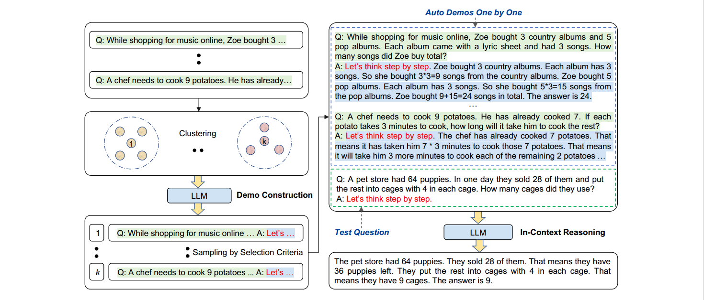

*Auto-CoT Prompting*

*Automatic Chain of Thought Prompting in Large Language Models*

## 简介

[\[张等，2022\]](https://arxiv.org/abs/2210.03493)提出了一种自动思维链提示的方法:AutoCoT。它从各种各样的问题中抽取样本，并生成推理链来构建样例。在实践中，手动构建样例比零样例获得了更好的性能。然而，这种优越的性能取决于有效的手动构建样例。具体来说，手动设计样例的问题和思维链需要很大的工作量。此外，人类为设计特定任务样例所做的努力甚至更多:不同的任务，如算术和常识推理，需要不同的样例方式。为了消除这种手工设计，我们提倡另一种Auto-CoT范式，用问题和推理链自动构建演示。

我们在十个基准推理任务上评估Auto-CoT，包括:(I)算术推理；㈡常识推理；㈢符号推理。实验结果表明，使用GPT-3，Auto-CoT始终与需要手动设计的手动CoT的性能相当或更好。

## 它是如何工作的？

首先，我们可以利用带有“让我们一步一步地思考”的提示的LLMs来为一个接一个的样例生成推理链，也就是说，让我们不仅一步一步地思考，而且一个接一个地思考。

我们的分析表明，论证问题的多样性是减轻零样例推理链错误影响的关键。基于这个观点，我们提出了一个自动构造演示的方法。Auto-CoT包括两个主要步骤。首先，将给定数据集的问题分成几个组。其次，从每个聚类中选择一个有代表性的问题，并使用简单的启发式算法生成其推理链。有了自动构建的样例，我们就可以用简单的方式提示LLM。

下图显示了Auto-CoT提示的完整工作流程。

**⭐Demo建构:问题聚类+零样本提示**

**⭐In-Context推理，即少样本CoT提示**

*提示:*

*问:罗杰有五个网球。他又买了两罐网球。每个罐子里有3个网球。他现在有多少个网球？*

*a:罗杰刚开始有5个球。2罐3个网球每罐是6个网球。5 +6= 11.答案是11。*

*问:约翰照顾10只狗。每只狗每天花0.5个小时散步和照顾它们。他一周花多少时间照顾狗？*

*答:约翰每天拿0.5×10=5散步，照顾狗。一周包含7天。*

*5×7=35 .答案是一周35小时。*

*问:一个变戏法的人可以变戏法16个球。一半球是高尔夫球，一半高尔夫球是蓝色的。有多少蓝色的高尔夫球？*

*答:*

*输出:*

*这个变戏法的人能变戏法16个球。一半的球是高尔夫球。所以有16/ 2 = 8个高尔夫球。一半的高尔夫球是蓝色的。所以有8/2 = 4个蓝色高尔夫球。答案是4。*
