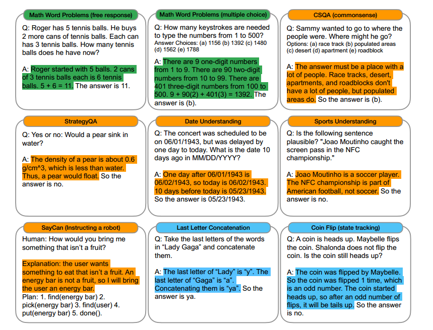

# *One/few-shot prompting*

## *Chain-of-Thought Prompting Elicits Reasoning in Large Language Models*

[魏等人](https://arxiv.org/abs/2201.11903)探索生成一个思维链(一系列中间推理步骤)如何显著提高大型语言模型执行复杂推理的能力。因为仅仅扩大大型语言模型的规模还不足以在具有挑战性的任务上实现高性能，例如算术、常识和符号推理，我们称之为“推理繁重的任务”，这里有一个想法来探索如何释放大型语言模型的推理能力。思维链提示是一种新方法，它赋予语言模型生成类似思维链——一系列连贯的中间推理步骤的能力，引导出问题的最终答案，这种方法优于标准prompting，有时甚至达到惊人的程度。这项工作强调了大型语言模型如何通过几个关于任务的自然语言数据的例子进行学习(例如，通过大型训练数据集自动学习输入和输出的模式)。

## 它是如何工作的？

在解决复杂的推理任务(如多步数学应用题)时，考虑自己的思维过程。典型的做法是将问题分解成中间步骤，并在给出最终答案之前解决每个步骤。思维链是一系列通向最终输出的中间自然语言推理步骤。这项工作探索了大型语言模型的推理能力是如何通过一个由两个想法激发的简单方法来解锁的。首先，算术推理技术可以受益于生成自然语言引导出最终答案的基本原理。第二，大型语言模型提供了通过提示在上下文中进行少量学习的令人兴奋的前景。也就是说，不是为每个新任务微调一个单独的语言模型检查点，而是简单地用一些演示任务的输入输出样本“提示”模型。值得注意的是，这在一系列简单的问答任务中取得了成功。

然而，上述两种想法都有关键的局限性。用于基本原理强化培训和微调方法，创建一大组高质量的推理是很昂贵的，这比普通机器学习中使用的简单输入-输出对复杂得多。

对于Brown等人(2020)使用的传统少数镜头提示方法，它在需要推理能力的任务上表现不佳，并且通常不会随着语言模型规模的增加而显著改善。在本文中，这两种观点的优势以避免其局限性的方式结合在一起。

具体来说，思维链提示探索了语言模型为推理任务执行少量提示的能力，给出的提示由三部分组成:<输入，思维链，输出>。下图显示了在少数几个提示演示中使用的思路链示例，并突出显示。




提示示例：

*提示:*

```
*问:罗杰有五个网球。他又买了两罐网球。每个罐子里有3个网球。他现在有多少个网球？*

*a:罗杰先发了5个球。2罐3个网球每罐是6个网球。5 +6= 11.答案是11。*

*问:约翰照顾10只狗。每只狗每天花0.5个小时散步和照顾它们的生意。他一周花多少时间照顾狗？*

*答:约翰每天拿0.5×10=5散步，照顾狗的生意。一周包含7天。*

*5×7=35 .答案是一周35小时。*

*问:一个变戏法的人可以变戏法16个球。一半球是高尔夫球，一半高尔夫球是蓝色的。有多少蓝色的高尔夫球？*

*答:*
```

*输出:*

```
*这个变戏法的人能变戏法16个球。一半的球是高尔夫球。所以有16/ 2 = 8个高尔夫球。一半的高尔夫球是蓝色的。所以有8/2 = 4个蓝色高尔夫球。答案是4。*
```
