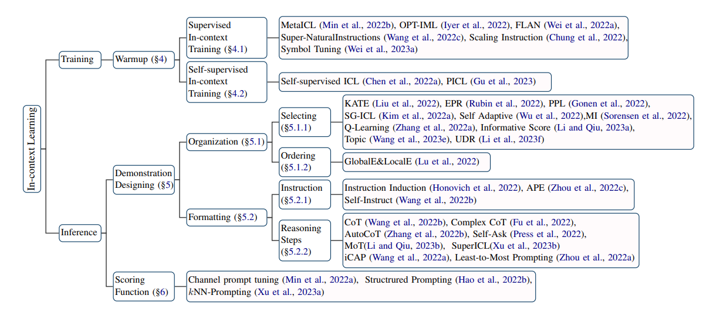

# ⛓️ 上下文学习(ICL)

## 什么是上下文学习(ICL)?

​随着模型大小和语料库大小的提升，大语言模型（LLM）展示了上下文学习（ICL）的能力，即从上下文中的几个例子中学习。许多研究表明，LLM可以通过ICL执行一系列复杂的任务，例如解决数学推理问题等。这些强大的能力已经被广泛验证为大型语言模型的新兴能力。

## 上下文学习有那些特征？

​上下文学习的核心思想是从类比中学习。首先，ICL需要几个例子来形成一个上下文示例。这些例子通常是用自然语言模板编写的。然后，ICL将一个查询问题和一段演示上下文连接在一起，形成一个提示，然后将其输入到语言模型中进行预测。与需要使用反向梯度来更新模型参数的训练阶段的监督学习不同，ICL不进行参数更新，而是直接使用预训练的语言模型进行预测。模型学习隐藏在演示中的模式，并相应地做出正确的预测。

## 上下文学习有哪些长处?

​ICL具有多种吸引人的优势。首先，由于演示是用自然语言编写的，因此它提供了一个可解释的接口来与LLM进行通信。其次，上下文学习类似于人类通过类比学习的决策过程。第三，与监督学习相比，ICL是一个无需训练的学习框架。

## 上下文学习的研究包括哪些部分?

ICL的优异表现取决于两个阶段：

（1） 培养LLM的ICL能力的训练阶段；

（2） LLM根据任务特定演示进行预测的推理阶段。

​尽管LLM已经显示出强大的ICL能力，但许多研究也表明，通过预训练和ICL推理之间的连续训练阶段，ICL能力可以进一步提高，简称模型预热。预热是ICL的一个可选过程，它在ICL推理之前调整LLM，包括修改LLM的参数或添加额外的参数。

​在推理阶段，由于输入和输出标签都用可解释的自然语言模板表示，因此有多个方向可以提高ICL的性能。许多研究表明，ICL的性能在很大程度上依赖于演示示例的组成，包括演示格式、演示示例的顺序等。所以对演示设计的研究通常分为两个部分：演示组织和演示格式。

