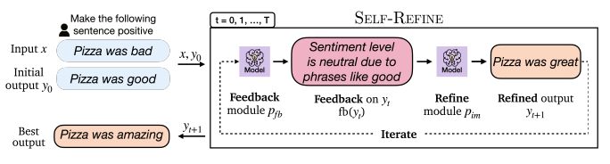
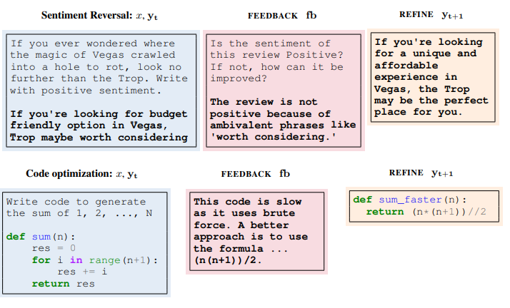
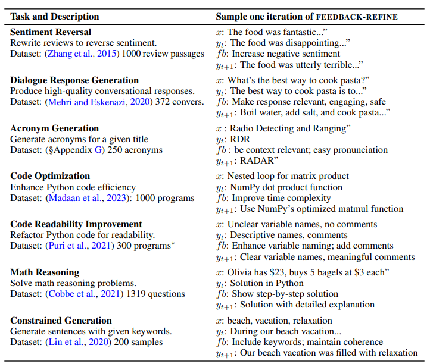

# Self-Refine: Iterative Refinement with Self-Feedback

## Introduction

[\[Aman Madaan et al. (2023)\]](https://arxiv.org/abs/2303.17651) presented a novel framework that enables large language models to utilize iterative refinement and self assessment for generating higher-quality outputs. What different from earlier work is this approach does not require supervised training data or reinforcement learning, and uses a single LLM. The main idea in this work is that the same underlying language model performs both feedback and refinement in a few-shot setup. They experimented with 7 diverse tasks, including review rewriting, acronym generation, constrained generation, story generation, code rewriting, response generation, and toxicity removal, demonstrating that this approach outperforms direct generation, improving on average by absolute ∼20% across tasks.

## How it works

Self-refine consists of an iterative loop between two components: FEEDBACK and REFINE. Given an initial draft output generated by a model M, pass it back to the same model M to get feedback. Feedback on the initial output is passed back to the same model, to iteratively refine the previously generated output. The loop ends in two situations: reaches the specified number of iterations or  the model itself determines that no further refinement is necessary.

FEEDBACK receives the initial output and provides the feedback on how to enhance it. The feedback is task-dependent and generally addresses multiple aspects of the input. Using actionable feedback makes it can pinpoint the reasons for the output meeting (or not meeting) the requirements. The feedback covers two aspects: localization of the problem and instruction to improve.

REFINE refines the output based on the received feedback and the previously generated output. 

## Prompt example

