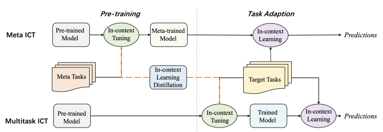
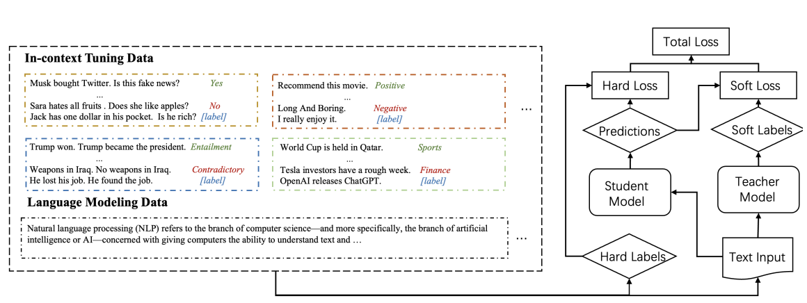
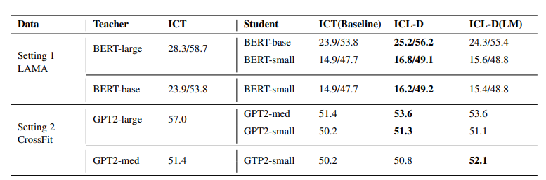
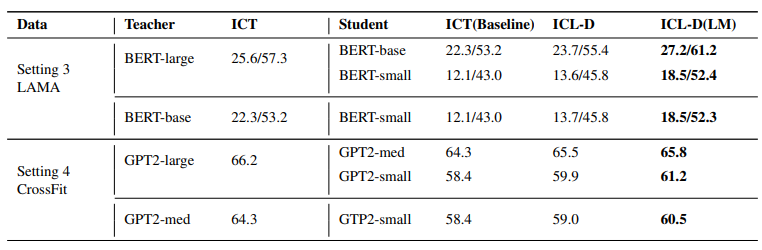
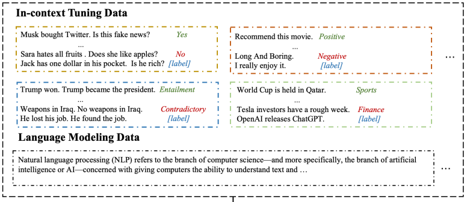

## In-context Learning Distillation: Transferring Few-shot Learning Ability of Pre-trained Language Models

## 介绍

​		[\[Huang et al. (2022)\]](https://arxiv.org/abs/2212.10670)为了解决大语言模型需要大量计算资源、只可被部署到大规模服务器上且不可用于实时系统等缺点，提出了一个名为“In-context Learning Distillation”的师徒框架，将few-shot learning从大模型迁移到小模型上；提出了一个名为multitask in-context tuning的新的few-shot learning范式，相较于传统few-shot supervised finetuning与Meta-ICT性能更好；并且在大量实验后从提炼的角度来理解上下文学习目标和语言建模目标的作用，并发现它们是相辅相成的。

## 它是如何工作的

- multitask in-context tuning: 相较于meta-tuning，为了更好地利用few-shot training的信息，本文提出了multitask in-context tuning。该方法分两步直接将模型调整为适应目标任务。首先以in-context tuning的方法使用目标任务中的一些示例来更新模型参数，然后通过in-context learning进行预测。原理如图：

​		由于大语言模型的序列长度限制，训练示例的数量n可能大于上下文示例的数量k。为了解决这种不一致性，从n个训练样本中随机选择k个上下文示例进行m次预测，并从m个预测中选择最常见的一个作为最终预测。实验后发现，该方法可以进一步缓解对上下文示例选择的过度敏感，并提高性能。

- In-context Learning Distillation: 提出in-context learning distillation将老师模型的few-shot learning能力提取到学生模型。原理如下图。学生模型通过模仿老师模型的预测（软标签）进行学习，同时也从基本事实（硬标签）进行学习。

​		他们在两个benchmark（LAMA、CrossFit）上实验了两种paradigm（meta-ICT、multi-ICT），总共产生了四种不同的few-shot learning设置。

​		Meta-ICT范式下的提取结果。 ICT(baseline): 没有老师模型的ICT-tuning。 ICL-D: 仅通过上下文学习目标进行提炼。 ICL-D(LM): 通过语境中的学习目标和语言建模目标进行提炼。

​		Multitask-ICT范式下的提取结果，比较基准与前一个相同。

## 提示示例

