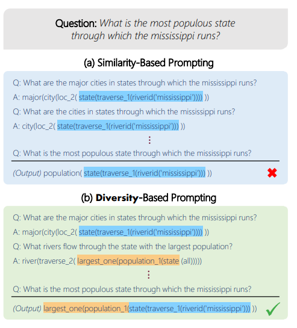
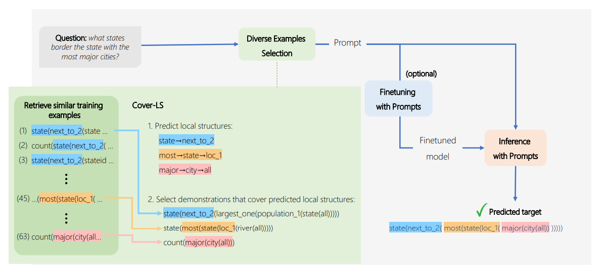
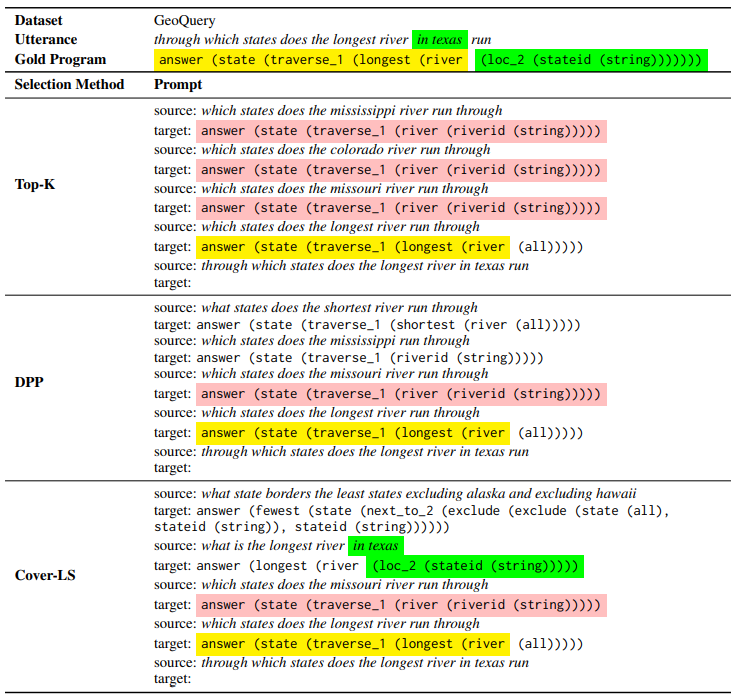

# Diverse Demonstrations Improve In-context Compositional Generalization

## 介绍

​		in-context learning 中测试集与训练集通常来自同一分布，设置中向模型提示与输入问题类似的提示。但是在组合泛化的设置中，在训练集没有输出的结构中测试模型，仅选择类似的演示远远不够，因为通常没有足够多的相似提示。[\[Itay Levy et al. (2022)\]](https://arxiv.org/abs/2212.06800)研究了如何利用ICL通过增加演示之间的多样性来提高语义解析的组合泛化。提出了两种方式去提高ICL演示的多样性：定义一组需要覆盖的元素，然后选择可以覆盖所有元素的示例组合；或定义不同示例间的不相似度，选择一个互相间最不相似的示例子集。本文进一步证明，通过以结构覆盖为目标，可以减少泛化所需的演示次数，并提高硬示例的测试性能。

## 它是如何工作的

​		如果示例不能顾及到问题的所有特征，会出现答非所问的问题，如图举例：

​		利用ICL改进语义解析的组合泛化的方法是优化整个示例集，并增加该集中示例的多样性。他们研究了两种增加多样性的方法：（a）基于覆盖的方法，定义一组以输入语言为条件的元素，并选择涵盖这些元素的示例；（b） 第二种方法，选择彼此最不相似的示例的子集，使得多样性独立于输入语言。

​	（a）：提出了**Cover LS**，这是一种给定测试话语X_test的算法，试图从程序Y_test的局部结构的集合S_Ytest中选择共同覆盖尽可能多的局部结构。由于在测试时无法访问Y_test，故在假设预测局部结构比预测整个程序更容易的情况下使用辅助模型来预测可能的局部结构。然后，迭代地选择覆盖预测的局部结构的示例。这种方法的结构如图：

​	（b）：另一种方法是更明确地定义多样性，并选择彼此不同的演示子集（同时与输入话语相关）。从训练集中选择高质量和多样化演示示例的一种自然方法是“Determinantal Point Process”，这是一种概率模型，定义了项目子集上的概率分布，为更包含相关和多样化项目的子集提供了更高概率。DPP需要每个项目的相关性得分和项目对之间的相似性得分。通过输入测试语言的检索器分数来定义示例的相关性。这种方法的性能不如第一种方法。

​		在选择好示例后，根据常用做法，按照检索器对输入话语的评分升序排列，然后格式化为最终的prompt。

​		在三个不同的数据集上验证了上述方法的有效性。每个数据集的示例语言-程序对如图：

## 提示示例

​		为检索到的源-目标对添加了特殊的前缀“source:”和“target:”，并用换行符将它们分隔开。下表为针对特定测试示例，使用不同的演示选择方法生成提示。每组都选择4个演示。

