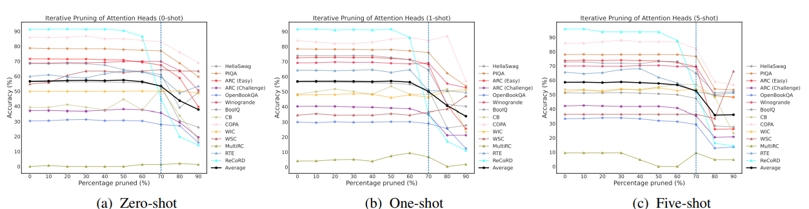

## Rethinking the Role of Scale for In-Context Learning: An Interpretability-based Case Study at 66 Billion Scale

## 介绍

​[\[Bansal et al. (2022)\]](https://arxiv.org/abs/2212.09095)使用两种方法探究是否所有的LLM组件在in-context learning中都是必需的。

​第一种方法是通过任务特定的重要性评分和现代LLM基础组件的结构化修剪。发现即使移除了高达70%左右的注意力头后，对几乎所有的14个NLP数据集/任务进行zero/few shot learning的性能几乎保持不变；相比之下，要保持类似的性能，前馈网络(FFN)最多被移除20%。同时，基于各自的重要性顺序对注意力头和FFN进行联合修剪时，新获得的上下文学习性能的拐点与通过独立修剪获得的拐点没有太大偏差。

​第二种方法是量化OPT-66B中所有注意力头执行与上下文学习相关的任务不可知基元操作子集的能力，即前缀匹配和复制。通过使用一种对Transformer逆向工程而找到这样的注意力头的框架，这篇文章计算了每个注意力头部的前缀匹配和复制的任务不可知分数，发现OPT-66B中的一小部分头部（称为诱导头）对两个基元都有非平凡的分数，并且这些头部与之前通过14个NLP数据集/任务确定的对上下文学习很重要的头部重叠。

## 它是如何工作的

​为了在第i层移除一个注意力头h，设置$A^h(M)$为$MHA^l(M) = [A^1(M); · · · ; A^H(M)]W^lo$中的零矩阵，这意味着$W^hk,W^hq,W^hv$可以被移除，并且W中对应的d行也可以被去除。在OPT-66B中，共有4608个注意力头跨越64层，占66B参数总数的21.7B。

​  同理为移除第i层的FFN，设置$FFN^l(M)$为$FFN^l(M) = ReLU(LN^l(M)W^l1)W^l2$中的零矩阵。这意味着W和用于FFN的层范数LN可以被完全去除。在OPT-66B中，FFN总共构成43.4B个参数。

​  基于特定任务和特定镜头的重要性得分，以迭代方式去除OPT-66B中的注意头时对上下文学习准确性的影响：

​  基于特定任务和特定镜头的重要性得分，以迭代方式删除OPT-66B中的前馈网络（FFN）时对上下文学习准确性的影响：

