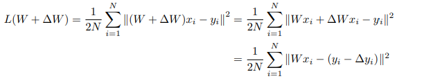
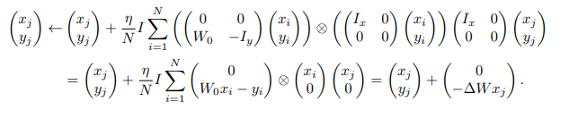
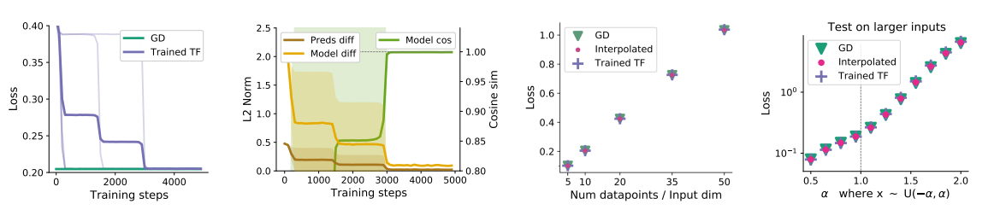
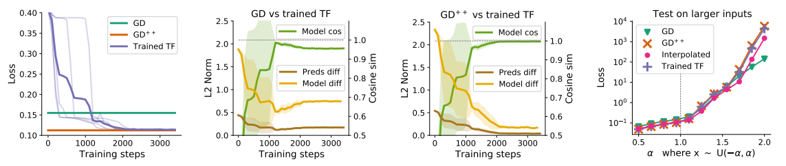
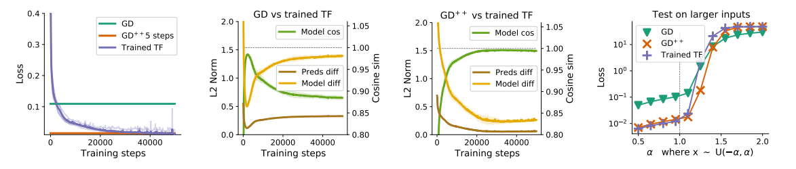

# Transformers learn in-context by gradient descent

## 介绍

​		[\[Johannes von Oswald et al. (2022)\]](https://arxiv.org/abs/2212.07677) 旨在弥合上下文学习和元学习之间的差距，并表明Transformers中的上下文学习可以看作是一种在其前向计算中近似基于梯度的few-shot learning的新兴性质。

​		本文为线性自注意力层构建了显式权重，该线性自注意力层在回归损失上引发与梯度下降（GD）的单个步骤相同的更新，并展示了几个自注意力层如何迭代地执行曲率校正，以改进平面梯度下降。

​		当在线性回归数据集上进行优化时，本文证明了仅线性自注意变换器要么收敛于构造，从而收敛于梯度下降算法，要么生成与GD训练的模型密切一致的模型，无论是分布内还是分布外验证任务。

​		通过将多层感知器（MLP）结合到Transformer架构中，它们能够通过显示其等效于学习深度表示上的线性模型来解决Transformer中的非线性回归任务。本文将元学习的MLP和输出层上的一步GD与经过训练的Transformers进行了比较，并证明了所确定的解决方案之间惊人的相似性。

​		本文通过提供证据来解决对特定令牌构造的依赖性，即学习的转换器首先将传入令牌编码为适合于在转换器的后面层中发生的上下文中梯度下降学习的格式。

## 它是如何工作的

​		首先，将标准多头自注意力层：

改为本文设计的线性自注意力层：

导出了参考线性模型的平方误差损失：

因此，可以将梯度下降步骤的结果视为回归损失的更新，其中更新的是数据，而不是权重。

Q,K,V矩阵如下设置：$W_K = W_Q = (\begin{matrix} I_X&0\\0&0 \end {matrix}),W_V = (\begin{matrix} 0&0\\W_0&-I_y \end {matrix})$

于是获得以下变化：

将一步梯度下降与单个线性自注意层进行比较：

将两步梯度下降与双层Transformer进行比较：

将五步梯度下降与五层Transformer进行比较：

