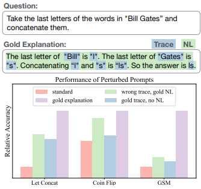
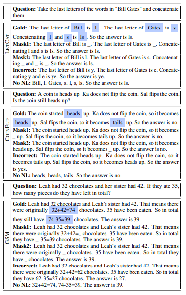
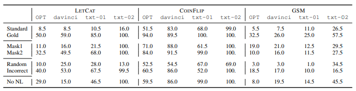
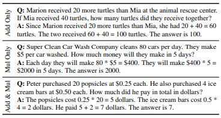
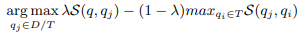
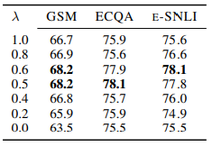

## Complementary Explanations for Effective In-Context Learning

## 介绍

​		[\[Ye et al. (2022)\]](https://arxiv.org/abs/2211.13892) 提出了一系列关于如何有效的在上下文学习中添加解释的研究。首先，通过一系列探索性实验，研究了计算痕迹和自然语言在解释中的影响，发现LLM依赖于它们两者来有效地进行上下文学习；其次，进一步研究了提示中范例之间的相互作用以及范例和查询之间的相互影响，揭示了通过选择与查询相关的补充解释来构建提示的好处；最后，提出了一种基于MMR的样本选择策略，该策略在三个重要数据集上成功地提高了任务性能。

## 它是如何工作的

​		与常规的上下文学习（in-context learning）不同，带解释的上下文学习在示例的“问题——答案”二元组的基础上增加了对答案原理的解释，构成了“问题——解释——答案”三元组。在示例中增加解释可以显著提高上下文学习的性能，效果如图。

​		首先研究解释是否能起作用，这一点分成两个部分，分别是计算痕迹是否起作用与自然语言是否起作用；最后研究错误的解释是否起作用。相关设置如图，共有三个不同的对照设置，分别是掩盖掉计算痕迹（Mask1、Mask2），掩盖掉自然语言（No NL）与给出错误的解释（Incorrect）。

​		实验结果如下表，结论为LLM确实遵循了prompt中的解释，无论是掩盖掉计算痕迹、掩盖掉语言还是给出错误的解释都对正确率有一定的提升；同时，计算痕迹与自然语言也都对正确率有影响，掩盖掉任一部分都会对正确率造成下降。

​		其次研究示例之间解释的关系与示例与问题之间解释的关系。实验设置如图，将示例分为只有加法、只有乘法和加法乘法混合，研究LLM是否能综合考虑到所有示例的解释。

​		考虑到示例选择时不仅只能选取与问题相似的示例，还应选择示例间互相互补的以足以覆盖所有特征，本文设计了如下算法：

​		改变λ时MMR样本选择策略的性能变化：

## 提示示例

​		带有解释的上下文学习的prompt构造如图：

​		在三个不同的数据集上构造带有解释的上下文学习的prompt：

