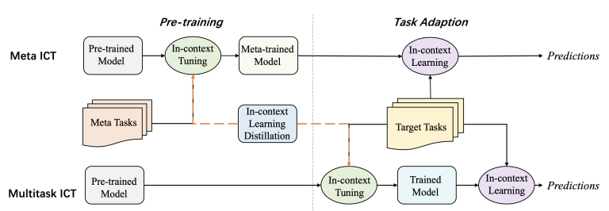
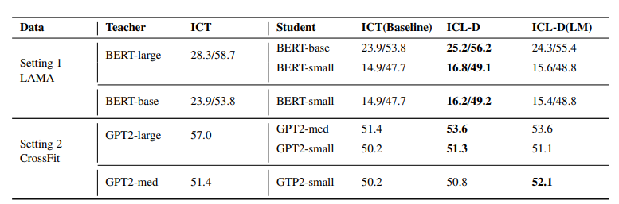

## In-context Learning Distillation: Transferring Few-shot Learning Ability of Pre-trained Language Models

## Introduction

Large language models always require massive computation resources, only can be deployed on extremely large-scale servers and can't be used in real-time systems due to their inefficient inference. To solve these problems, [\[Huang et al. (2022)\]](https://arxiv.org/abs/2212.10670) proposed In-context Learning Distillation, a teacher-student framework to transfer few-shot learning ability from a large language model to a smaller one, proposed another new few-shot learning paradigm: multitask in-context tuning, which demonstrates superior performance compared to traditional few-shot supervised finetuning and Meta-ICT, and made a conclusion that the role of in-context learning objectives and language modeling objectives are complementary to each other.

## How it works

- multitask in-context tuning: To better exploit the information in the few-shot training examples, they proposed multitask in-context tuning for multitask few-shot learning.  Multitask-ICT directly adapts the model to target tasks in two steps. First, it updates model parameters with a few examples from target tasks in an in-context tuning manner. Then it makes predictions via in-context learning. 

Due to the limitation on the input sequence length of LMs, the number of training examples n can be larger than the number of in-context examples k. To address this inconsistency, they propose majority voting inference. Firstly, randomly select k in-context examples from n training samples for m times and then choose the most common one from m predictions as the final prediction. They find this method can further mitigate the over-sensitivity to the choice of in-context examples and improve the performance.

- In-context Learning Distillation: The student learns from the teacher by imitating the teacher’s predictions (soft labels). The student learns to perform in-context learning as well as language modeling from the teacher. In addition to learning from the teacher’s predictions, the student also learns from the ground truths (hard label). 

They experimented with two paradigms (Meta-ICT, Multi-ICT) on two benchmarks (LAMA, CrossFit), resulting in four different few-shot learning settings in total.

Distillation results under Meta-ICT paradigms. ICT(baseline): In-context tuning without the teacher. ICL-D: In-context knowledge distillation which only distills through in-context learning objectives. ICL-D(LM): In-context knowledge distillation which distills through both in-context learning objectives and language modeling objectives. 

​	 Distillation results under the Multitask-ICT paradigm.

## Prompt example

